# UNIVERSIDAD PERUANA DE CIENCIAS APLICADAS


**Carrera:** Ingeniería de Software  
**Ciclo:** 7

**Curso:** 1ASI0657 - Fundamentos de Arquitectura de Software

**Sección:** 17949

**Profesor:** Jorge Luis Delgado Vite

## "Informe de Trabajo Final"

**Startup:** ParkTeam  
**Producto:** ParkLink

-------------------------------

### Relación de integrantes:

| Nombre                                | Código       |
|---------------------------------------|--------------|
|Javier Masaru Nikaido Vargas           |U20221G099    |
|Fabian Alejandro Oliva Lopez           |U202312013    |
|Pietro Osores Marchese                 |U202310971    |
|Percy Alonso Muñiz Huayanca            |U202319563    |
|Matias Rodolfo Salcedo Champi          |U202319698    |

**Abril 2026**

## Registro de Versiones del Informe

| Version | Fecha      | Autor                                          | Descripción de modificación                                                |
| ------- | ---------- | ---------------------------------------------- | -------------------------------------------------------------------------- |
| 1ra     | 15/04/2026 | Javier Masaru Nikaido Vargas,Fabian Alejandro Oliva Lopez,Pietro Osores Marchese,Percy Alonso Muñiz Huayanca,Matias Rodolfo Salcedo Champi | Avance1: En esta primera entrega se avanzo con el capitulo 1,2 y 3 de forma organizada para empezar con el pryecto de ParkLink estbleciedo la idea y un estudio del contaxto y las features. |                                                                                                                                                                                        |

## Student Outcome
| Criterio específico | Acciones realizadas | Conclusiones |
|---------------------|---------------------|--------------|
| **CO1:** Actualiza conceptos y conocimientos necesarios para su desarrollo profesional y en especial para su proyecto en soluciones de software. | **TB1 - Fabian Alejandro Oliva López:** Definí el ADN de la startup, estableciendo la visión, misión y valores como fundamento estratégico del proyecto. Supervisé el proceso Lean UX para garantizar la alineación con los objetivos del curso. Identifiqué y definí los segmentos objetivo, aplicando conocimientos de estrategia de producto. **TB1 - Javier Masaru Nikaido Vargas:** Realicé investigación de competidores mediante benchmarking para entender el mercado. Ejecuté entrevistas y needfinding para validar el problema con usuarios reales, aplicando técnicas de UX Research. **TB1 - Matias Rodolfo Salcedo Champi:** Diseñé el Solution Profile y nombre del producto, aplicando conceptos de product design. Creé User Personas y Empathy Maps para comprender las necesidades de los usuarios, integrando conocimientos de diseño centrado en el usuario. **TB1 - Percy Alonso Muñiz Huayanca:** Desarrollé Lean UX Assumptions e Hypothesis Statements, aplicando metodologías de diseño ágil. Construí User Task Matrix, As-is y To-Be Scenario Mapping para analizar procesos actuales y futuros, integrando conocimientos de análisis de procesos. **TB1 - Pietro Osores Marchese:** Elaboré el Lean UX Canvas para consolidar la propuesta de valor. Creé User Stories, Impact Map y Product Backlog para especificar requerimientos del proyecto, aplicando conocimientos de gestión de proyectos ágiles. | El equipo ha demostrado capacidad para integrar y aplicar conocimientos de arquitectura de software en un proyecto real de solución tecnológica. Cada integrante actualizó sus conocimientos en las áreas de UX, diseño de producto, análisis de procesos y gestión de requerimientos, aplicando metodologías ágiles y herramientas de elicitación de requisitos. |
| **CO2:** Reconoce la necesidad del aprendizaje permanente para el desempeño profesional y el desarrollo de proyectos en soluciones de software. | **TB1 - Fabian Alejandro Oliva López:** Al definir la visión y estrategia de la startup, reconocí la importancia de actualizar constantemente los conocimientos en estrategia de producto y liderazgo de proyectos. **TB1 - Javier Masaru Nikaido Vargas:** Al realizar entrevistas y needfinding, identifiqué la necesidad de mejorar continuamente las técnicas de investigación de usuarios y comunicación con stakeholders. **TB1 - Matias Rodolfo Salcedo Champi:** Al crear User Personas y Empathy Maps, comprendí la relevancia del aprendizaje continuo en metodologías de diseño centrado en el usuario. **TB1 - Percy Alonso Muñiz Huayanca:** Al desarrollar escenarios y mappings de procesos, reconocí la necesidad de actualizarse en herramientas de análisis y modelado de procesos de negocio. **TB1 - Pietro Osores Marchese:** Al crear el Product Backlog y User Stories, entendí la importancia del aprendizaje continuo en gestión de requerimientos y priorización de funcionalidades en entornos ágiles. | El equipo reconoce que el desarrollo de soluciones de software requiere aprendizaje continuo. La aplicación de metodologías como Lean UX, Needfinding, User Stories e Impact Mapping evidencia el compromiso de cada miembro por adquirir nuevas competencias y adaptarse a las tendencias tecnológicas del mercado de movilidad urbana. |

## Contenido 

- [Capítulo I: Introducción](#capítulo-i-introducción)
    - [1.1. Startup Profile](#11-startup-profile)
    - [1.1.1. Descripción de la Startup](#111-descripción-de-la-startup)
    - [1.1.2. Perfiles de integrantes del equipo](#112-perfiles-de-integrantes-del-equipo)
    - [1.2. Solution Profile](#12-solution-profile)
    - [1.2.1. Nombre del Producto](#121-nombre-del-producto)
    - [1.2.2. Antecedentes y problemática](#122-antecedentes-y-problemática)
    - [1.2.3. Lean UX Process](#123-lean-ux-process)
    - [1.2.3.1. Lean UX Problem Statements](#1221-lean-ux-problem-statements)
    - [1.2.3.2. Lean UX Assumptions](#1222-lean-ux-assumptions)
    - [1.2.3.3. Lean UX Hypothesis Statements](#1223-lean-ux-hypothesis-statements)
    - [1.2.3.4. Lean UX Canvas](#1224-lean-ux-canvas)
    - [1.3. Segmentos objetivo](#13-segmentos-objetivo)
- [Capítulo II: Requirements Elicitation \& Analysis](#capítulo-ii-requirements-elicitation--analysis)
    - [2.1. Competidores](#21-competidores)
    - [2.2. Entrevistas](#22-entrevistas)
    - [2.3. Needfinding](#23-needfinding)
    - [2.3.1. User Personas](#231-user-personas)
    - [2.3.2. User Task Matrix](#232-user-task-matrix)
    - [2.3.3. Empathy Mapping](#233-empathy-mapping)
    - [2.3.4. As-is Scenario Mapping](#234-as-is-scenario-mapping)
 - [Capítulo III: Requirements Specification](#capítulo-iii-requirements-specification)
   - [3.1. To-Be Scenario Mapping](#31-to-be-scenario-mapping)
   - [3.2. User Stories](#32-user-stories)
   - [3.3. Impact Mapping](#33-impact-mapping)
   - [3.4. Product Backlog](#34-product-backlog)
- [Capítulo IV: Product Architecture Design](#capítulo-iv-product-architecture-design)
    - [4.1. Strategic-Level Domain-Driven Design](#41-strategic-level-domain-driven-design)
    - [4.1.1. Principles Statements](#411-principles-statements)
    - [4.1.2. Approaches Statements Architectural Styles & Patterns](#412-approaches-statements-architectural-styles--patterns)
    - [4.1.3. Software Architecture](#413-software-architecture)
    - [4.1.3.1. Software Architecture System Landscape Diagram](#4131-software-architecture-system-landscape-diagram)
    - [4.1.3.2. Software Architecture Context Level Diagrams](#4132-software-architecture-context-level-diagrams)
    - [4.1.3.3. Software Architecture Container Level Diagrams](#4133-software-architecture-container-level-diagrams)
    - [4.1.4. Approach driven ViewPoints Diagrams](#414-approach-driven-viewpoints-diagrams)
    - [4.1.5. Relational / Non-Relational Database Diagram](#415-relational--non-relational-database-diagram)
    - [4.1.6. Design Patterns](#416-design-patterns)
    - [4.1.7. Tactics](#417-tactics)
    - [4.2. Architectural Drivers](#42-architectural-drivers)
    - [4.1.8. Design Purpose](#418-design-purpose)
    - [4.1.9. Primary Functionality (Primary User Stories)](#419-primary-functionality-primary-user-stories)
    - [4.1.10. Quality Attribute Scenarios](#4110-quality-attribute-scenarios)
    - [4.1.11. Constraints](#4111-constraints)
    - [4.1.12. Architectural Concerns](#4112-architectural-concerns)
    - [4.3. ADD Iterations](#43-add-iterations)
    - [4.3.1. Iteration 1: Establish Overall System Structure](#431-iteration-1-establish-overall-system-structure)
    - [4.3.2. Iteration 2: Address Critical Quality Attributes](#432-iteration-2-address-critical-quality-attributes)
    - [4.3.3. Iteration 3: External Integrations & Cross-Cutting Concerns](#433-iteration-3-external-integrations--cross-cutting-concerns)
  
# Capítulo I: Introducción

## 1.1. Startup Profile

### 1.1.1. Descripción del Startup

En las ciudades modernas, uno de los principales problemas que enfrentan los conductores es la dificultad para encontrar estacionamiento disponible. Esta situación genera congestión vehicular, pérdida de tiempo, estrés y un impacto ambiental negativo debido al aumento de emisiones contaminantes producto de la circulación innecesaria de vehículos.

**Misión:**
Brindar una plataforma eficiente y confiable que permita a los conductores encontrar y reservar estacionamientos fácilmente, mientras se genera valor para los propietarios mediante la monetización de sus espacios.

**Visión:**
Ser la plataforma líder en reserva de estacionamientos en Latinoamérica, contribuyendo al desarrollo de ciudades más organizadas, sostenibles y tecnológicamente conectadas.

**Valores:**

Innovación tecnológica
Eficiencia operativa
Confianza y seguridad
Sostenibilidad urbana

#### 1.1.2. Perfiles de integrantes del equipo
| Nombre                          | Descripción                                                                                                                                                                                                                                                                                                                                 | Foto |
|---------------------------------|---------------------------------------------------------------------------------------------------------------------------------------------------------------------------------------------------------------------------------------------------------------------------------------------------------------------------------------------|------|
| Fabian Alejandro Oliva Lopez     | Me considero una persona activa en los proyectos, impulsando al equipo a realizar buenos trabajos. Mi objetivo es brindar apoyo y dar lo mejor de mí para fomentar un ambiente colaborativo y de respeto.                                                                                                                                 |  |
| Javier Masaru Nikaido Vargas     | Estudiante de Ingeniería de Software con enfoque en el desarrollo organizado y eficiente de soluciones. Me caracterizo por trabajar de manera estructurada, priorizando la planificación y el cumplimiento de plazos, manteniendo un ambiente de trabajo tranquilo y productivo.                                                      |  |
| Pietro Osores Marchese           | Soy Pietro Osores Marchese, estudiante de Ingeniería de Sistemas con interés en el desarrollo de software y la innovación tecnológica. Mi perfil combina habilidades en programación frontend, diseño de interfaces y gestión de proyectos ágiles, con un enfoque en la creación de soluciones digitales funcionales y escalables. Me caracterizo por el trabajo en equipo, la adaptabilidad y la búsqueda constante de nuevas herramientas para optimizar procesos y experiencias de usuario. |  |
| Matias Rodolfo Salcedo Champi    | Soy un estudiante de Ingeniería de Software con experiencia en el desarrollo de aplicaciones móviles y web. He participado en proyectos de investigación y desarrollo, y manejo tecnologías como Flutter, Dart, Node.js, Express.js, MongoDB, PostgreSQL, Git y GitHub.                                                             |  |
| Percy Alonso Muñiz Huayanca      | Soy un estudiante de Ingeniería de Software apasionado por el desarrollo backend y el análisis de datos. Me considero una persona proactiva y resiliente, siempre enfocado en el aprendizaje continuo y en la implementación de soluciones tecnológicas eficientes. Mi objetivo es aportar mis habilidades técnicas en IA y gestión de datos para impulsar el éxito del equipo en cada proyecto. |  |


## 1.2. Solution Profile

### 1.2.1. Nombre del producto

El producto desarrollado lleva por nombre ParkLink, una plataforma digital orientada a la gestión y reserva de estacionamientos.

### 1.2.2 Antecedentes y problemática

En entornos urbanos, encontrar estacionamiento se ha convertido en una tarea compleja debido al crecimiento exponencial del parque automotor y la limitada disponibilidad de espacios. Esta situación obliga a los conductores a recorrer largas distancias en busca de un lugar donde estacionar, generando efectos adversos en múltiples dimensiones de la vida cotidiana.

El crecimiento sostenido de la circulación vehicular en las ciudades ha superado significativamente la capacidad de infraestructura disponible. Los espacios de estacionamiento públicos y privados no han aumentado en la misma proporción que el número de vehículos, creando un desequilibrio crónico entre la demanda y la oferta. Este problema se agrava especialmente en zonas comerciales, centros empresariales, instituciones educativas y áreas residenciales densamente pobladas.

Para analizar esta problemática de manera integral, se aplica la técnica de las **5W's + 2H's**:

#### - What (¿Qué sucede?)
Los conductores no cuentan con información en tiempo real sobre la disponibilidad de estacionamientos, lo que los obliga a buscar manualmente. La falta de visibilidad sobre dónde hay espacios disponibles genera una búsqueda constante e ineficiente, donde los conductores circulan repetidamente por las mismas calles esperando encontrar un lugar libre.

#### - Why (¿Por qué es un problema?)
- **Tráfico innecesario**: La búsqueda de estacionamiento genera viajes adicionales que congestionan las vías urbanas
- **Consumo de combustible**: Se desperdicia combustible buscando un espacio que podría evitarse con información previa
- **Estrés en los conductores**: La incertidumbre y el tiempo de búsqueda prolongado generan ansiedad y frustración
- **Eficiencia del tiempo**: El tiempo invertido en buscar estacionamiento representa una pérdida significativa de productividad
- **Contaminación ambiental**: Los vehículos en búsqueda constante de estacionamiento contribuyen a la emisión de gases contaminantes
- **Accidentes**: El stress y la distracción aumentan el riesgo de incidentes viales menores

#### - Who (¿A quiénes afecta?)
- **Conductores urbanos**: Todos aquellos que utilizan vehículo para movilizarse daily en zonas de alta demanda
- **Propietarios de estacionamientos no utilizados**: Personas o empresas con espacios disponibles que no tienen forma de monetizarlos eficientemente
- **Ciudades en general**: El tráfico causedo por la búsqueda de estacionamiento afecta la movilidad urbana
- **Comercios locales**: Los clientes potenciales pueden evitar zonas donde es difícil estacionar
- **Medio ambiente**: El increase de emisiones afecta la calidad del aire urbano

#### - When (¿Cuándo ocurre?)
- Principalmente en horas pico de la mañana y tarde, cuando las personas se desplazan hacia sus centros de trabajo o estudio
- En eventos especiales, días de pago, o fechas comerciales importantes
- Durante horarios de lunch en zonas empresariales y comerciales
- Los fines de semana en zonas de entretenimiento, centros comerciales y áreas recreativas

#### - Where (¿Dónde ocurre?)
- En zonas urbanas, comerciales y residenciales con alta densidad vehicular
- Centros financieros y distritos empresariales
- Alrededores de universidades, hospitales y centros comerciales
- Calles y avenidas principales con alta circulación
- Espacios de estacionamiento subutilizados en residencial areas

#### - How (¿Cómo sucede?)
- **Falta de plataformas digitales centralizadas**: No existe una herramienta unificada que conecte oferta y demanda
- **Información desactualizada o inexistente**: Los sistemas existentes no reflejan la disponibilidad real en tiempo real
- **Procesos manuales**: tanto para propietarios como para usuarios, todo se maneja de forma tradicional
- **Desconexión entre partes**: Los propietarios no tienen cómo dar a conocer sus espacios disponibles
- **Ausencia de sistemas de reservas**: No hay forma de garantizar un espacio con anticipación

#### - How Much (¿Cuánto cuesta o impacta?)
- **Económico**: Gasto adicional de combustible estimado en porcentajes significativos del presupuesto familiar
- **Ambiental**: Aumento de emisiones de CO2 por vehículos circulando sin necesidad
- **Social**: Estrés, pérdida de tiempo familiar y reducción de la calidad de vida
- **Productividad**: Horas de trabajo perdidas en búsqueda de estacionamiento
- **Económico para propietarios**: Ingresos no percibidos por espacios subutilizados

### 1.2.3 Lean UX Process

El proceso de Lean UX se enfoca en crear productos digitales eficientes mediante la experimentación rápida y la validación constante de hipótesis, priorizando la colaboración y el aprendizaje continuo. En el caso de ParkLink, plataforma de reserva de estacionamientos, el proceso Lean UX se desarrolló en las siguientes fases:

#### Comprender 
En esta fase, se realizó una investigación cualitativa centrada en el comportamiento de los conductores en zonas urbanas, enfocándonos en entender cómo buscan actualmente estacionamiento y cuáles son las principales dificultades que enfrentan. A través de observaciones y supuestos iniciales del equipo, identificamos que la mayoría de los conductores pierde tiempo recorriendo calles sin tener información clara sobre la disponibilidad de espacios.

#### Esbozar
Con los hallazgos obtenidos, comenzamos a diseñar prototipos de baja fidelidad para la plataforma ParkLink. Estos prototipos se enfocaron en funcionalidades clave que respondieran directamente a las necesidades de los usuarios:
- **Mapa interactivo**: Que muestra estacionamientos disponibles según la ubicación del conductor.
- **Sistema de reservas anticipadas**: Para asegurar un espacio antes de llegar al destino.
- **Visualización de precios y horarios**: Facilitando la toma de decisiones.
- **Registro y gestión de espacios**: Permitiendo a los propietarios publicar y administrar sus cocheras.

#### Probar
Se realizaron pruebas de usabilidad con usuarios potenciales, simulando escenarios reales de búsqueda de estacionamiento en zonas de alta demanda. Durante las pruebas, observamos cómo los usuarios interactuaban con el mapa y el sistema de reservas, evaluando la facilidad de uso y la comprensión de la plataforma.

#### Medir 
Una vez implementados los prototipos mejorados, se definieron métricas clave para evaluar el rendimiento de la plataforma. Se analizaron indicadores como el tiempo promedio que tarda un usuario en encontrar estacionamiento, la cantidad de reservas realizadas y la frecuencia de uso de la aplicación.

#### 1.2.3.1 Lean UX Problem Statements

##### Problem Statement 1
Muchos conductores en zonas urbanas pierden tiempo buscando estacionamiento debido a la falta de información en tiempo real sobre espacios disponibles. Esta situación genera congestión vehicular, mayor consumo de combustible, estrés en los usuarios y una experiencia de movilidad ineficiente.

**¿Cómo podríamos diseñar una solución digital que permita a los conductores encontrar y reservar estacionamientos en tiempo real, reduciendo el tráfico y mejorando su experiencia de movilidad?**

---

##### Problem Statement 2

Actualmente, muchos propietarios de estacionamientos o espacios disponibles no cuentan con una plataforma que les permita ofrecer sus cocheras de manera sencilla, segura y organizada. Esto provoca que dichos espacios permanezcan desaprovechados, generando una pérdida de oportunidades económicas.

**¿Cómo podríamos diseñar una plataforma que permita a los propietarios publicar y gestionar sus espacios de estacionamiento de forma fácil, segura y rentable?**

#### 1.2.3.2 Lean UX Assumptions

### 1.2.3.2.1 Business Assumptions
- Existe una alta demanda de soluciones digitales que optimicen la búsqueda de estacionamientos en zonas urbanas.
- Los conductores están dispuestos a pagar por conveniencia, ahorro de tiempo y seguridad al estacionar.
- Los propietarios de espacios buscan generar ingresos adicionales mediante la monetización de sus cocheras.

### 1.2.3.2.2 Business Outcomes
- Generar ingresos a través de comisiones por reservas realizadas en la plataforma.
- Incrementar la base de usuarios activos (conductores y propietarios).
- Posicionar la plataforma como una solución confiable en el mercado de movilidad urbana.

### 1.2.3.2.3 User Assumptions
- Los conductores actualmente buscan estacionamiento de forma manual, sin herramientas digitales especializadas.
- Prefieren soluciones rápidas, intuitivas y que les permitan planificar con anticipación.
- Los propietarios desean una forma sencilla de publicar y gestionar sus espacios sin procesos complejos.

### 1.2.3.2.4 User Outcomes
- Los conductores reducen significativamente el tiempo de búsqueda de estacionamiento.
- Disminuye el estrés asociado a la conducción en zonas congestionadas.
- Los propietarios logran generar ingresos adicionales mediante el uso eficiente de sus espacios.

### 1.2.3.3 Lean UX Hypothesis Statements

#### Hypothesis Statement 1

Creemos que lograremos reducir el tiempo de búsqueda de estacionamiento y mejorar la experiencia de movilidad urbana.

Sabremos que si los conductores
pueden visualizar y reservar estacionamientos disponibles en tiempo real,
cuando implementemos una plataforma digital que centralice la información de espacios y permita reservas anticipadas.

---

#### Hypothesis Statement 2

Creemos que lograremos un aumento en la generación de ingresos para los propietarios de estacionamientos.

Sabremos que si los propietarios
pueden publicar y gestionar fácilmente sus espacios dentro de la plataforma,
cuando veamos que utilizan activamente la aplicación para ofrecer sus cocheras y recibir reservas.

#### Hypothesis Statement 3

Creemos que lograremos una mejora en la toma de decisiones de los usuarios al momento de estacionar.

Sabremos que si los conductores
tienen acceso a información clara sobre precios, ubicación y disponibilidad,
cuando implementemos una interfaz que muestre datos en tiempo real de forma sencilla y confiable.

### 1.2.3.4	Lean UX Canvas


### 1.3. Segmentos objetivo

**Segmento 1: Conductores**
- **Características:**
  - Personas que conducen en zonas urbanas
  - Edades entre 20 y 60 años
  - Uso frecuente de apps móviles
    
- **Necesidades:**
  - Encontrar estacionamiento rápido
  - Reducir tiempo de búsqueda
  - Reservar anticipadamente
  - Pago seguro

**Segmento 2: Propietarios de estacionamientos**
- **Características:**
  - Personas o empresas con espacios disponibles
  - Interés en generar ingresos
    
- **Necesidades:**
  - Publicar espacios fácilmente
  - Gestionar reservas
  - Definir precios
  - Recibir pagos seguros

# Capítulo II: Requirements & Analysis

### 2.1.1 Competitive Analysis Landscape

<table>
  <tr>
    <th colspan="6">Competitive Analysis Landscape</th>
  </tr>

  <tr>
    <th>¿Por qué llevar a cabo este análisis?</th>
    <th colspan="5">
      ¿Cómo podemos diseñar una solución digital eficiente, confiable y diferenciada que permita a los conductores encontrar y reservar estacionamientos en tiempo real, reduciendo el tiempo de búsqueda, el tráfico urbano y el estrés, superando las limitaciones actuales de las aplicaciones existentes en el mercado?
    </th>
  </tr>

  <tr>
    <th rowspan="4">Perfil</th>
    <th></th>
    <th>ParkLink</th>
    <th>Apparka</th>
    <th>Parkopedia</th>
    <th>Quadra</th>
  </tr>

  <tr>
    <td><b>Overview</b></td>
    <td>
      Plataforma digital orientada a la búsqueda, visualización y reserva de estacionamientos en tiempo real. 
      Conecta a conductores con propietarios de espacios disponibles, permitiendo optimizar el uso de infraestructura urbana subutilizada.
    </td>
    <td>
      Aplicación peruana enfocada en el pago digital de estacionamientos en vía pública, facilitando la gestión del tiempo de estacionamiento sin necesidad de efectivo.
    </td>
    <td>
      Plataforma global que ofrece un amplio directorio de estacionamientos en múltiples ciudades del mundo, proporcionando información de ubicación, precios y disponibilidad aproximada.
    </td>
    <td>
      Aplicación enfocada en la gestión y administración de estacionamientos, orientada a mejorar la eficiencia del uso de espacios mediante herramientas tecnológicas.
    </td>
  </tr>

  <tr>
    <td><b>Ventaja competitiva</b></td>
    <td>
      Integración de múltiples funcionalidades en una sola plataforma: búsqueda en tiempo real, reservas anticipadas y monetización de espacios privados.
    </td>
    <td>
      Alta adopción local y facilidad de uso para pagos digitales en zonas reguladas por municipalidades.
    </td>
    <td>
      Gran cobertura internacional y base de datos extensa de estacionamientos.
    </td>
    <td>
      Enfoque en optimización operativa y uso eficiente de espacios a través de tecnología.
    </td>
  </tr>

  <tr>
    <td><b>¿Qué valor ofrece a los clientes?</b></td>
    <td>
      Reducción significativa del tiempo de búsqueda, menor estrés al conducir, posibilidad de asegurar un espacio antes de llegar y generación de ingresos para propietarios.
    </td>
    <td>
      Comodidad en el pago, eliminación del uso de efectivo y facilidad para gestionar el tiempo de estacionamiento.
    </td>
    <td>
      Acceso a información amplia sobre ubicaciones de estacionamiento en diferentes ciudades.
    </td>
    <td>
      Mejora en la organización y control de estacionamientos, especialmente en contextos institucionales.
    </td>
  </tr>

  <tr>
    <th rowspan="2">Perfil de Marketing</th>
    <td><b>Mercado Objetivo</b></td>
    <td>
      Conductores urbanos que buscan optimizar su tiempo y propietarios de estacionamientos interesados en monetizar sus espacios.
    </td>
    <td>
      Conductores en zonas urbanas del Perú donde el estacionamiento es regulado.
    </td>
    <td>
      Conductores a nivel global que requieren información sobre estacionamientos en distintas ciudades.
    </td>
    <td>
      Municipalidades, empresas privadas y operadores de estacionamientos.
    </td>
  </tr>

  <tr>
    <td><b>Estrategias de Marketing</b></td>
    <td>
      Marketing digital, campañas en redes sociales, alianzas estratégicas con estacionamientos privados y enfoque en experiencia de usuario.
    </td>
    <td>
      Implementación mediante convenios con municipalidades y campañas locales de adopción.
    </td>
    <td>
      Posicionamiento SEO, presencia global y partnerships con plataformas de movilidad.
    </td>
    <td>
      Estrategias B2B y acuerdos institucionales con entidades públicas y privadas.
    </td>
  </tr>

  <tr>
    <th rowspan="3">Perfil de Producto</th>
    <td><b>Productos & Servicios</b></td>
    <td>
      Plataforma web y aplicación móvil para búsqueda, reserva y gestión de estacionamientos.
    </td>
    <td>
      Aplicación móvil para pago de estacionamientos en vía pública.
    </td>
    <td>
      Plataforma web y móvil para consulta de estacionamientos.
    </td>
    <td>
      Aplicación móvil orientada a la gestión y administración de estacionamientos.
    </td>
  </tr>

  <tr>
    <td><b>Precios & Costos</b></td>
    <td>
      Modelo freemium con comisión por reserva realizada dentro de la plataforma.
    </td>
    <td>
      Pago por uso según tiempo de estacionamiento.
    </td>
    <td>
      Acceso gratuito con posibles servicios premium o integraciones comerciales.
    </td>
    <td>
      Modelo basado en licencias o contratos con instituciones.
    </td>
  </tr>

  <tr>
    <td><b>Canales de distribución (Web y/o Móvil)</b></td>
    <td>Web y móvil</td>
    <td>Móvil</td>
    <td>Web y móvil</td>
    <td>Móvil</td>
  </tr>

  <tr>
    <th rowspan="4">Análisis SWOT</th>
    <td><b>Fortalezas</b></td>
    <td>
      Propuesta integral que combina búsqueda, reserva y monetización en una sola plataforma. 
      Enfoque centrado en el usuario y alineado con tendencias de smart cities.
    </td>
    <td>
      Aplicación consolidada en el mercado local con alta adopción y facilidad de uso.
    </td>
    <td>
      Amplia base de datos global y reconocimiento internacional.
    </td>
    <td>
      Capacidad de optimizar el uso de espacios mediante soluciones tecnológicas especializadas.
    </td>
  </tr>

  <tr>
    <td><b>Debilidades</b></td>
    <td>
      Proyecto en etapa inicial sin posicionamiento consolidado en el mercado.
    </td>
    <td>
      Limitado a pagos, sin funcionalidades de reserva o predicción de disponibilidad.
    </td>
    <td>
      No garantiza disponibilidad en tiempo real ni permite reservas.
    </td>
    <td>
      Enfoque limitado al sector institucional, con poca orientación al usuario final.
    </td>
  </tr>

  <tr>
    <td><b>Oportunidades</b></td>
    <td>
      Crecimiento de soluciones de movilidad inteligente y demanda de optimización urbana.
    </td>
    <td>
      Expansión a más ciudades y mejora de funcionalidades.
    </td>
    <td>
      Integración con nuevas tecnologías y servicios de movilidad.
    </td>
    <td>
      Implementación en proyectos de smart cities y expansión institucional.
    </td>
  </tr>

  <tr>
    <td><b>Amenazas</b></td>
    <td>
      Competencia de aplicaciones ya posicionadas y barreras de adopción inicial.
    </td>
    <td>
      Entrada de nuevas aplicaciones más completas.
    </td>
    <td>
      Dependencia de la actualización de datos y falta de precisión en tiempo real.
    </td>
    <td>
      Dependencia de entidades públicas y cambios en regulaciones.
    </td>
  </tr>

</table>


### 2.1.2. Estrategias y tácticas frente a competidores

A partir del análisis competitivo realizado en la sección anterior, se identificaron diversas oportunidades y debilidades en los competidores actuales (Apparka, Parkopedia y Quadra). En base a estos hallazgos, se plantean las siguientes estrategias y tácticas para posicionar a ParkLink como una solución diferenciada en el mercado:

#### 1. Diferenciación mediante reservas en tiempo real
Se identificó que competidores como Parkopedia no ofrecen disponibilidad en tiempo real ni permiten realizar reservas anticipadas, mientras que Apparka se limita únicamente al pago.

**Estrategia:**
Implementar un sistema de reservas en tiempo real que permita a los usuarios asegurar un espacio antes de llegar a su destino.

**Tácticas:**
- Desarrollo de un mapa interactivo con disponibilidad actualizada.
- Sistema de confirmación inmediata de reservas.
- Integración de notificaciones en tiempo real.

---

#### 2. Plataforma integral 
Los competidores actuales ofrecen soluciones parciales: Apparka se enfoca en pagos, Parkopedia en información y Quadra en gestión.

**Estrategia:**
Ofrecer una plataforma integral que combine búsqueda, reserva, pago y gestión en un solo sistema.

**Tácticas:**
- Integración de múltiples funcionalidades dentro de una sola aplicación.
- Experiencia unificada para conductores y propietarios.
- Optimización de flujos de usuario para reducir fricción.

---

#### 3. Enfoque en la monetización de espacios privados
Ninguno de los competidores explota completamente el potencial de los estacionamientos privados subutilizados.

**Estrategia:**
Permitir a los propietarios publicar y monetizar sus espacios de estacionamiento.

**Tácticas:**
- Sistema de registro sencillo para propietarios.
- Panel de gestión de ingresos y reservas.
- Incentivos para atraer nuevos espacios a la plataforma.

---

#### 4. Mejora de la experiencia del usuario (UX/UI)
Se observó que varias soluciones no están centradas completamente en la experiencia del usuario o presentan limitaciones en usabilidad.

**Estrategia:**
Desarrollar una interfaz intuitiva, rápida y centrada en el usuario.

**Tácticas:**
- Diseño responsive y mobile-first.
- Navegación simple basada en mapas.
- Pruebas de usabilidad constantes con usuarios reales.

---

#### 5. Posicionamiento como solución de smart mobility
El crecimiento de las ciudades inteligentes representa una gran oportunidad para soluciones innovadoras.

**Estrategia:**
Posicionar a ParkLink como una solución de movilidad inteligente (smart parking).

**Tácticas:**
- Integración con tecnologías de geolocalización y análisis de datos.
- Uso de métricas para optimizar la oferta y demanda de estacionamientos.
- Comunicación del impacto en reducción de tráfico y contaminación.

---

#### 6. Estrategia de crecimiento y adopción
Se identificó que algunos competidores dependen fuertemente de instituciones o tienen alcance limitado.

**Estrategia:**
Expandir la plataforma mediante estrategias digitales y alianzas estratégicas.

**Tácticas:**
- Campañas en redes sociales dirigidas a conductores urbanos.
- Alianzas con centros comerciales, empresas y parkings privados.
- Programas de referidos para aumentar la base de usuarios.

---

#### 7. Mejora continua basada en datos
Los competidores presentan limitaciones en actualización de datos o precisión.

**Estrategia:**
Implementar un modelo de mejora continua basado en datos y feedback de usuarios.

**Tácticas:**
- Recolección de métricas de uso en la plataforma.
- Análisis del comportamiento del usuario.
- Actualizaciones frecuentes con nuevas funcionalidades.

## 2.2.Entrevistas.
Esta parte del informe presentará la parte objetiva de las entrevistas junto con el análisis 
relevante de cada una de ellas


### 2.2.1. Diseño de entrevistas.

En esta sección se presenta el diseño de entrevistas aplicado a los segmentos objetivo definidos previamente. El objetivo de estas entrevistas es comprender las necesidades, comportamientos, problemas y expectativas de los usuarios en relación con la búsqueda y gestión de estacionamientos en entornos urbanos.

A través de estas entrevistas se busca obtener información cualitativa relevante que permita validar el problema identificado, así como identificar oportunidades de mejora y funcionalidades clave para el desarrollo de la solución propuesta.

---

#### Segmento #1 Conductores urbanos

Nuestra plataforma ha desarrollado un conjunto de preguntas diseñadas específicamente para comprender las experiencias, necesidades y dificultades de los conductores al momento de buscar estacionamiento en zonas urbanas.

Actualmente, muchos conductores enfrentan problemas como la falta de información en tiempo real, la pérdida de tiempo buscando espacios disponibles y el estrés asociado a la congestión vehicular. Nuestro objetivo es identificar cómo realizan actualmente este proceso, qué herramientas utilizan y qué expectativas tienen frente a una posible solución digital.

Además, buscamos entender qué funcionalidades consideran más importantes en una aplicación de estacionamientos, así como su disposición a utilizar herramientas tecnológicas que optimicen su experiencia de movilidad urbana.

##### Preguntas Principales

- ¿Nos podría indicar su nombre, edad y con qué frecuencia conduce en zonas urbanas?
- ¿Cómo sueles buscar estacionamiento actualmente?
- ¿Cuánto tiempo promedio te toma encontrar un espacio disponible?
- ¿Qué problemas enfrentas al buscar estacionamiento?
- ¿Utilizas alguna aplicación o herramienta digital para encontrar estacionamiento? ¿Cuál?
- ¿Qué aspectos valoras más al momento de elegir un estacionamiento? (precio, ubicación, seguridad, etc.)
- ¿Te gustaría poder reservar un estacionamiento antes de llegar a tu destino? ¿Por qué?
- ¿Qué funcionalidades te gustaría encontrar en una aplicación de estacionamientos?
- ¿Qué tipo de información te gustaría visualizar en tiempo real dentro de la aplicación?
- ¿Qué esperas lograr al usar una aplicación como ParkLink?

---

#### Segmento #2 Propietarios de estacionamientos

Nuestra solución también se enfoca en propietarios de espacios de estacionamiento, ya sean personas naturales o empresas, que cuentan con espacios disponibles y buscan una forma eficiente de gestionarlos y monetizarlos.

Actualmente, muchos de estos espacios no son aprovechados adecuadamente debido a la falta de herramientas digitales que faciliten su administración, visibilidad y control. Por ello, el objetivo de estas entrevistas es comprender cómo gestionan actualmente sus espacios, qué dificultades enfrentan y qué necesidades tienen en cuanto a una plataforma digital.

Asimismo, se busca identificar qué funcionalidades consideran necesarias para facilitar la gestión de reservas, el control de ingresos y la interacción con los usuarios.

##### Preguntas Principales

- ¿Nos podría indicar su nombre, edad y si es propietario de espacios de estacionamiento o representa a una empresa?
- ¿Cuántos espacios de estacionamiento tiene disponibles actualmente?
- ¿Cómo gestiona actualmente el uso de sus espacios?
- ¿Qué problemas enfrenta al administrar sus estacionamientos?
- ¿Ha considerado alquilar o monetizar sus espacios? ¿Por qué?
- ¿Qué tipo de herramientas utiliza actualmente para llevar el control de sus espacios?
- ¿Qué funcionalidades le gustaría ver en una aplicación de gestión de estacionamientos?
- ¿Qué información considera importante para administrar sus espacios de manera eficiente?
- ¿Qué tan importante es para usted poder visualizar reservas en tiempo real?
- ¿Qué nivel de control o personalización espera de una aplicación como ParkLink?
- ¿Qué beneficios esperaría obtener al implementar una solución como ParkLink?

  
### 2.2.2. Registro de entrevistas

---

#### Segmento: Conductores urbanos

| Información del entrevistado | Detalle | Evidencia / Foto |
| :--- | :--- | :--- |
| **Nombre:** | Humberto Garcia Calla | |
| **Edad:** | 50 años |  |
| **Procedencia:** | Lima, Perú | |
| **Link de Entrevista:** | [Ver Entrevista - Conductor 1](https://upcedupe-my.sharepoint.com/:v:/g/personal/u202319563_upc_edu_pe/IQA6cKL_J7H1Q5sAObrd-g1vAWugvlOh81HxZl96DyfSgxo?e=O8QHUO) | |

**Resumen:**
Humberto conduce a diario por motivos laborales en zonas céntricas de Lima. Comentó que su mayor problema es llegar a un destino sin saber si habrá espacio disponible, lo que a veces le toma hasta 20 minutos resolver dando vueltas. Durante la entrevista dejó claro que lo que más le interesaría de una app como ParkLink es poder ver en tiempo real qué espacios están libres cerca de su destino, idealmente con precio y distancia visibles desde el mapa.

---

| Información del entrevistado | Detalle | Evidencia / Foto |
| :--- | :--- | :--- |
| **Nombre:** | Juan Pablo Yataca Juarez | |
| **Edad:** | 25 años |  |
| **Procedencia:** | Miraflores, Lima | |
| **Link de Entrevista:** | [Ver Entrevista - Conductor 2](https://upcedupe-my.sharepoint.com/:v:/g/personal/u202319563_upc_edu_pe/IQC5Pn9y3_vMSKKKp_IpOexzAd2qvLUgFDTOpbtFJuvqdyM?e=QZNtnX) | |

**Resumen:**
Juan usa su vehículo principalmente los fines de semana para salidas sociales. Mencionó que varias veces ha tenido que cancelar planes porque no encontró dónde estacionarse a tiempo. Lo que más le llamó la atención de la propuesta fue la posibilidad de reservar un espacio antes de salir, algo que considera que le ahorraría mucho estrés. También indicó que le gustaría poder extender su reserva desde la misma app si se demora más de lo previsto.

---

#### Segmento: Propietarios de estacionamientos

| Información del entrevistado | Detalle | Evidencia / Foto |
| :--- | :--- | :--- |
| **Nombre:** | Jarol Saquiray Vargas | |
| **Edad:** | 24 años |  |
| **Procedencia:** | San Isidro, Lima | |
| **Link de Entrevista:** | [Ver Entrevista - Alquilador 1](https://upcedupe-my.sharepoint.com/:v:/g/personal/u202319563_upc_edu_pe/IQCRWaljRumMQZEnTSeyx43mAcyZOxY7GjN-oaVipHdFt_w?e=vKuME0) | |

**Resumen:**
Jarol tiene 3 espacios de cochera que alquila de manera informal a vecinos conocidos. Reconoce que pierde ingresos porque no tiene cómo llegar a más personas. A lo largo de la entrevista, lo que más le interesó fue la posibilidad de publicar sus espacios en una plataforma y poder configurar él mismo los horarios y el precio según el día. Actualmente lo gestiona todo por WhatsApp y considera que eso le genera mucha confusión.

---

| Información del entrevistado | Detalle | Evidencia / Foto |
| :--- | :--- | :--- |
| **Nombre:** | Dlan Garcia Levano | |
| **Edad:** | 23 años |  |
| **Procedencia:** | Surco, Lima | |
| **Link de Entrevista:** | [Ver Entrevista - Alquilador 2](https://upcedupe-my.sharepoint.com/:v:/g/personal/u202319563_upc_edu_pe/IQDgcsDPBaZbSq5m9rknewivAauO8nQm4IM_qcDCXGv_Vug?e=gbPYcK) | |

**Resumen:**
Dlan administra espacios de un edificio residencial que quedan vacíos durante las mañanas entre semana. Nos comentó que no tiene ningún sistema para gestionarlos y que ha intentado alquilarlos antes sin éxito por falta de visibilidad. Su principal necesidad es poder habilitar y deshabilitar los espacios fácilmente según el horario, sin que eso implique darlos de baja definitivamente.

### 2.2.3. Análisis de entrevistas

#### Análisis de entrevistas al segmento Conductores urbanos

##### Datos demográficos
**Edad:** Promedio: **28.5 años** | Rango: **25 - 32 años**
**Sexo:** El **100%** de los entrevistados son de género **masculino**.
**Procedencia:**
● El **50% (1)** proviene de **Lima Centro**
● El **50% (1)** proviene de **Miraflores**

---

##### Estadísticas:
● El **100%** de los entrevistados pierde entre 15 a 20 minutos buscando estacionamiento.  
● El **100%** no utiliza herramientas digitales específicas actualmente.  
● El **50%** ha llegado a cancelar planes sociales por falta de parqueo.  
● El **100%** considera el estrés de búsqueda como un factor negativo en su rutina.  

---

##### Funcionalidades deseadas en la aplicación:
● Visualización de disponibilidad en tiempo real: **100%**
● Sistema de reserva anticipada: **100%**
● Extensión de tiempo desde la app: **50%**
● Mapa con precios y distancias: **100%**

---

#### Análisis de entrevistas al segmento Propietarios de estacionamientos

##### Datos demográficos
**Edad:** Promedio: **41.5 años** | Rango: **38 - 45 años**
**Sexo:** El **100%** de los entrevistados son de género **masculino**.
**Procedencia:**
● El **50% (1)** proviene de **San Isidro**
● El **50% (1)** proviene de **Surco**

---

##### Estadísticas:
● El **100%** de los entrevistados gestiona sus espacios de forma manual o informal (WhatsApp).  
● El **100%** busca monetizar espacios subutilizados durante el día.  
● El **50%** presenta dificultades para llevar un control ordenado de sus ingresos.  
● El **100%** requiere autonomía total para decidir sus horarios de disponibilidad.  

---

##### Funcionalidades deseadas en la aplicación:
● Panel de configuración de horarios y precios: **100%**
● Registro de ingresos y exportación de reportes: **50%**
● Sistema de activación/desactivación rápida de espacios: **100%**
● Verificación de identidad para mayor seguridad: **100%**

## 2.3. Needfinding

### 2.3.1. User Personas

Para la elaboración de nuestros User Persona se tomaron en cuenta los datos obtenidos y analizados en las entrevistas realizadas a los segmentos de conductores urbanos y propietarios de estacionamientos.

Se identificaron patrones comunes en ambos grupos, considerando aspectos como sus necesidades, comportamientos, problemas frecuentes y expectativas frente a una posible solución digital. En base a ello, se definieron perfiles representativos que reflejan las características más relevantes de cada segmento.

Asimismo, a partir de las respuestas recopiladas, se construyeron los User Persona incluyendo sus objetivos, motivaciones y frustraciones principales, priorizando aquellos elementos que se repitieron con mayor frecuencia durante el proceso de entrevistas.

Finalmente, se realizó un análisis que permitió identificar los valores, habilidades (skills) y una frase representativa para cada perfil, con el fin de sintetizar de manera clara las características más importantes de los usuarios y facilitar la comprensión de sus necesidades dentro del desarrollo de la solución propuesta.


# Capítulo III: Requirements Specification

## 3.1. To-Be Scenario Mapping

El To-Be Scenario Mapping describe cómo cambiaría la experiencia de cada User Persona al contar con ParkLink como solución. El proceso de elaboración siguió las etapas de preparación, lluvia de ideas individual, revisión, identificación de fases y comparación con el As-Is Scenario Mapping para evidenciar las mejoras que la solución introduce. Los mapas fueron elaborados en la herramienta Miro.

### To-Be Scenario Map — Conductor Urbano (Carlos Mendoza)

> Elaborado en Miro. Acceso al artefacto: [Ver en Miro](https://miro.com/app/board/uXjVGiIH610=/?share_link_id=240859047074)


| | **Planificar** | **Buscar** | **Seleccionar** | **Reservar** | **Llegar y usar** |
|---|---|---|---|---|---|
| **Doing** | Revisa ParkLink antes de salir y busca espacios disponibles en su destino | Visualiza en el mapa los espacios libres cercanos a su destino con precio y horario | Compara opciones por precio, distancia y valoraciones | Confirma la reserva y realiza el pago desde la app | Llega directamente al espacio reservado, ingresa y usa el tiempo contratado |
| **Thinking** | "Por fin sé si habrá lugar antes de salir" | "Puedo ver todo en tiempo real, es exactamente lo que necesitaba" | "Tengo varias opciones, voy a elegir la que me conviene más" | "Mi espacio está garantizado, ya no tengo que preocuparme" | "Llegué directo, sin dar vueltas, esto sí funciona" |
| **Feeling** | Tranquilo y organizado | Seguro y con control de la situación | Empoderado para decidir | Aliviado y confiado | Satisfecho y con tiempo recuperado |

---

### To-Be Scenario Map — Propietario de Espacio (Elena Torres)

> Elaborado en Miro. Acceso al artefacto: [Ver en Miro](https://miro.com/app/board/uXjVGiIFZLU=/?share_link_id=511863885761)


| | **Registrar** | **Configurar** | **Recibir reserva** | **Gestionar acceso** | **Cobrar** |
|---|---|---|---|---|---|
| **Doing** | Publica su cochera en ParkLink con foto, precio y horarios disponibles | Define reglas de acceso, horarios bloqueados y precio por hora o día | Recibe notificación de reserva confirmada con datos del conductor | Autoriza el acceso desde la app en el horario pactado | Recibe el pago automáticamente en su cuenta sin manipular efectivo |
| **Thinking** | "Fue sencillo, tardé menos de 10 minutos" | "Tengo control total de cuándo y a quién le presto mi espacio" | "Alguien reservó, la plataforma funciona" | "Sé exactamente quién entra y cuándo, me da seguridad" | "Gané dinero sin hacer nada extra, solo configuré una vez" |
| **Feeling** | Sorprendida por la simplicidad | Segura y con control | Entusiasmada con el ingreso | Tranquila y confiada | Satisfecha con el ingreso pasivo generado |

---

## 3.2. User Stories

A continuación se presentan las Épicas y User Stories identificadas para ParkLink. Cada User Story incluye su descripción siguiendo el patrón "Como [rol], deseo [característica], para [beneficio]" y sus criterios de aceptación en formato Given-When-Then.

### Épicas

| Epic ID | Título | Descripción |
|---|---|---|
| EP01 | Búsqueda y descubrimiento de estacionamientos | Funcionalidades que permiten al conductor encontrar espacios disponibles en tiempo real según su ubicación y filtros. |
| EP02 | Reserva y gestión de reservas | Funcionalidades que permiten al conductor reservar un espacio, gestionarlo y cancelarlo si es necesario. |
| EP03 | Publicación y gestión de espacios | Funcionalidades que permiten al propietario registrar, configurar y administrar sus espacios de estacionamiento. |
| EP04 | Pagos y facturación | Funcionalidades relacionadas con el procesamiento de pagos, reembolsos y comprobantes. |
| EP05 | Gestión de cuenta y autenticación | Funcionalidades de registro, inicio de sesión y administración del perfil de usuario. |
| EP06 | Notificaciones y comunicación | Funcionalidades de alertas y mensajes para conductores y propietarios sobre el estado de sus reservas y espacios. |

---

### User Stories

| Epic ID | User Story ID | Título | Descripción | Criterios de Aceptación | Relacionado con (Epic ID) |
|---|---|---|---|---|---|
| EP01 | US01 | Buscar estacionamientos por ubicación | Como conductor, deseo buscar estacionamientos disponibles cerca de mi destino, para planificar mi llegada sin perder tiempo buscando en la calle. | **Given** que el conductor ha ingresado un destino en la app, **When** ejecuta la búsqueda, **Then** el sistema muestra en el mapa todos los espacios disponibles en un radio de 1 km con precio, horario y distancia. | EP01 |
| EP01 | US02 | Ver disponibilidad en tiempo real | Como conductor, deseo ver en tiempo real si un espacio está disponible, para no llegar a un lugar ya ocupado. | **Given** que el conductor visualiza un espacio en el mapa, **When** selecciona el espacio, **Then** el sistema muestra su disponibilidad actualizada al momento con estados: disponible, reservado u ocupado. | EP01 |
| EP01 | US03 | Filtrar estacionamientos por precio y horario | Como conductor, deseo filtrar los estacionamientos disponibles por rango de precio y horario, para encontrar la opción que mejor se ajusta a mis necesidades. | **Given** que el conductor ha realizado una búsqueda, **When** aplica filtros de precio (mínimo/máximo) y horario, **Then** el mapa actualiza los resultados mostrando solo los espacios que cumplen los criterios seleccionados. | EP01 |
| EP01 | US04 | Ver detalle de un espacio de estacionamiento | Como conductor, deseo ver el detalle completo de un espacio antes de reservarlo, para tomar una decisión informada. | **Given** que el conductor selecciona un espacio en el mapa, **When** accede al detalle, **Then** el sistema muestra foto, dirección exacta, precio por hora, horario disponible, valoración promedio y reseñas de otros usuarios. | EP01 |
| EP02 | US05 | Reservar un espacio de estacionamiento | Como conductor, deseo reservar un espacio de estacionamiento con anticipación, para asegurar mi lugar antes de llegar al destino. | **Given** que el conductor ha seleccionado un espacio disponible, **When** elige la fecha, hora de inicio y duración y confirma la reserva, **Then** el sistema bloquea el espacio, genera un código de confirmación y notifica al propietario. | EP02 |
| EP02 | US06 | Cancelar una reserva | Como conductor, deseo poder cancelar una reserva realizada, para liberar el espacio si ya no lo necesito. | **Given** que el conductor tiene una reserva activa, **When** selecciona cancelar con al menos 1 hora de anticipación, **Then** el sistema cancela la reserva, libera el espacio y procesa el reembolso correspondiente según la política de cancelación. | EP02 |
| EP02 | US07 | Ver historial de reservas | Como conductor, deseo ver el historial de mis reservas anteriores, para llevar control de mis gastos de estacionamiento. | **Given** que el conductor accede a su perfil, **When** navega a "Mis reservas", **Then** el sistema muestra un listado con todas las reservas pasadas incluyendo fecha, espacio, duración, costo y estado (completada, cancelada). | EP02 |
| EP02 | US08 | Extender tiempo de reserva activa | Como conductor, deseo poder extender el tiempo de mi reserva activa, para evitar cargos por sobrepasar el tiempo sin haberlo planificado. | **Given** que el conductor tiene una reserva en curso, **When** solicita extender el tiempo antes de que expire, **Then** el sistema valida disponibilidad del espacio, agrega el tiempo adicional y cobra la diferencia automáticamente si el espacio sigue libre. | EP02 |
| EP03 | US09 | Registrar un espacio de estacionamiento | Como propietario, deseo registrar mi espacio de estacionamiento en la plataforma, para empezar a recibir reservas y generar ingresos. | **Given** que el propietario accede a "Publicar espacio", **When** completa los datos (dirección, foto, precio por hora, horario disponible) y confirma, **Then** el sistema publica el espacio en el mapa y lo hace visible para búsquedas de conductores. | EP03 |
| EP03 | US10 | Configurar horarios y precio del espacio | Como propietario, deseo configurar los horarios disponibles y el precio de mi cochera, para tener control total sobre cuándo y a qué precio se alquila. | **Given** que el propietario accede a la configuración de su espacio, **When** modifica los horarios y precio, **Then** el sistema actualiza la información en tiempo real y aplica los nuevos parámetros a partir de la siguiente reserva disponible. | EP03 |
| EP03 | US11 | Habilitar y deshabilitar un espacio | Como propietario, deseo poder habilitar o deshabilitar mi espacio temporalmente, para no recibir reservas cuando no esté disponible sin eliminarlo de la plataforma. | **Given** que el propietario accede a la gestión de su espacio, **When** cambia el estado a "No disponible", **Then** el sistema oculta el espacio del mapa de búsqueda y cancela automáticamente las reservas futuras notificando a los conductores afectados. | EP03 |
| EP03 | US12 | Ver reservas activas de mi espacio | Como propietario, deseo ver las reservas activas de mis espacios, para saber quién usará mi cochera y en qué momento. | **Given** que el propietario accede a su panel de gestión, **When** navega a "Mis reservas", **Then** el sistema muestra un calendario con todas las reservas confirmadas, incluyendo datos del conductor, horario y monto a cobrar. | EP03 |
| EP03 | US13 | Ver historial de ingresos | Como propietario, deseo ver el historial de ingresos generados por mis espacios, para hacer seguimiento de mis ganancias. | **Given** que el propietario accede a su panel financiero, **When** selecciona un rango de fechas, **Then** el sistema muestra el total de ingresos, número de reservas completadas y detalle por espacio en el período seleccionado. | EP03 |
| EP04 | US14 | Pagar una reserva en línea | Como conductor, deseo pagar mi reserva directamente en la app con tarjeta o billetera digital, para no manejar efectivo y tener comprobante inmediato. | **Given** que el conductor confirma una reserva, **When** selecciona su método de pago y confirma el cobro, **Then** el sistema procesa el pago de forma segura, genera un comprobante digital y activa la reserva. | EP04 |
| EP04 | US15 | Recibir reembolso por cancelación | Como conductor, deseo recibir un reembolso automático si cancelo con anticipación suficiente, para no perder dinero por cambios de planes. | **Given** que el conductor cancela una reserva dentro del plazo de política de cancelación, **When** confirma la cancelación, **Then** el sistema procesa el reembolso al método de pago original en un plazo máximo de 3 días hábiles. | EP04 |
| EP04 | US16 | Ver comprobante de pago | Como conductor, deseo poder ver y descargar el comprobante de cada pago realizado, para tener respaldo de mis transacciones. | **Given** que el conductor accede a una reserva completada o confirmada, **When** selecciona "Ver comprobante", **Then** el sistema muestra el detalle del pago (monto, fecha, espacio, duración) con opción de descarga en PDF. | EP04 |
| EP05 | US17 | Registrarse como conductor | Como usuario nuevo, deseo registrarme como conductor en ParkLink, para acceder a la búsqueda y reserva de estacionamientos. | **Given** que un usuario accede a la pantalla de registro, **When** completa sus datos (nombre, correo, contraseña, número de placa) y confirma, **Then** el sistema crea su cuenta, envía un correo de verificación y le permite iniciar sesión. | EP05 |
| EP05 | US18 | Registrarse como propietario | Como usuario nuevo, deseo registrarme como propietario en ParkLink, para publicar mis espacios y recibir reservas. | **Given** que un usuario accede al registro y selecciona el rol "Propietario", **When** completa sus datos personales y bancarios para recibir pagos y confirma, **Then** el sistema crea su cuenta con perfil de propietario y le habilita el panel de gestión de espacios. | EP05 |
| EP05 | US19 | Iniciar sesión | Como usuario registrado, deseo iniciar sesión con mi correo y contraseña, para acceder a mi cuenta y funcionalidades de la app. | **Given** que el usuario ingresa su correo y contraseña correctos, **When** presiona "Iniciar sesión", **Then** el sistema autentica al usuario y lo redirige a su pantalla principal según su rol (conductor o propietario). | EP05 |
| EP06 | US20 | Recibir notificación de reserva confirmada | Como conductor, deseo recibir una notificación cuando mi reserva sea confirmada, para tener certeza de que el espacio está asegurado. | **Given** que el sistema procesa una reserva exitosa, **When** el pago es aprobado, **Then** el conductor recibe una notificación push y correo electrónico con los datos de la reserva (dirección, hora, código de acceso). | EP06 |

---

## 3.3. Impact Mapping

El Impact Map se elaboró identificando los Business Goals SMART del producto, los actores clave (User Personas), los impactos esperados en su comportamiento y los entregables que ParkLink debe proveer para generarlos. Los User Stories se vinculan a los entregables correspondientes.

> Elaborado en Miro. Acceso al artefacto: [Ver en Miro](https://miro.com/app/board/uXjVGiIFZLU=/?share_link_id=410165343938)


### Business Goal 1
**"Alcanzar 500 conductores activos con al menos una reserva completada en Lima Metropolitana en los primeros 6 meses de operación."**

| Actor | Impact | Deliverable | User Stories |
|---|---|---|---|
| Carlos Mendoza (Conductor) | Usar ParkLink para todas sus búsquedas de estacionamiento en lugar de buscar manualmente | Sistema de búsqueda de espacios por ubicación en tiempo real | US01, US02, US03, US04 |
| Carlos Mendoza (Conductor) | Completar su primera reserva en la plataforma con pago exitoso | Sistema de reservas con confirmación y pago integrado | US05, US14 |
| Carlos Mendoza (Conductor) | Recomendar la app a compañeros de trabajo con el mismo problema | Sistema de notificaciones y comprobantes que generan confianza | US16, US20 |

### Business Goal 2
**"Lograr que 100 propietarios publiquen al menos un espacio activo en la plataforma durante los primeros 3 meses de lanzamiento."**

| Actor | Impact | Deliverable | User Stories |
|---|---|---|---|
| Elena Torres (Propietaria) | Publicar su cochera en menos de 10 minutos sin necesidad de soporte técnico | Flujo de registro de espacio simple con foto, precio y horario | US09, US10 |
| Elena Torres (Propietaria) | Gestionar sus reservas y acceso desde el panel de propietario | Panel de gestión con reservas activas y control de disponibilidad | US11, US12 |
| Elena Torres (Propietaria) | Recibir pagos automáticos y ver su historial de ingresos | Sistema de cobro automático e historial financiero | US13, US15 |

---

## 3.4. Product Backlog

El Product Backlog se prioriza según el valor que cada User Story aporta al negocio y a los usuarios, poniendo primero las funcionalidades que entregan la propuesta de valor central de ParkLink. La estimación utiliza la escala Fibonacci (1, 2, 3, 5, 8).

> Elaborado en Trello. Acceso al Product Backlog: [Ver en Trello](https://trello.com/invite/b/69df03bb02e6ebfeb10cb05b/ATTI20390e86970646ac1ef1ccb1898c24b573D43151/product-backlog)


| # Orden | User Story ID | Título | Descripción | Story Points |
|---|---|---|---|---|
| 1 | US01 | Buscar estacionamientos por ubicación | Como conductor, deseo buscar estacionamientos disponibles cerca de mi destino, para planificar mi llegada sin perder tiempo buscando en la calle. | 8 |
| 2 | US02 | Ver disponibilidad en tiempo real | Como conductor, deseo ver en tiempo real si un espacio está disponible, para no llegar a un lugar ya ocupado. | 8 |
| 3 | US09 | Registrar un espacio de estacionamiento | Como propietario, deseo registrar mi espacio de estacionamiento en la plataforma, para empezar a recibir reservas y generar ingresos. | 5 |
| 4 | US05 | Reservar un espacio de estacionamiento | Como conductor, deseo reservar un espacio de estacionamiento con anticipación, para asegurar mi lugar antes de llegar al destino. | 8 |
| 5 | US14 | Pagar una reserva en línea | Como conductor, deseo pagar mi reserva directamente en la app, para no manejar efectivo y tener comprobante inmediato. | 8 |
| 6 | US10 | Configurar horarios y precio del espacio | Como propietario, deseo configurar los horarios y precio de mi cochera, para tener control total sobre cuándo y a qué precio se alquila. | 5 |
| 7 | US03 | Filtrar estacionamientos por precio y horario | Como conductor, deseo filtrar los estacionamientos por precio y horario, para encontrar la opción que mejor se ajusta a mis necesidades. | 3 |
| 8 | US04 | Ver detalle de un espacio de estacionamiento | Como conductor, deseo ver el detalle completo de un espacio antes de reservarlo, para tomar una decisión informada. | 3 |
| 9 | US12 | Ver reservas activas de mi espacio | Como propietario, deseo ver las reservas activas de mis espacios, para saber quién usará mi cochera y cuándo. | 5 |
| 10 | US20 | Recibir notificación de reserva confirmada | Como conductor, deseo recibir una notificación cuando mi reserva sea confirmada, para tener certeza de que el espacio está asegurado. | 3 |
| 11 | US11 | Habilitar y deshabilitar un espacio | Como propietario, deseo habilitar o deshabilitar mi espacio temporalmente, para no recibir reservas cuando no esté disponible. | 3 |
| 12 | US06 | Cancelar una reserva | Como conductor, deseo cancelar una reserva realizada, para liberar el espacio si ya no lo necesito. | 5 |
| 13 | US15 | Recibir reembolso por cancelación | Como conductor, deseo recibir un reembolso automático si cancelo con anticipación, para no perder dinero por cambios de planes. | 5 |
| 14 | US08 | Extender tiempo de reserva activa | Como conductor, deseo extender el tiempo de mi reserva activa, para evitar cargos por sobrepasar el tiempo contratado. | 5 |
| 15 | US13 | Ver historial de ingresos | Como propietario, deseo ver el historial de ingresos de mis espacios, para hacer seguimiento de mis ganancias. | 3 |
| 16 | US16 | Ver comprobante de pago | Como conductor, deseo ver y descargar el comprobante de cada pago, para tener respaldo de mis transacciones. | 2 |
| 17 | US07 | Ver historial de reservas | Como conductor, deseo ver el historial de mis reservas anteriores, para llevar control de mis gastos. | 2 |
| 18 | US17 | Registrarse como conductor | Como usuario nuevo, deseo registrarme como conductor, para acceder a la búsqueda y reserva de estacionamientos. | 3 |
| 19 | US18 | Registrarse como propietario | Como usuario nuevo, deseo registrarme como propietario, para publicar mis espacios y recibir reservas. | 3 |
| 20 | US19 | Iniciar sesión | Como usuario registrado, deseo iniciar sesión, para acceder a mi cuenta y funcionalidades de la app. | 2 |

---

# Capítulo IV: Product Architecture Design

## 4.1. Strategic-Level Domain-Driven Design

### 4.1.1. Principles Statements

A continuación se presentan los principios arquitectónicos que guían el diseño de ParkLink. Estos principios reflejan las decisiones estratégicas del equipo para garantizar una solución confiable, escalable y centrada en el usuario.

| # | Principio | Descripción | Justificación |
|-----|-----------|-------------|---------------|
| P-01 | Separación de responsabilidades por dominio | El sistema se estructura mediante bounded contexts explícitos: User & Identity, Parking Discovery, Reservation Management y Parking Supply & Monetization. Cada contexto encapsula sus propias reglas de negocio y no comparte lógica con los demás. | ParkLink conecta conductores con propietarios mediante flujos distintos: búsqueda, reserva, publicación y pago. Mezclar estas responsabilidades en un único módulo generaría alto acoplamiento, dificultaría el mantenimiento y aumentaría el riesgo de errores transversales. |
| P-02 | Consistencia fuerte en operaciones críticas | Las operaciones de reserva, pago, cancelación y extensión se ejecutan dentro de transacciones ACID sobre la base de datos relacional. La base de datos es siempre la fuente de verdad para el estado de una reserva o pago. | Una reserva duplicada o un pago procesado dos veces rompen la confianza del usuario y generan pérdidas económicas. La consistencia fuerte en el Core Domain no puede sacrificarse por conveniencia de rendimiento. |
| P-03 | Disponibilidad visible separada de disponibilidad confirmable | La búsqueda de estacionamientos consulta una proyección de disponibilidad en cache (Redis). La confirmación real de disponibilidad sólo ocurre dentro del Reservation Management Service mediante bloqueo transaccional sobre la base de datos. | Mostrar disponibilidad al conductor no equivale a garantizarla. Si el cache fuera la fuente de verdad, dos conductores podrían reservar el mismo espacio simultáneamente. Esta separación previene el error más crítico del dominio. |
| P-04 | Seguridad por diseño | La autenticación con JWT, la autorización por roles y los checks de ownership son obligatorios en todas las operaciones críticas. Ningún recurso sensible es accesible sin validación explícita de identidad y permisos. | ParkLink maneja datos personales, pagos y acceso físico a espacios. La seguridad no puede ser una capa añadida a posteriori; debe estar integrada desde el diseño de cada endpoint y operación. |
| P-05 | Desacoplamiento de proveedores externos | El dominio depende de interfaces (ports), no de SDKs de proveedores concretos. Los adapters encapsulan la comunicación con Stripe, MercadoPago, Google Maps, Firebase Cloud Messaging y SendGrid. | Los proveedores externos cambian, tienen interrupciones o son reemplazados. Si el dominio dependiera directamente de un SDK, cualquier cambio de proveedor implicaría modificar lógica de negocio. El Adapter Pattern aísla ese riesgo. |
| P-06 | Resiliencia ante fallos de terceros | Toda llamada a un proveedor externo está envuelta en un Circuit Breaker con retry y backoff exponencial. El sistema degrada su servicio de forma controlada sin propagar el fallo hacia el usuario. | ParkLink depende de mapas, pagos y notificaciones para operar. Si cualquiera de estos servicios falla y no existe aislamiento, el fallo se propaga y la plataforma deja de funcionar completamente, afectando usuarios que no están relacionados con la operación fallida. |
| P-07 | Trazabilidad de operaciones financieras y críticas | Las reservas, cancelaciones, pagos y reembolsos quedan registrados en una tabla de auditoría append-only. Ningún registro de auditoría puede ser modificado ni eliminado. | La trazabilidad es un requisito regulatorio y de confianza. Los usuarios deben poder consultar el historial de sus transacciones y el equipo debe poder investigar incidentes sin depender de logs efímeros. |
| P-08 | Modularidad orientada al crecimiento | La arquitectura se diseña como backend modular con bounded contexts bien definidos, de modo que cada módulo pueda extraerse como microservicio independiente cuando el volumen de operaciones lo justifique. | ParkLink inicia como MVP con carga moderada. Sobrediseñar microservicios desde el inicio añade complejidad innecesaria. Sin embargo, definir límites claros desde el principio permite escalar sin reescribir la arquitectura. |

---

### 4.1.2. Approaches Statements – Architectural Styles & Patterns

#### Enfoque Metodológico: Domain-Driven Design (DDD)

Se adopta Domain-Driven Design (DDD) como metodología central para estructurar la lógica del negocio. DDD permite modelar el dominio de reserva y gestión de estacionamientos de forma explícita, separando responsabilidades en bounded contexts que reflejan los subdominios identificados en las Épicas del Product Backlog.

**Bounded Contexts identificados:**

| Bounded Context | Descripción | Épicas relacionadas |
|----------------|-------------|---------------------|
| User & Identity Context | Registro, autenticación JWT, gestión de roles y perfiles de conductor y propietario. | EP05 |
| Parking Discovery Context | Búsqueda de espacios, visualización en mapa, filtros, disponibilidad visible y detalle de espacio. | EP01 |
| Reservation Management Context | Ciclo de vida completo de reservas: creación, bloqueo, cancelación, extensión e historial. Core Domain del sistema. | EP02 |
| Parking Supply & Monetization Context | Publicación de espacios, configuración de horarios y precios, pagos, reembolsos, comprobantes e ingresos del propietario. | EP03, EP04 |

---

#### Estilos Arquitectónicos

**1. Arquitectura Modular por Bounded Contexts — Backend API**

El backend sigue una arquitectura modular alineada a DDD estratégico. Cada bounded context se implementa como un módulo independiente con sus propias capas internas, expuesto a través de un API Gateway centralizado:

| Capa | Responsabilidad |
|------|----------------|
| Capa de Presentación (Controllers) | Endpoints REST, validación de entrada, mapeo de DTOs |
| Capa de Aplicación (Services / Use Cases) | Orquestación de casos de uso, transacciones, eventos |
| Capa de Dominio (Domain Layer) | Entidades, aggregates, value objects, domain events |
| Capa de Infraestructura (Infra Layer) | Repositorios, adapters externos, cache, ORM |

**2. Arquitectura Hexagonal (Ports & Adapters)**

Aplicada en la capa de dominio para desacoplar la lógica de negocio de los detalles de implementación. El dominio define interfaces (puertos) que son implementadas por adaptadores de infraestructura como `StripeAdapter`, `MercadoPagoAdapter`, `S3StorageAdapter`, `FCMAdapter` y `MapsAdapter`. Esto garantiza que un cambio de proveedor no afecte las reglas de negocio.

**3. Arquitectura Event-Driven (EDA) — Comunicación entre Contextos**

Los efectos secundarios de operaciones críticas (notificaciones, actualización de disponibilidad visible, sincronización de vistas del propietario) se propagan mediante eventos de dominio internos. El componente productor publica un evento como `ReservationConfirmed` o `SpaceAvailabilityChanged` que es consumido de forma asíncrona por los suscriptores correspondientes. Esto desacopla las operaciones principales de sus consecuencias secundarias.

**4. CQRS Ligero — Separación de Lectura y Escritura**

Se aplica CQRS de forma liviana en el Parking Discovery Context. Las búsquedas y consultas de disponibilidad consultan una proyección de lectura en Redis, mientras que los comandos de reserva, cancelación y extensión operan exclusivamente sobre la base de datos relacional como fuente de verdad. Esta separación optimiza la lectura sin comprometer la consistencia transaccional de los comandos.

---

#### Patrones Arquitectónicos

| Patrón | Contexto de aplicación |
|--------|------------------------|
| Repository Pattern | Abstracción del acceso a MySQL para reservas, espacios, usuarios y pagos. Facilita testing y permite cambiar el motor de base de datos sin afectar el dominio. |
| Adapter Pattern | Encapsula la comunicación con proveedores externos: Stripe, MercadoPago, Google Maps, Firebase Cloud Messaging, SendGrid y S3-compatible storage. El dominio depende de interfaces, no de SDKs concretos. |
| Circuit Breaker | Envuelve todas las llamadas a proveedores externos. Abre el circuito ante fallos repetidos y ejecuta un fallback controlado, evitando la propagación del fallo hacia operaciones internas. |
| CQRS | Separación de comandos (crear, cancelar, extender reserva) y consultas (buscar espacios, ver disponibilidad) para optimizar rendimiento de lectura en búsquedas frecuentes. |
| Event Bus (Pub/Sub) | Publicación y suscripción de eventos de dominio para actualización de disponibilidad visible, notificaciones y sincronización de vistas de propietario, desacoplando contextos. |
| Command Pattern | Encapsula operaciones críticas de reserva como comandos explícitos validables y auditables: `CreateReservationCommand`, `CancelReservationCommand`, `ExtendReservationCommand`. |
| Idempotency Key Pattern | Cada solicitud de cobro incluye una clave de idempotencia (UUID v4) persistida junto a la transacción. Reintentos de red no generan dobles cobros. |
| State Pattern | Controla las transiciones de estado de una reserva: `Requested → PendingPayment → Confirmed → Completed / Cancelled / Extended`. Evita transiciones inválidas. |

---

### 4.1.3. Software Architecture

La arquitectura de software de ParkLink se define a partir de los principales procesos del dominio identificados en las épicas, user stories y technical stories del proyecto. ParkLink conecta a conductores que necesitan encontrar y reservar estacionamientos con propietarios o empresarios que desean publicar, administrar y monetizar sus cocheras. Por ello, la arquitectura se organiza mediante Domain-Driven Design estratégico, separando el sistema en bounded contexts con responsabilidades explícitas y vocabulario propio.

La separación por bounded contexts permite reducir acoplamiento entre capacidades que evolucionan por motivos distintos. La búsqueda de estacionamientos cambia por criterios de experiencia de usuario, mapas, filtros y disponibilidad visible; la reserva cambia por reglas transaccionales de bloqueo, cancelación y extensión; la publicación y monetización cambian por reglas de oferta, precios, pagos, reembolsos y comprobantes; y la identidad cambia por seguridad, autenticación y control de roles. Esta división evita concentrar todo el comportamiento en un único módulo ambiguo y permite que cada parte del sistema sea diseñada, probada y escalada según sus propios drivers arquitectónicos.

ParkLink utiliza el C4 Model para representar la arquitectura en niveles progresivos. Los diagramas se documentan mediante Structurizr DSL, ya que esta notación permite declarar explícitamente el modelo arquitectónico, sus relaciones y sus vistas. El System Landscape Diagram muestra el ecosistema completo, actores externos, sistemas externos y bounded contexts principales. Los Context Level Diagrams explican las responsabilidades y dependencias de cada bounded context. El Container Level Diagram muestra los contenedores ejecutables y de datos que soportan la solución, incluyendo aplicaciones cliente, API Gateway o Backend API, módulos backend, base de datos, cache de disponibilidad, object storage, pasarela de pagos, servicio de mapas y servicio de notificaciones.

La comunicación entre contextos combina interacciones síncronas y eventos de dominio. Las consultas de búsqueda, autenticación y obtención de detalles se atienden mediante APIs REST/JSON sobre HTTPS. Las operaciones críticas, como crear una reserva, bloquear un espacio, confirmar un pago, cancelar una reserva o generar un reembolso, se tratan como comandos transaccionales donde el contexto propietario de la regla de negocio mantiene la consistencia. Para efectos secundarios como notificaciones, actualización de disponibilidad visible, emisión de comprobantes o sincronización de vistas de propietario, se utilizan eventos de dominio internos, de modo que la operación principal no dependa directamente de procesos secundarios.

Desde el punto de vista de clasificación estratégica, el Core Domain de ParkLink es el Reservation Management Context. Este contexto captura la propuesta de valor central del producto: asegurar que un conductor pueda reservar un espacio real, bloquearlo durante el intervalo correspondiente, extenderlo si existe disponibilidad, cancelarlo bajo reglas definidas y mantener trazabilidad del ciclo de vida de la reserva. Si este contexto falla, ParkLink pierde confianza operativa aunque la búsqueda, los pagos o la autenticación funcionen correctamente.

| Bounded Context | Clasificación estratégica | Sustento en el informe |
|---|---|---|
| Reservation Management Context | Core Domain | Soporta EP02, US05, US06, US07, US08, TS01 y TS04. Controla el ciclo de vida de reservas, bloqueo de espacios, cancelaciones, extensiones e historial. |
| Parking Discovery Context | Supporting Domain | Soporta EP01, US01, US02, US03, US04, TS02 y RNF02. Habilita búsqueda, mapa, filtros, detalle, disponibilidad visible y recomendación de opciones convenientes. |
| Parking Supply & Monetization Context | Supporting Domain | Soporta EP03, EP04, US09 a US16, TS05 y TS06. Gestiona publicación de espacios, horarios, precios, ingresos, pagos, reembolsos y comprobantes. |
| User & Identity Context | Generic Domain | Soporta EP05, US17, US18, US19 y TS03. Gestiona registro, autenticación JWT, roles y perfiles, capacidades comunes en sistemas digitales. |

La arquitectura también prepara la escalabilidad futura. Inicialmente, los bounded contexts pueden implementarse como módulos dentro de un backend modular expuesto por una API RESTful. Sin embargo, sus límites explícitos permiten evolucionar hacia microservicios independientes cuando el volumen de reservas, búsquedas o pagos lo justifique. Esta decisión evita sobrediseñar el sistema desde el inicio, pero conserva una frontera clara para separar despliegue, base de datos o colas de eventos más adelante.

La seguridad se aborda de forma transversal, pero la responsabilidad primaria recae en el User & Identity Context mediante registro, autenticación con JWT, control de roles y separación de permisos entre conductor y propietario. Las operaciones críticas se protegen con validaciones de autorización, idempotencia en pagos, consistencia ACID en reservas y pagos, y separación entre la base de datos como fuente de verdad y la cache de disponibilidad como mecanismo de consulta rápida. Así, ParkLink evita que una disponibilidad mostrada en el mapa sea tratada como confirmación definitiva hasta que Reservation Management bloquee formalmente el espacio.

#### 4.1.3.1. Software Architecture System Landscape Diagram

El System Landscape Diagram muestra a ParkLink como sistema principal dentro del ecosistema de movilidad urbana. Los conductores interactúan con la plataforma para buscar, comparar, reservar, pagar y consultar sus reservas. Los propietarios o empresarios de estacionamientos interactúan con la plataforma para publicar espacios, configurar horarios y precios, gestionar reservas recibidas y consultar ingresos.

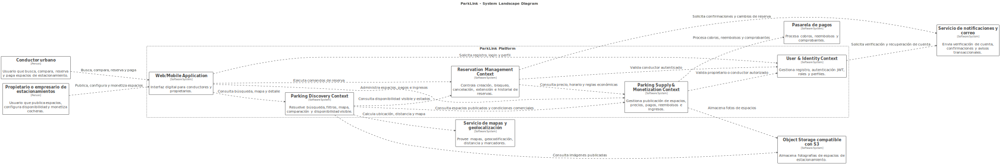

En el paisaje del sistema, ParkLink se ubica como el sistema que coordina la relación entre demanda y oferta de estacionamientos. La integración con el servicio de mapas y geolocalización sustenta las historias US01, US02, US03 y US04, donde el conductor necesita visualizar espacios cercanos, disponibilidad, precio, horario, distancia y valoración. La pasarela de pagos sustenta US14, US15 y US16, relacionadas con pago en línea, reembolsos y comprobantes. El servicio de notificaciones y correo sustenta EP06 y US20, además de flujos de verificación de cuenta. El object storage compatible con S3 se justifica por US04 y US09, donde los espacios requieren fotografías para ser publicados y evaluados por el conductor antes de reservar.

#### 4.1.3.2. Software Architecture Context Level Diagrams

Los diagramas de contexto muestran cada bounded context como una unidad funcional con propósito definido, actores, entradas, salidas, dependencias internas y sistemas externos relacionados. Esta separación permite defender la arquitectura desde DDD estratégico: cada contexto encapsula reglas propias y evita que conceptos como usuario, disponibilidad, reserva, espacio, pago o ingreso sean mezclados sin control.

##### User & Identity Context

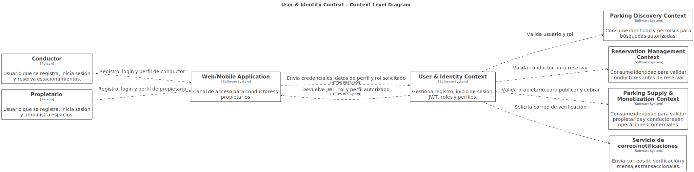

| Aspecto | Descripción |
|---|---|
| Propósito | Gestionar registro, inicio de sesión, autenticación JWT, roles y perfiles de conductor y propietario. |
| Actores | Conductores y propietarios. |
| Contextos relacionados | Parking Discovery, Reservation Management y Parking Supply & Monetization consumen identidad, rol y permisos. |
| Sistemas externos | Servicio de correo/notificaciones para verificación de cuenta y mensajes transaccionales. |
| Entradas principales | Datos de registro, credenciales de inicio de sesión, selección de rol, datos de perfil de conductor o propietario. |
| Salidas principales | JWT, usuario autenticado, perfil autorizado, rol de conductor o propietario, eventos de verificación de cuenta. |
| Responsabilidad dentro del dominio | Proteger el acceso a funcionalidades y evitar que usuarios sin rol válido ejecuten acciones de reserva, publicación o monetización. |

Este contexto se separa porque la identidad es una capacidad transversal y genérica. No debe contener reglas de disponibilidad, reserva, precio o pago; su responsabilidad es autenticar, autorizar y proveer información confiable de usuario a los demás contextos.

##### Parking Discovery Context

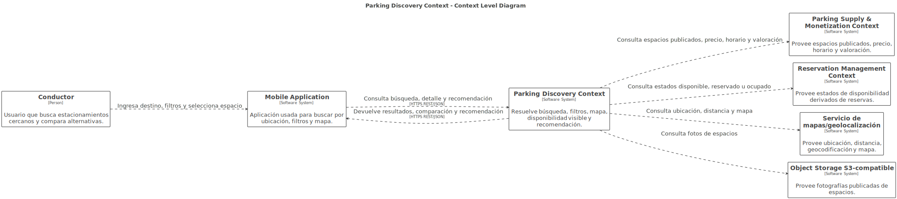

| Aspecto | Descripción |
|---|---|
| Propósito | Permitir búsqueda de estacionamientos, visualización en mapa, disponibilidad visible, comparación por precio, distancia, horario y valoración, y recomendación de la opción más conveniente. |
| Actores | Conductores. |
| Contextos relacionados | Consulta espacios publicados en Parking Supply & Monetization y estados de reserva en Reservation Management. |
| Sistemas externos | Servicio de mapas/geolocalización y object storage para imágenes. |
| Entradas principales | Destino, ubicación del conductor, filtros de precio, horario, distancia, selección de espacio. |
| Salidas principales | Listado de espacios, marcadores de mapa, detalle del espacio, disponibilidad visible, recomendación de alternativa conveniente. |
| Responsabilidad dentro del dominio | Convertir la oferta publicada y la disponibilidad de reservas en información útil para que el conductor tome una decisión informada. |

Este contexto se separa porque sus reglas son principalmente de consulta, presentación y comparación. No debe confirmar reservas ni cobrar pagos. Esa separación evita que una búsqueda en mapa modifique accidentalmente el estado real de un espacio.

##### Reservation Management Context

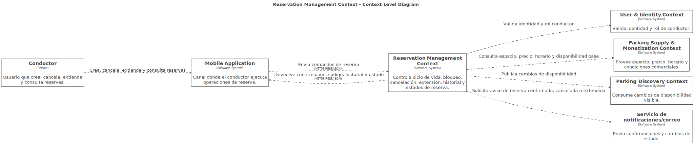

| Aspecto | Descripción |
|---|---|
| Propósito | Controlar el ciclo de vida de la reserva: creación, bloqueo de espacio, cancelación, extensión, historial y estados. |
| Actores | Conductores; propietarios como receptores de reservas recibidas mediante el contexto de supply. |
| Contextos relacionados | User & Identity para validar usuarios, Parking Supply & Monetization para datos de espacio y reglas económicas, Parking Discovery para publicar cambios de disponibilidad. |
| Sistemas externos | Servicio de notificaciones/correo para confirmaciones y cambios de estado. |
| Entradas principales | Espacio seleccionado, fecha, hora de inicio, duración, solicitud de cancelación, solicitud de extensión. |
| Salidas principales | Reserva confirmada, código de confirmación, espacio bloqueado, reserva cancelada, reserva extendida, historial de reservas. |
| Responsabilidad dentro del dominio | Garantizar consistencia operacional y evitar sobre-reservas mediante reglas transaccionales sobre el estado de cada reserva. |

Este contexto se separa porque representa el Core Domain. La reserva tiene reglas de consistencia más estrictas que la búsqueda o la publicación: debe bloquear un espacio, controlar estados y coordinar cambios sin depender de vistas cacheadas. Mezclar esta lógica con búsqueda o pagos aumentaría el riesgo de sobreventa, cancelaciones incorrectas o extensiones inconsistentes.

##### Parking Supply & Monetization Context

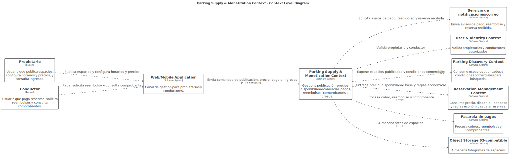

| Aspecto | Descripción |
|---|---|
| Propósito | Gestionar publicación de espacios, horarios, precios, habilitación/deshabilitación, reservas recibidas por propietarios, ingresos, pagos, reembolsos y comprobantes. |
| Actores | Propietarios o empresarios de estacionamientos y conductores cuando realizan pagos o consultan comprobantes. |
| Contextos relacionados | User & Identity para roles, Parking Discovery para visibilidad de espacios, Reservation Management para precio, reserva activa, cancelaciones y extensión. |
| Sistemas externos | Pasarela de pagos, object storage compatible con S3 y servicio de notificaciones/correo. |
| Entradas principales | Datos del espacio, fotos, dirección, precio por hora, horario disponible, cambio de estado, solicitud de pago, cancelación con reembolso, consulta de ingresos. |
| Salidas principales | Espacio publicado, espacio oculto, precio vigente, comprobante, reembolso, historial de ingresos, notificación al propietario. |
| Responsabilidad dentro del dominio | Administrar la oferta monetizable de estacionamientos y las reglas económicas asociadas al cobro, reembolso e ingreso del propietario. |

Este contexto se separa porque combina reglas de oferta y monetización que pertenecen al propietario y al flujo financiero. Aunque se comunica con Reservation Management, no debe decidir el ciclo de vida completo de una reserva; su responsabilidad es proveer condiciones comerciales, procesar pagos y registrar ingresos.

#### 4.1.3.3. Software Architecture Container Level Diagrams

El Container Level Diagram muestra cómo los productos digitales y servicios técnicos soportan los bounded contexts. La arquitectura puede implementarse inicialmente como backend modular con módulos alineados a los contextos, manteniendo la posibilidad de extraerlos como microservicios si el crecimiento del producto lo requiere.

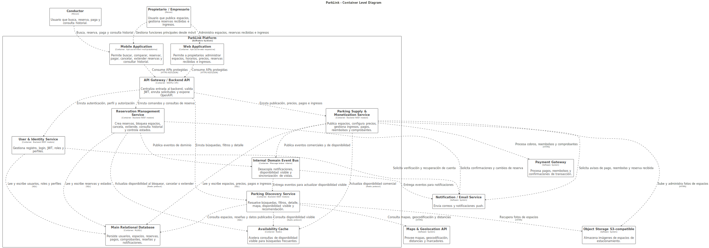

| Contenedor | Responsabilidad | Tecnología sugerida | Comunicación | Bounded context soportado |
|---|---|---|---|---|
| Mobile Application | Permitir a conductores buscar, comparar, reservar, pagar, cancelar, extender reservas y consultar historial; también permite a propietarios gestionar funciones principales desde móvil si el flujo lo requiere. | Aplicación móvil multiplataforma permitida por la guía del curso. | Consume API Gateway mediante HTTPS REST/JSON; usa GPS del dispositivo para búsquedas por ubicación. | User & Identity, Parking Discovery, Reservation Management, Parking Supply & Monetization. |
| Web Application | Permitir a propietarios o empresarios administrar espacios, horarios, precios, reservas recibidas e ingresos desde una interfaz más adecuada para gestión. | Aplicación web responsive con HTML, CSS, JavaScript o framework web compatible con el stack del equipo. | Consume API Gateway mediante HTTPS REST/JSON. | User & Identity, Parking Supply & Monetization, Reservation Management. |
| API Gateway / Backend API | Centralizar entrada al backend, validar tokens JWT, enrutar solicitudes a módulos por bounded context y exponer documentación OpenAPI. | RESTful API; Node.js/Express.js o framework REST equivalente permitido por la guía. | Recibe HTTPS desde aplicaciones cliente; enruta a servicios internos. | Transversal a los cuatro bounded contexts. |
| User & Identity Service | Gestionar registro, login, JWT, roles, perfiles de conductor y propietario. | Módulo backend REST con hashing seguro de contraseñas y JWT. | Lee/escribe en base de datos; envía correos de verificación; provee identidad a otros módulos. | User & Identity Context. |
| Parking Discovery Service | Resolver búsquedas, filtros, detalle, disponibilidad visible, mapa y recomendación de estacionamientos. | Módulo backend REST optimizado para consultas e integración con mapas. | Consulta base de datos, cache de disponibilidad, Maps API y object storage. | Parking Discovery Context. |
| Reservation Management Service | Crear reservas, bloquear espacios, cancelar, extender, consultar historial y controlar estados de reserva. | Módulo backend REST con reglas transaccionales y validaciones de concurrencia. | Lee/escribe en base de datos; actualiza cache; emite eventos; solicita notificaciones. | Reservation Management Context. |
| Parking Supply & Monetization Service | Publicar espacios, configurar horarios y precios, habilitar/deshabilitar disponibilidad, gestionar reservas recibidas, ingresos, pagos, reembolsos y comprobantes. | Módulo backend REST con integración a pasarela de pagos y object storage. | Lee/escribe en base de datos; se integra con Payment Gateway, object storage y notificaciones. | Parking Supply & Monetization Context. |
| Main Relational Database | Persistir usuarios, perfiles, espacios, disponibilidad base, reservas, pagos, comprobantes, reseñas y notificaciones. | MySQL, coherente con la justificación relacional del informe. | Accedida únicamente por servicios backend; cada contexto mantiene propiedad lógica de sus datos. | Soporte persistente para los cuatro bounded contexts. |
| Availability Cache | Acelerar consultas de disponibilidad visible y reducir carga sobre la base de datos en búsquedas frecuentes. | Redis. | Actualizada por Reservation Management y Supply; consultada por Parking Discovery. | Parking Discovery y Reservation Management. |
| Internal Domain Event Bus | Desacoplar efectos secundarios como notificaciones, actualización de disponibilidad visible y sincronización de vistas. | Bus de eventos interno o message broker según evolución del despliegue. | Recibe eventos desde servicios de dominio y los entrega a consumidores internos. | Principalmente Reservation Management, Parking Discovery y Parking Supply & Monetization. |
| Object Storage S3-compatible | Almacenar imágenes de espacios de estacionamiento publicadas por propietarios. | Servicio compatible con S3. | Supply sube imágenes; Discovery recupera imágenes para detalle de espacios. | Parking Supply & Monetization y Parking Discovery. |
| Payment Gateway | Procesar pagos en línea, reembolsos y confirmación de transacciones. | Stripe, MercadoPago o proveedor equivalente. | Integración HTTPS desde Parking Supply & Monetization. | Parking Supply & Monetization. |
| Maps & Geolocation API | Proveer mapas, geocodificación, distancias y visualización de marcadores. | Google Maps Platform o proveedor equivalente. | Consultado por Parking Discovery. | Parking Discovery Context. |
| Notification / Email Service | Enviar correos y notificaciones push sobre verificación de cuenta, confirmación de reserva, cancelación, reembolso y reserva recibida. | Firebase Cloud Messaging y servicio SMTP/SendGrid. | Recibe solicitudes o eventos desde Identity, Reservation y Supply. | User & Identity, Reservation Management, Parking Supply & Monetization. |

Esta estructura soporta las user stories principales del backlog. US01 a US04 se resuelven mediante Mobile Application, API Gateway, Parking Discovery Service, Maps API, cache de disponibilidad y object storage. US05 a US08 se resuelven mediante Reservation Management Service, base de datos relacional, cache y eventos de notificación. US09 a US13 se resuelven mediante Parking Supply & Monetization Service, Web/Mobile Application, object storage y base de datos. US14 a US16 se resuelven mediante la integración entre Parking Supply & Monetization Service y Payment Gateway. US17 a US19 se resuelven mediante User & Identity Service con JWT y roles. US20 se resuelve mediante eventos de reserva confirmada y el servicio de notificaciones/correo.

La base de datos relacional se mantiene como fuente de verdad para reservas y pagos porque estas operaciones requieren consistencia fuerte. La cache no reemplaza esa fuente de verdad; solo acelera la lectura de disponibilidad para el conductor. Esta decisión es clave: una disponibilidad mostrada en el mapa no equivale a una reserva confirmada hasta que el Reservation Management Context haya bloqueado el espacio y registrado el estado correspondiente.

### 4.1.4. Approach Driven ViewPoints Diagrams

Los ViewPoints Diagrams complementan los diagramas C4 mostrando la arquitectura de ParkLink desde cuatro perspectivas distintas, cada una orientada a un stakeholder específico. Esta representación permite defender decisiones arquitectónicas frente a preocupaciones concretas como rendimiento, seguridad, escalabilidad y mantenibilidad.

---

#### ViewPoint 1: Functional Viewpoint — Flujo de Reserva End-to-End

**Stakeholder:** Conductor urbano
**Driver:** US05, US14, QAS-02, AC-02
**Preocupación:** ¿Cómo garantiza el sistema que mi reserva es confirmada sin duplicados y con pago procesado correctamente?

Este viewpoint muestra el flujo funcional completo desde que el conductor selecciona un espacio hasta que recibe confirmación de reserva y pago. La decisión arquitectónica central es la separación entre disponibilidad visible (Redis) y disponibilidad confirmable (MySQL con bloqueo transaccional), que previene la doble reserva bajo concurrencia.

<table>
  <thead>
    <tr>
      <th>Paso</th>
      <th>Actor / Componente</th>
      <th>Acción</th>
      <th>Decisión arquitectónica aplicada</th>
    </tr>
  </thead>
  <tbody>
    <tr>
      <td>1</td>
      <td>Conductor → Parking Discovery Service</td>
      <td>Busca espacios cercanos con precio, horario y distancia</td>
      <td>CQRS ligero: lectura desde Redis Cache sin tocar MySQL</td>
    </tr>
    <tr>
      <td>2</td>
      <td>Conductor → API Gateway</td>
      <td>Confirma reserva sobre un espacio seleccionado</td>
      <td>JWT validado en API Gateway; rol DRIVER verificado</td>
    </tr>
    <tr>
      <td>3</td>
      <td>API Gateway → Reservation Service</td>
      <td>Enruta solicitud al Core Domain</td>
      <td>Routing centralizado; sin lógica de negocio en el gateway</td>
    </tr>
    <tr>
      <td>4</td>
      <td>Reservation Service → MySQL</td>
      <td>Abre transacción ACID y bloquea disponibilidad con SELECT FOR UPDATE</td>
      <td>Locking pesimista; previene doble reserva bajo concurrencia</td>
    </tr>
    <tr>
      <td>5</td>
      <td>Reservation Service → Event Bus</td>
      <td>Persiste reserva en estado PendingPayment y emite ReservationPaymentRequested</td>
      <td>Estado intermedio desacopla reserva de confirmación de pago</td>
    </tr>
    <tr>
      <td>6</td>
      <td>Payment Service → Stripe Adapter → Stripe</td>
      <td>Procesa cobro con Idempotency-Key</td>
      <td>Idempotency Key Pattern; reintentos de red no generan doble cargo</td>
    </tr>
    <tr>
      <td>7</td>
      <td>Payment Service → Event Bus</td>
      <td>Emite PaymentSucceeded tras confirmación del proveedor</td>
      <td>Event-Driven; la operación principal no espera notificación</td>
    </tr>
    <tr>
      <td>8</td>
      <td>Event Bus → Availability Cache + Notification Worker</td>
      <td>Actualiza Redis e informa al conductor</td>
      <td>Cache-Aside Invalidation; consistencia eventual en la proyección de lectura</td>
    </tr>
  </tbody>
</table>

---

#### ViewPoint 2: Security Viewpoint — Autenticación, Autorización y Protección de Datos

**Stakeholder:** Equipo de desarrollo y usuarios de la plataforma
**Driver:** QAS-04, C-06, AC-05
**Preocupación:** ¿Cómo protege el sistema las credenciales, los pagos y el acceso a recursos propios de cada usuario?

Este viewpoint muestra las capas de seguridad aplicadas de forma transversal en ParkLink. La seguridad no es una capa añadida a posteriori sino un principio integrado desde el diseño de cada endpoint y operación crítica (P-04).

<table>
  <thead>
    <tr>
      <th>Capa</th>
      <th>Mecanismo</th>
      <th>Alcance</th>
      <th>ADR relacionado</th>
    </tr>
  </thead>
  <tbody>
    <tr>
      <td><b>Transporte</b></td>
      <td>HTTPS obligatorio en todo el tráfico externo</td>
      <td>Todas las comunicaciones cliente-servidor y con proveedores externos</td>
      <td>ADR-102</td>
    </tr>
    <tr>
      <td><b>Autenticación</b></td>
      <td>JWT stateless emitido por User & Identity Service con claim de rol (DRIVER / OWNER)</td>
      <td>Todos los endpoints protegidos; verificable por cualquier módulo sin consultar BD</td>
      <td>ADR-103</td>
    </tr>
    <tr>
      <td><b>Autorización</b></td>
      <td>Role-Based Access Control (RBAC) en API Gateway + Ownership checks en cada servicio</td>
      <td>Operaciones de reserva, gestión de espacios y pagos; un usuario no puede operar recursos ajenos</td>
      <td>ADR-206</td>
    </tr>
    <tr>
      <td><b>Contraseñas</b></td>
      <td>Hashing con bcrypt; nunca almacenadas en texto plano</td>
      <td>Registro y login de conductores y propietarios</td>
      <td>ADR-103</td>
    </tr>
    <tr>
      <td><b>Datos de pago</b></td>
      <td>Procesados exclusivamente por pasarela externa; ParkLink no almacena datos de tarjeta</td>
      <td>Flujo completo de cobro, reembolso y comprobante</td>
      <td>ADR-301, C-06</td>
    </tr>
    <tr>
      <td><b>Media (fotos)</b></td>
      <td>Bucket S3 privado; acceso solo mediante pre-signed URLs con TTL de 15 minutos emitidas por backend</td>
      <td>Subida y descarga de imágenes de espacios de estacionamiento</td>
      <td>ADR-303</td>
    </tr>
    <tr>
      <td><b>Webhooks</b></td>
      <td>Verificación de firma HMAC SHA-256 antes de procesar cualquier evento del proveedor de pagos</td>
      <td>Endpoint POST /payments/webhook; descarta eventos no firmados o duplicados</td>
      <td>ADR-302</td>
    </tr>
  </tbody>
</table>

---

#### ViewPoint 3: Performance & Scalability Viewpoint — Búsqueda Rápida y Crecimiento

**Stakeholder:** Equipo de producto y negocio
**Driver:** QAS-01, QAS-06, AC-03, AC-07
**Preocupación:** ¿Puede el sistema responder búsquedas en menos de 3 segundos y soportar el crecimiento de usuarios sin degradación?

Este viewpoint muestra las decisiones que optimizan el rendimiento actual y habilitan el crecimiento futuro sin reescribir la arquitectura base. El objetivo es que la escalabilidad sea una consecuencia del diseño modular, no un esfuerzo extraordinario posterior.

<table>
  <thead>
    <tr>
      <th>Decisión arquitectónica</th>
      <th>Impacto en rendimiento</th>
      <th>Impacto en escalabilidad</th>
      <th>ADR relacionado</th>
    </tr>
  </thead>
  <tbody>
    <tr>
      <td>Redis como proyección de disponibilidad visible</td>
      <td>Búsquedas responden sin consultar MySQL; latencia sub-milisegundo en lecturas de cache</td>
      <td>Cache puede replicarse horizontalmente sin afectar la fuente de verdad</td>
      <td>ADR-104, ADR-204</td>
    </tr>
    <tr>
      <td>Índices en space_id, start_datetime, end_datetime y status en RESERVATIONS</td>
      <td>Validación de solapamientos en milisegundos incluso con alto volumen de reservas</td>
      <td>Los índices mantienen su eficiencia al crecer el volumen de datos con una buena estrategia de partición</td>
      <td>ADR-207</td>
    </tr>
    <tr>
      <td>CQRS ligero: lecturas desde cache, escrituras en MySQL</td>
      <td>Desacopla la carga de lectura frecuente de la carga transaccional de comandos</td>
      <td>Read replicas pueden añadirse al modelo de lectura sin cambiar el dominio transaccional</td>
      <td>ADR-104</td>
    </tr>
    <tr>
      <td>Bounded contexts con módulos independientes</td>
      <td>Sin impacto directo en rendimiento actual del MVP</td>
      <td>Cada contexto puede extraerse como microservicio con escalado independiente cuando el volumen lo justifique</td>
      <td>ADR-101</td>
    </tr>
    <tr>
      <td>Circuit Breaker en proveedores externos</td>
      <td>Evita que una llamada lenta a Stripe o Google Maps bloquee hilos de operaciones no relacionadas</td>
      <td>Protege la plataforma ante degradación de terceros sin añadir capacidad de cómputo</td>
      <td>ADR-305</td>
    </tr>
    <tr>
      <td>Notificaciones asíncronas vía Event Bus</td>
      <td>La confirmación de reserva no espera el envío del correo o push; el usuario recibe respuesta inmediata</td>
      <td>El Notification Worker puede escalar de forma independiente al resto del sistema</td>
      <td>ADR-306</td>
    </tr>
  </tbody>
</table>

---

#### ViewPoint 4: Maintainability Viewpoint — Evolución y Mantenimiento del Sistema

**Stakeholder:** Equipo de desarrollo
**Driver:** QAS-07, AC-08, C-07
**Preocupación:** ¿Cómo puede el equipo añadir nuevas funcionalidades, cambiar proveedores o corregir errores sin afectar el resto del sistema?

Este viewpoint muestra cómo la arquitectura facilita el cambio controlado. El principio P-05 de desacoplamiento de proveedores y el P-08 de modularidad orientada al crecimiento son los que más directamente responden a esta preocupación.

<table>
  <thead>
    <tr>
      <th>Escenario de cambio</th>
      <th>Módulos afectados</th>
      <th>Mecanismo de aislamiento</th>
      <th>ADR relacionado</th>
    </tr>
  </thead>
  <tbody>
    <tr>
      <td>Cambiar de Stripe a MercadoPago como pasarela de pagos</td>
      <td>Solo StripeAdapter → nueva implementación MercadoPagoAdapter</td>
      <td>Adapter Pattern; el dominio depende de la interfaz PaymentProvider, no del SDK concreto</td>
      <td>ADR-307</td>
    </tr>
    <tr>
      <td>Añadir nuevo canal de notificación (ej. SMS)</td>
      <td>Nuevo SMSAdapter + registro en RoutingPolicy del Notification Worker</td>
      <td>Adapter Pattern + Open/Closed Principle; no se modifica lógica existente</td>
      <td>ADR-307</td>
    </tr>
    <tr>
      <td>Cambiar proveedor de mapas (ej. Google Maps → Mapbox)</td>
      <td>Solo MapsAdapter → nueva implementación</td>
      <td>Interfaz GeoLocationProvider desacopla al dominio del SDK de Google Maps</td>
      <td>ADR-107</td>
    </tr>
    <tr>
      <td>Añadir nueva regla de cancelación o extensión</td>
      <td>AvailabilityPolicy dentro de Reservation Management Context</td>
      <td>Política encapsulada en su bounded context; no afecta Discovery ni Supply & Monetization</td>
      <td>ADR-101, ADR-202</td>
    </tr>
    <tr>
      <td>Extraer Reservation Management como microservicio independiente</td>
      <td>Solo el módulo de reservas y su esquema de base de datos</td>
      <td>Bounded context ya tiene interfaces, repositorios y eventos de dominio bien definidos</td>
      <td>ADR-101</td>
    </tr>
    <tr>
      <td>Añadir nueva épica de funcionalidad (ej. suscripciones premium)</td>
      <td>Nuevo bounded context o extensión de Parking Supply & Monetization</td>
      <td>La separación de contextos evita modificar el Core Domain de reservas</td>
      <td>ADR-101</td>
    </tr>
    <tr>
      <td>Investigar un incidente en una transacción financiera</td>
      <td>Solo consulta a la tabla audit_events y correlación por X-Correlation-Id</td>
      <td>Audit log append-only + Correlation IDs propagados en todos los servicios</td>
      <td>ADR-304, ADR-308</td>
    </tr>
  </tbody>
</table>

---

### 4.1.5 Relational / Non-Relational Database Diagram

#### Justificación del modelo relacional

Los datos de ParkLink tienen una estructura bien definida y relaciones claras:

> reservas → espacios → usuarios → pagos

- ✅ MySQL es compatible con Node.js/Express.js y soporta claves foráneas.
- ✅ El negocio requiere consistencia **ACID** (reservas, pagos, cancelaciones).
- ✅ Las consultas (filtros por ubicación, precio, horario) se optimizan con **índices y JOINs**.

---

#### Diagrama Entidad-Relación

##### Descripción de Tablas

| Tabla | Propósito | Columnas clave |
|------|----------|---------------|
| **USERS** | Perfil de usuario | user_id (PK), name, email, password_hash, role, phone, created_at |
| **PARKING_SPACES** | Espacios registrados | space_id (PK), owner_id (FK), address, latitude, longitude, price_per_hour, status |
| **AVAILABILITY** | Horarios disponibles | availability_id (PK), space_id (FK), day_of_week, start_time, end_time |
| **RESERVATIONS** | Reservas realizadas | reservation_id (PK), driver_id (FK), space_id (FK), start_datetime, end_datetime, status, total_amount |
| **PAYMENTS** | Pagos | payment_id (PK), reservation_id (FK), amount, method, status, transaction_date |
| **REVIEWS** | Reseñas | review_id (PK), reservation_id (FK), driver_id (FK), rating, comment |
| **NOTIFICATIONS** | Notificaciones | notification_id (PK), user_id (FK), type, message, is_read, sent_at |

### 4.1.6 Design Patterns

| ID | Patrón | Categoría | Uso |
|----|--------|----------|-----|
| DP-01 | Repository | Acceso a datos | Abstrae MySQL y facilita testing |
| DP-02 | Observer / Event Bus | Comportamental | Manejo de eventos desacoplados |
| DP-03 | Strategy | Comportamental | Métodos de pago intercambiables |
| DP-04 | Chain of Responsibility | Comportamental | Validación paso a paso |
| DP-05 | Singleton | Creacional | Instancia única de servicios |
| DP-06 | Factory Method | Creacional | Creación de notificaciones |
| DP-07 | Command | Comportamental | Encapsulación de reservas |
| DP-08 | Decorator | Estructural | Añade funcionalidades dinámicas |
| DP-09 | CQRS | Arquitectural | Separación lectura/escritura |
| DP-10 | State | Comportamental | Estados de reservas |

### 4.1.7 Tactics

_Pendiente de completar._

---

## 4.2. Architectural Drivers

Los **Architectural Drivers** de **ParkLink** representan los requerimientos funcionales clave, atributos de calidad, restricciones y preocupaciones arquitectónicas que influyen directamente en el diseño de la solución.

ParkLink busca resolver el problema de la dificultad para encontrar estacionamiento en entornos urbanos, conectando a **conductores** que necesitan reservar espacios con **propietarios** que desean monetizar sus cocheras. A nivel arquitectónico, esto exige una solución que soporte:

- búsqueda de espacios en tiempo real,
- gestión de disponibilidad,
- reservas confiables,
- pagos seguros,
- roles diferenciados,
- y notificaciones oportunas.
  
### 4.1.8. Design Purpose

El propósito de diseño de **ParkLink** es definir una arquitectura de software que soporte de manera eficiente, segura y escalable la **búsqueda, reserva, publicación, administración y monetización de espacios de estacionamiento**.

La solución debe permitir:

- a los **conductores**, buscar y reservar estacionamientos disponibles;
- a los **propietarios**, publicar, configurar y gestionar sus espacios;
- al sistema, procesar pagos, cancelaciones, reembolsos y notificaciones;
- y a la plataforma, crecer de forma modular y mantenible.

### Tabla: Design Purpose de ParkLink

| Elemento | Descripción |
|---|---|
| **Propósito del negocio** | Reducir el tiempo de búsqueda de estacionamiento y monetizar espacios subutilizados. |
| **Propósito del sistema** | Proveer una plataforma digital para búsqueda, reserva, publicación, administración y pago de estacionamientos. |
| **Stakeholders principales** | Conductores, propietarios de estacionamientos, administradores del sistema y servicios externos. |
| **Valor esperado** | Mejorar la movilidad urbana, reducir estrés y tiempo perdido, y generar ingresos para propietarios. |
| **Implicancia arquitectónica** | Se requiere modularidad, seguridad, integridad transaccional, buena experiencia de usuario y capacidad de escalamiento. |

---

### 4.1.9. Primary Functionality (Primary User Stories)


La funcionalidad primaria de ParkLink se deriva de las **user stories** más importantes del backlog, especialmente aquellas que soportan la propuesta de valor principal del sistema.

### Tabla: Primary User Stories de ParkLink

| Prioridad | User Story ID | Título | Actor | Relevancia arquitectónica |
|---|---|---|---|---|
| 1 | **US01** | Buscar estacionamientos por ubicación | Conductor | Requiere geolocalización, búsquedas rápidas y consulta de espacios disponibles. |
| 2 | **US02** | Ver disponibilidad en tiempo real | Conductor | Exige consistencia y actualización de estados de espacios. |
| 3 | **US05** | Reservar un espacio de estacionamiento | Conductor | Requiere validación, bloqueo de espacio y control de concurrencia. |
| 4 | **US14** | Pagar una reserva en línea | Conductor | Exige integración con pasarela de pago y trazabilidad. |
| 5 | **US09** | Registrar un espacio de estacionamiento | Propietario | Requiere gestión estructurada de espacios y datos del propietario. |
| 6 | **US10** | Configurar horarios y precio del espacio | Propietario | Obliga a definir disponibilidad configurable y reglas de monetización. |
| 7 | **US11** | Habilitar y deshabilitar un espacio | Propietario | Requiere actualización inmediata de estado y sincronización con las búsquedas. |
| 8 | **US12** | Ver reservas activas de mi espacio | Propietario | Necesita panel de gestión y visualización clara de reservas. |
| 9 | **US15** | Recibir reembolso por cancelación | Conductor | Requiere consistencia en la lógica de pagos y cancelaciones. |
| 10 | **US20** | Recibir notificación de reserva confirmada | Conductor | Exige un módulo desacoplado de notificaciones. |

### Funcionalidades primarias agrupadas

#### 1. Búsqueda y descubrimiento de estacionamientos

- Buscar estacionamientos por ubicación.
- Ver disponibilidad en tiempo real.
- Filtrar por precio y horario.
- Ver el detalle completo de un espacio.

#### 2. Reserva y gestión de reservas

- Reservar un espacio.
- Cancelar una reserva.
- Ver historial de reservas.
- Extender tiempo de reserva activa.

#### 3. Publicación y gestión de espacios

- Registrar un espacio.
- Configurar horarios y precio.
- Habilitar/deshabilitar disponibilidad.
- Ver reservas activas.
- Ver historial de ingresos.

#### 4. Pagos y monetización

- Pagar una reserva en línea.
- Recibir reembolso por cancelación.
- Ver comprobantes de pago.

#### 5. Gestión de usuarios y acceso

- Registrarse como conductor.
- Registrarse como propietario.
- Iniciar sesión.

#### 6. Notificaciones

- Recibir confirmación de reserva y eventos asociados.
---

### 4.1.10. Quality Attribute Scenarios

Los siguientes escenarios de atributos de calidad permiten definir el comportamiento esperado del sistema desde una perspectiva no funcional.

### Tabla: Quality Attribute Scenarios

| ID | Atributo | Fuente | Estímulo | Entorno | Artefacto | Respuesta esperada | Métrica |
|---|---|---|---|---|---|---|---|
| **QAS-01** | Performance | Conductor | Busca estacionamientos por ubicación | Operación normal | Servicio de búsqueda | El sistema muestra resultados cercanos con precio, horario y distancia. | 95% de búsquedas en **≤ 3 segundos**. |
| **QAS-02** | Performance / Consistency | Conductor | Intenta reservar un espacio disponible | Alta concurrencia | Servicio de reservas | El sistema valida disponibilidad y confirma la reserva sin duplicidad. | Confirmación en **≤ 5 segundos** y **0 dobles reservas**. |
| **QAS-03** | Availability | Usuario | Se presenta una falla parcial del sistema | Producción | Plataforma general | El sistema recupera servicios críticos y mantiene continuidad operativa. | Disponibilidad mensual de **99.5%**. |
| **QAS-04** | Security | Usuario / atacante | Intenta acceder a datos o transacciones sin autorización | Producción | Servicios de autenticación y pagos | El sistema protege credenciales, roles y transacciones. | 100% tráfico bajo **HTTPS**, contraseñas cifradas. |
| **QAS-05** | Usability | Propietario | Registra un nuevo espacio | Operación normal | Módulo de publicación | El sistema guía al usuario de forma sencilla y clara. | Registro exitoso en **≤ 10 minutos**. |
| **QAS-06** | Scalability | Negocio | Aumenta la cantidad de usuarios y reservas | Crecimiento de demanda | Arquitectura del sistema | El sistema mantiene un desempeño aceptable al escalar. | Soportar crecimiento sin degradación crítica. |
| **QAS-07** | Modifiability | Equipo de desarrollo | Se necesita integrar otra pasarela de pago o canal de notificación | Evolución del sistema | Módulos de integración | El cambio puede implementarse con bajo impacto en el resto del sistema. | Afectar como máximo **1 o 2 módulos principales**. |
| **QAS-08** | Interoperability | Servicio externo | Se conecta un servicio de mapas o pagos | Producción | Adaptadores e integraciones | El sistema intercambia información correctamente con APIs externas. | Integración exitosa mediante **REST APIs**. |

### Atributos de calidad prioritarios

Los atributos más importantes para ParkLink son:

- **Performance**, por la necesidad de búsquedas y reservas rápidas.
- **Consistency**, para evitar reservas duplicadas.
- **Security**, debido al manejo de credenciales y pagos.
- **Availability**, porque el usuario necesita la plataforma cuando se moviliza.
- **Usability**, tanto para conductores como propietarios.
- **Modifiability**, para facilitar futuras mejoras e integraciones.
---

### 4.1.11. Constraints

Las restricciones delimitan las decisiones arquitectónicas y el alcance técnico de la solución.

### Tabla: Constraints de ParkLink

| ID | Tipo | Restricción | Implicancia arquitectónica |
|---|---|---|---|
| **C-01** | Negocio | La solución se enfoca en dos segmentos principales: conductores y propietarios. | La arquitectura debe manejar roles y permisos diferenciados. |
| **C-02** | Alcance | El MVP se centra en búsqueda, reserva, publicación de espacios, pagos y notificaciones. | Se priorizan módulos esenciales del dominio. |
| **C-03** | Dominio | El sistema debe evitar dobles reservas para un mismo espacio y horario. | Se requiere control transaccional y validación concurrente. |
| **C-04** | Técnico | Debe integrarse con servicios de mapas/geolocalización y pasarelas de pago. | Se necesitan adaptadores o capas de integración desacopladas. |
| **C-05** | Plataforma | La solución debe ser accesible desde web y dispositivos móviles. | Debe contemplarse arquitectura responsive o mobile-friendly. |
| **C-06** | Seguridad | No se deben almacenar datos sensibles de pago de forma insegura. | Es obligatorio usar pasarelas externas y buenas prácticas de protección. |
| **C-07** | Proyecto | El sistema se desarrolla en un contexto académico con tiempo y recursos limitados. | Se debe priorizar claridad, modularidad y foco en el MVP. |
| **C-08** | Evolución | La solución debe permitir crecimiento futuro hacia más usuarios y ubicaciones. | La arquitectura debe ser escalable y mantenible. |
| **C-09** | Arquitectura | El sistema debe mantener separación de responsabilidades por dominio. | Justifica el uso de bounded contexts. |
| **C-10** | Trazabilidad | Las operaciones críticas deben quedar registradas. | Requiere persistencia confiable y seguimiento de eventos de negocio. |

---

### 4.1.12. Architectural Concerns

Las preocupaciones arquitectónicas representan los aspectos que más importan a los stakeholders y que deben influir directamente en el diseño.

### Tabla: Architectural Concerns de ParkLink

| ID | Stakeholder | Concern | Descripción | Impacto arquitectónico |
|---|---|---|---|---|
| **AC-01** | Conductores | Disponibilidad real de espacios | Los usuarios necesitan confiar en la disponibilidad que ven en la app. | Exige sincronización y actualización confiable de estados. |
| **AC-02** | Conductores / Propietarios | Conflictos de reserva | No deben ocurrir reservas simultáneas sobre el mismo espacio. | Requiere validación fuerte y control de concurrencia. |
| **AC-03** | Conductores | Rapidez de búsqueda y reserva | El valor principal del producto es ahorrar tiempo. | Obliga a optimizar consultas, filtros y respuestas. |
| **AC-04** | Propietarios | Facilidad para publicar y administrar espacios | Si el proceso es complejo, el propietario no adoptará la plataforma. | Se necesita una interfaz simple y flujos claros. |
| **AC-05** | Todos los usuarios | Seguridad y confianza | Los usuarios deben confiar en el sistema para registrarse, reservar y pagar. | Requiere autenticación robusta, autorización por roles y pagos seguros. |
| **AC-06** | Startup | Integración con servicios externos | El sistema depende de mapas, pagos y posiblemente notificaciones push o correo. | La arquitectura debe desacoplar integraciones externas. |
| **AC-07** | Startup | Escalabilidad del producto | La plataforma debe crecer en número de usuarios y zonas disponibles. | Se favorece diseño modular y separación por contextos. |
| **AC-08** | Equipo de desarrollo | Mantenibilidad | La solución evolucionará con nuevas funcionalidades. | Es clave mantener bajo acoplamiento y alta cohesión. |
| **AC-09** | Negocio | Trazabilidad de operaciones | Reservas, cancelaciones, pagos y reembolsos deben quedar registrados. | Obliga a contar con persistencia clara e historial de operaciones. |
| **AC-10** | Usuario final | Experiencia móvil | Muchos usuarios accederán desde el celular mientras se movilizan. | Debe priorizarse la experiencia móvil y tiempos de respuesta bajos. |

### Concerns más críticos

Los concerns más críticos para ParkLink son:

1. **Exactitud de la disponibilidad de espacios**
2. **Prevención de doble reserva**
3. **Seguridad en autenticación y pagos**
4. **Rendimiento de búsqueda y reserva**
5. **Facilidad de uso para conductores y propietarios**
6. **Capacidad de crecimiento e integración**
---

## 4.3. ADD Iterations

El diseño arquitectónico de ParkLink se desarrolla aplicando el método **Attribute-Driven Design (ADD 3.0)** del SEI (Cervantes & Kazman, 2016). Se ejecutan **3 iteraciones** sucesivas, cada una refinando la arquitectura mediante la selección de drivers (functional requirements, quality attributes, constraints y architectural concerns) y la toma documentada de decisiones de diseño.

| Iteración | Nombre | Foco principal |
|---|---|---|
| 1 | Establish Overall System Structure | Reference architecture, módulos top-level y primary functionality |
| 2 | Address Critical Quality Attributes | Disponibilidad en tiempo real, seguridad y consistencia transaccional |
| 3 | External Integrations & Cross-Cutting Concerns | Pagos idempotentes, media segura, auditoría, resiliencia ante terceros |

Cada iteración produce un Architectural Design Backlog actualizado, un Iteration Goal explícito, decisiones de diseño documentadas (ADRs), vistas C4/UML refinadas y un análisis Kanban de drivers atendidos.

---

### 4.3.1. Iteration 1: Establish Overall System Structure

Esta iteración establece la estructura general del sistema ParkLink definiendo los módulos top-level, la referencia arquitectónica base y la distribución de responsabilidades entre bounded contexts. El foco está en tomar las decisiones fundacionales que condicionarán todas las iteraciones siguientes: qué contextos existen, cómo se comunican, dónde reside cada responsabilidad y cómo se protege el acceso. Sin esta base, los atributos de calidad críticos como consistencia, seguridad y rendimiento no tendrían un lugar concreto donde implementarse.

#### 4.3.1.1. Architectural Design Backlog

Esta iteración toma como entrada los drivers fundamentales que definen la estructura base del sistema. ParkLink no solo debe conectar conductores con propietarios; debe hacerlo sobre una arquitectura que tenga responsabilidades claras por dominio, un punto de acceso seguro y módulos que puedan evolucionar de forma independiente. Sin definir esta estructura primero, no es posible atacar atributos de calidad como rendimiento, consistencia o seguridad en iteraciones posteriores.

### Drivers que entran a la iteración

| Tipo | ID | Descripción | Estado pre-iteración |
|------|----|------------|----------------------|
| Primary Functionality | US01 | Buscar estacionamientos por ubicación | Backlog |
| Primary Functionality | US02 | Ver disponibilidad en tiempo real | Backlog |
| Primary Functionality | US05 | Reservar un espacio de estacionamiento | Backlog |
| Primary Functionality | US09 | Registrar un espacio de estacionamiento | Backlog |
| Primary Functionality | US14 | Pagar una reserva en línea | Backlog |
| Primary Functionality | US17 | Registrarse como conductor | Backlog |
| Primary Functionality | US18 | Registrarse como propietario | Backlog |
| Primary Functionality | US19 | Iniciar sesión | Backlog |
| Quality Attribute | QAS-01 | Performance: búsquedas respondidas en ≤ 3 segundos | Backlog |
| Quality Attribute | QAS-02 | Consistency: confirmación de reserva en ≤ 5 segundos sin dobles reservas | Backlog |
| Quality Attribute | QAS-04 | Security: autenticación, roles y tráfico bajo HTTPS | Backlog |
| Quality Attribute | QAS-06 | Scalability: arquitectura que soporte crecimiento sin degradación | Backlog |
| Constraint | C-01 | Roles diferenciados: conductor y propietario | Vigente |
| Constraint | C-02 | MVP centrado en búsqueda, reserva, publicación, pagos y notificaciones | Vigente |
| Constraint | C-09 | Separación de responsabilidades por dominio (bounded contexts) | Vigente |
| Architectural Concern | AC-07 | Escalabilidad modular del producto | Backlog |
| Architectural Concern | AC-08 | Mantenibilidad y bajo acoplamiento | Backlog |

#### 4.3.1.2. Establish Iteration Goal by Selecting Drivers

**Iteration Goal:** Establecer la estructura general del sistema ParkLink definiendo los módulos top-level, la referencia arquitectónica base y la distribución de responsabilidades entre bounded contexts, de modo que:

- El sistema cuente con una arquitectura modular alineada a DDD estratégico con bounded contexts explícitos.
- Exista un punto de entrada único al backend (API Gateway) que centralice routing, autenticación JWT y control de acceso por roles.
- Cada bounded context tenga responsabilidades claras y no comparta lógica de negocio con otros.
- La arquitectura soporte las funcionalidades primarias: búsqueda, reserva, publicación, pagos y gestión de usuarios.
- El diseño permita escalar módulos de forma independiente cuando el volumen lo justifique.

**Drivers primarios seleccionados:** US01, US05, US09, US17, US19, QAS-01, QAS-04, C-09.  

**Drivers secundarios:** US02, US14, US18, QAS-02, QAS-06, AC-07, AC-08.

#### 4.3.1.3. Choose One or More Elements of the System to Refine

Elementos a refinar dentro de la arquitectura en esta primera iteración

- **Sistema completo ParkLink** — definición de bounded contexts y sus responsabilidades.
- **API Gateway** — punto de entrada único, validación JWT y routing.
- **User & Identity Context** — registro, login, gestión de roles y generación de JWT.
- **Parking Discovery Context** — búsqueda, visualización en mapa, filtros y disponibilidad.
- **Reservation Management Context** — gestión del ciclo de vida de reservas (Core Domain).
- **Parking Supply & Monetization Context** — publicación de espacios, gestión de precios, pagos e ingresos.
- **Main Relational Database** — fuente de verdad para todos los bounded contexts.
- **Availability Cache** — mecanismo de lectura rápida para disponibilidad en búsquedas.

#### 4.3.1.4. Choose One or More Design Concepts That Satisfy the Selected Drivers

| Driver | Design Concept / Pattern | Justificación |
|--------|--------------------------|--------------|
| C-09 (bounded contexts) | Domain-Driven Design estratégico con 4 bounded contexts explícitos | Cada contexto encapsula sus reglas, evita mezclar disponibilidad, reserva, pago e identidad. |
| QAS-04 (seguridad) | JWT + API Gateway como único punto de entrada con validación de token y rol | Centraliza autenticación y evita que cada servicio repita la lógica de seguridad. |
| QAS-01 (performance búsqueda) | CQRS liviano + Redis cache para disponibilidad visible | Separa lecturas de escrituras; la cache acelera búsquedas sin cargar la BD transaccional. |
| QAS-02 (consistencia reserva) | Transacciones ACID en Reservation Management + bloqueo optimista | Previene dobles reservas bajo concurrencia sin sacrificar rendimiento general. |
| AC-07 (escalabilidad) | Arquitectura modular con separación por bounded context | Permite extraer módulos como microservicios cuando el volumen lo justifique. |
| AC-08 (mantenibilidad) | Repository Pattern + Layered Architecture por contexto | Abstrae acceso a datos y facilita testing y evolución independiente. |
| US17, US18, US19 (identidad) | Stateless authentication con JWT | Token portátil verificable por cualquier módulo sin consultar BD en cada request. |
| US01, US02 (búsqueda) | Adapter Pattern para Maps & Geolocation API | Desacopla el proveedor de mapas del dominio de búsqueda. |

#### 4.3.1.5. Instantiate Architectural Elements, Allocate Responsibilities, and Define Interfaces

| Componente | Responsabilidad | Interfaz pública |
|------------|----------------|------------------|
| `API Gateway` | Centralizar entrada al backend, validar JWT, enrutar por bounded context, rate limiting | Recibe todas las solicitudes HTTPS; enruta a servicios internos |
| `UserIdentityService` | Registro, login, emisión de JWT, gestión de roles y perfiles | `POST /auth/register`, `POST /auth/login`, `GET /users/{id}/profile` |
| `ParkingDiscoveryService` | Búsqueda de espacios, filtros, detalle, disponibilidad visible, mapa | `GET /spaces?lat&lng&radius`, `GET /spaces/{id}`, `GET /spaces/{id}/availability` |
| `ReservationService` | Crear, cancelar, extender reservas; consultar historial; bloquear espacio | `POST /reservations`, `DELETE /reservations/{id}`, `PATCH /reservations/{id}/extend`, `GET /reservations` |
| `ParkingSupplyService` | Publicar espacios, configurar horarios y precios, habilitar/deshabilitar, ver ingresos | `POST /spaces`, `PUT /spaces/{id}`, `PATCH /spaces/{id}/status`, `GET /spaces/{id}/earnings` |
| `PaymentService` | Procesar pagos, reembolsos y comprobantes | `POST /payments`, `POST /payments/{id}/refund`, `GET /payments/{id}/receipt` |
| `MainDatabase` | Persistir usuarios, espacios, reservas, pagos, reseñas y notificaciones | Accedida únicamente por servicios backend vía ORM/JDBC |
| `AvailabilityCache` | Acelerar consultas de disponibilidad visible para búsquedas frecuentes | Consultada por `ParkingDiscoveryService`; actualizada por `ReservationService` y `ParkingSupplyService` |
| `MapsAdapter` | Proveer geocodificación, distancias y marcadores de mapa | `resolveLocation(address)`, `getNearbySpaces(lat, lng, radius)` |

#### 4.3.1.6. Sketch Views (C4 & UML) and Record Design Decisions

Las vistas se modelan en Structurizr DSL, manteniendo coherencia con los diagramas C4. Cada bloque define un workspace independiente con su modelo y vistas asociadas.

##### 4.3.1.6.1. System Context View — ParkLink Overall Structure

Vista de contexto del sistema completo mostrando actores, sistemas externos y ParkLink como sistema central.


#### 4.3.1.6.2. Container View — Top-Level Modules

Vista de contenedores mostrando los módulos top-level de ParkLink y sus relaciones con sistemas externos.


#### 4.3.1.6.3. Dynamic View — Flujo de Registro e Inicio de Sesión

Modela el flujo end-to-end de registro de un conductor y su posterior inicio de sesión


#### 4.3.1.6.4. Dynamic View — Flujo de Búsqueda y Reserva

Modela el flujo completo desde que el conductor busca un espacio hasta que confirma la reserva, incluyendo el bloqueo del espacio y la actualización del cache.


#### 4.3.1.6.5. Class Diagram — Domain Model Core Bounded Contexts

Vista de clases del modelo de dominio de los bounded contexts principales.


## Design Decisions registradas (ADR-style)

| ADR | Decisión | Status | Driver | Razonamiento |
|-----|----------|--------|--------|--------------|
| `ADR-101` | Arquitectura modular con 4 bounded contexts: User & Identity, Parking Discovery, Reservation Management, Parking Supply & Monetization | Accepted | `C-09`, `AC-07` | Cada contexto encapsula sus reglas; permite evolución y despliegue independiente |
| `ADR-102` | API Gateway como único punto de entrada al backend con validación JWT centralizada | Accepted | `QAS-04`, `C-01` | Evita duplicar lógica de autenticación; centraliza rate limiting y routing |
| `ADR-103` | Autenticación stateless con JWT incluyendo claim de rol (`DRIVER` / `OWNER`) | Accepted | `QAS-04`, `US17`, `US18`, `US19` | Token portable verificable por cualquier módulo sin consultar BD en cada request |
| `ADR-104` | Redis como cache de disponibilidad visible; MySQL como fuente de verdad para reservas y pagos | Accepted | `QAS-01`, `QAS-02` | Cache acelera búsquedas sin comprometer consistencia transaccional del Core Domain |
| `ADR-105` | Reservation Management como Core Domain con transacciones ACID y bloqueo optimista para prevenir dobles reservas | Accepted | `QAS-02`, `AC-09` | La reserva es la propuesta de valor central; su consistencia no puede sacrificarse |
| `ADR-106` | Repository Pattern por bounded context para abstraer el acceso a MySQL | Accepted | `AC-08`, `C-09` | Facilita testing unitario y permite cambiar el motor de BD sin afectar el dominio |
| `ADR-107` | Adapter Pattern para Google Maps Platform; el dominio depende de interfaz `GeoLocationProvider`, no del SDK de Google | Accepted | `AC-08`, `C-INT` | Cambio de proveedor de mapas sin tocar lógica de búsqueda |

#### 4.3.1.7. Analysis of Current Design and Review Iteration Goal (Kanban Board)

| Driver | Status pre-iter | Status post-iter | Evidencia |
|--------|----------------|------------------|-----------|
| `US01` Búsqueda por ubicación | Backlog | Addressed | ParkingDiscoveryService + MapsAdapter + cache definidos |
| `US02` Disponibilidad en tiempo real | Backlog | Addressed | Redis cache actualizada por ReservationService y ParkingSupplyService |
| `US05` Reserva de espacio | Backlog | Addressed | ReservationService con ACID + bloqueo optimista (`ADR-105`) |
| `US09` Registro de espacio | Backlog | Addressed | ParkingSupplyService con ParkingSpace aggregate definido |
| `US17` Registro conductor | Backlog | Addressed | UserIdentityService + flujo completo en Dynamic View |
| `US18` Registro propietario | Backlog | Addressed | Mismo servicio con rol `OWNER` diferenciado |
| `US19` Inicio de sesión | Backlog | Addressed | JWT con claim de rol, `ADR-103` |
| `QAS-01` Performance búsqueda | Backlog | Addressed | Redis cache + CQRS liviano (`ADR-104`) |
| `QAS-02` Consistencia reserva | Backlog | Addressed | ACID + bloqueo optimista en Core Domain (`ADR-105`) |
| `QAS-04` Seguridad | Backlog | Addressed | API Gateway + JWT + HTTPS (`ADR-102`, `ADR-103`) |
| `QAS-06` Escalabilidad | Backlog | Partially addressed | Módulos separados por contexto; extracción a microservicios pendiente |
| `C-09` Separación por dominio | Vigente | Addressed | 4 bounded contexts con responsabilidades explícitas (`ADR-101`) |
| `AC-07` Escalabilidad modular | Backlog | Partially addressed | Estructura modular definida; falta estrategia de despliegue independiente |
| `AC-08` Mantenibilidad | Backlog | Addressed | Repository Pattern + Adapter Pattern por bounded context (`ADR-106`, `ADR-107`) |
| `US14` Pago en línea | Backlog | Partially addressed | PaymentService identificado en estructura; flujo completo en Iteration 2 |

**Iteration Goal:** Alcanzado todos los drivers primarios han sido atendidos. La estructura general del sistema queda definida con bounded contexts explícitos, API Gateway centralizado, autenticación JWT y separación entre cache y fuente de verdad.


---

### 4.3.2. Iteration 2: Address Critical Quality Attributes

Esta iteración refina la estructura general definida en Iteration 1 para atacar los riesgos arquitectónicos más sensibles del MVP: disponibilidad visible, prevención de doble reserva, seguridad de acceso y preparación del flujo de pago asociado a una reserva. El foco sigue estando dentro del núcleo transaccional de ParkLink; las integraciones externas completas se dejan para Iteration 3.

#### 4.3.2.1. Architectural Design Backlog

Esta iteración toma como entrada los drivers críticos que no pueden quedar como decisiones superficiales, porque afectan directamente la confianza operativa del producto. ParkLink no sólo debe mostrar estacionamientos; debe garantizar que la disponibilidad visible sea confiable, que una reserva no se duplique, que el acceso esté protegido por roles y que la búsqueda responda rápido mientras el usuario está en movimiento.

Drivers que entran a la iteración:

| Tipo | ID | Descripción | Estado pre-iteración |
|---|---|---|---|
| User Story | US01 | Buscar estacionamientos por ubicación | Backlog arquitectónico |
| User Story | US02 | Ver disponibilidad en tiempo real | Backlog arquitectónico |
| User Story | US05 | Reservar un espacio de estacionamiento | Backlog arquitectónico |
| User Story | US06 | Cancelar una reserva | Backlog arquitectónico |
| User Story | US08 | Extender tiempo de reserva activa | Backlog arquitectónico |
| User Story | US10 | Configurar horarios y precio del espacio | Backlog arquitectónico |
| User Story | US11 | Habilitar y deshabilitar un espacio | Backlog arquitectónico |
| User Story | US14 | Pagar una reserva en línea | Backlog arquitectónico parcial |
| Quality Attribute | QAS-01 | 95% de búsquedas respondidas en 3 segundos o menos | Backlog arquitectónico |
| Quality Attribute | QAS-02 | Confirmación de reserva en 5 segundos o menos y 0 dobles reservas | Backlog arquitectónico |
| Quality Attribute | QAS-03 | Disponibilidad mensual objetivo de 99.5% | Backlog arquitectónico |
| Quality Attribute | QAS-04 | Protección de credenciales, roles y transacciones | Backlog arquitectónico |
| Constraint | C-03 | El sistema debe evitar dobles reservas para el mismo espacio y horario | Vigente |
| Constraint | C-06 | No almacenar datos sensibles de pago de forma insegura | Vigente |
| Concern | AC-01 | Disponibilidad real de espacios | Backlog arquitectónico |
| Concern | AC-02 | Conflictos de reserva | Backlog arquitectónico |
| Concern | AC-03 | Rapidez de búsqueda y reserva | Backlog arquitectónico |
| Concern | AC-05 | Seguridad y confianza | Backlog arquitectónico |

El backlog se prioriza con base en riesgo arquitectónico. La doble reserva y la disponibilidad incorrecta tienen prioridad máxima porque rompen la promesa central del producto. La seguridad base también se atiende en esta iteración porque todos los flujos críticos dependen de identidad, autorización y separación de permisos entre conductor y propietario.

#### 4.3.2.2. Establish Iteration Goal by Selecting Drivers

**Iteration Goal:** refinar los elementos internos de ParkLink que soportan disponibilidad, reserva, seguridad y rendimiento, de modo que:

1. La búsqueda consulte una proyección rápida de disponibilidad sin tratar la cache como fuente de verdad.
2. La reserva sea confirmada sólo después de validar disponibilidad dentro de una transacción ACID.
3. No existan dobles reservas para el mismo espacio y rango horario.
4. Los cambios de horario, cancelación, extensión o deshabilitación de un espacio actualicen la disponibilidad visible.
5. Las operaciones críticas estén protegidas por autenticación JWT, autorización por rol y validaciones de ownership.
6. El ciclo de reserva quede preparado para el pago mediante un estado `PendingPayment`, sin acoplar todavía el dominio al proveedor externo.
7. El diseño mantenga bajo acoplamiento entre búsqueda, reserva, publicación, identidad y monetización.

**Drivers primarios seleccionados:** US02, US05, QAS-02, C-03, AC-01, AC-02.

**Drivers secundarios:** US01, US06, US08, US10, US11, US14, QAS-01, QAS-03, QAS-04, AC-03, AC-05.

La iteración no intenta resolver todavía el detalle avanzado de proveedores externos, webhooks de pago, signed URLs de media o resiliencia contra terceros. Esos elementos quedan para Iteration 3. Acá se define el núcleo interno que hace posible confiar en el estado de una reserva.

#### 4.3.2.3. Choose One or More Elements of the System to Refine

Elementos seleccionados para refinamiento:

| Elemento | Motivo de refinamiento | Drivers relacionados |
|---|---|---|
| `Reservation Management Service` | Es el Core Domain y debe controlar creación, cancelación, extensión, estados y bloqueo de espacios. | US05, US06, US08, QAS-02, C-03, AC-02 |
| `Parking Discovery Service` | Debe responder búsquedas rápidas usando disponibilidad visible y filtros sin modificar el estado real de reservas. | US01, US02, QAS-01, AC-03 |
| `Parking Supply & Monetization Service` | Define horarios, precios, habilitación y deshabilitación de espacios que afectan la disponibilidad base. | US10, US11, AC-01 |
| `Payment Authorization Boundary` | Representa el punto de integración interno entre una reserva retenida y el flujo de pago, sin definir todavía provider, webhook o reembolso. | US14, C-06 |
| `User & Identity Service` | Debe autenticar usuarios, emitir tokens y separar permisos de conductor y propietario. | QAS-04, AC-05, C-06 |
| `Availability Cache` | Debe acelerar lecturas frecuentes de disponibilidad sin reemplazar a la base de datos relacional. | US02, QAS-01, QAS-03 |
| `Main Relational Database` | Debe garantizar consistencia fuerte en reservas mediante transacciones, locks e índices. | QAS-02, C-03, AC-02 |
| `Internal Domain Event Bus` | Debe propagar cambios de disponibilidad y reserva sin acoplar directamente todos los servicios. | US06, US08, US11, QAS-03 |
| `API Gateway / Backend API` | Debe validar tokens, aplicar autorización básica y enrutar operaciones críticas al servicio correcto. | QAS-04, AC-05 |

El refinamiento mantiene el enfoque de backend modular. No se separan microservicios independientes todavía porque el riesgo principal no es despliegue distribuido, sino consistencia de reglas de negocio. Separar demasiado pronto aumentaría complejidad transaccional sin aportar valor al MVP.

#### 4.3.2.4. Choose One or More Design Concepts That Satisfy the Selected Drivers

| Driver | Design Concept / Pattern | Justificación |
|---|---|---|
| QAS-02, C-03 | **Transaction Script + ACID Transaction Boundary** en `ReservationService` | La creación, cancelación y extensión de reservas deben ejecutarse como unidad atómica. |
| QAS-02, AC-02 | **Pessimistic Locking** con `SELECT ... FOR UPDATE` sobre disponibilidad o slot del espacio | Evita que dos solicitudes concurrentes confirmen el mismo espacio y horario. |
| US02, QAS-01 | **CQRS ligero** para separar lectura de disponibilidad visible y escritura transaccional de reservas | La búsqueda puede ser optimizada sin comprometer la consistencia del comando de reserva. |
| US02, QAS-03 | **Cache-Aside + Event-Driven Cache Invalidation** | Redis acelera consultas, pero se invalida mediante eventos de dominio después de cambios relevantes. |
| US06, US08, US11 | **Domain Events** (`ReservationConfirmed`, `ReservationCancelled`, `ReservationExtended`, `SpaceAvailabilityChanged`) | Propagan cambios de estado sin acoplar directamente Discovery, Reservation y Supply. |
| US14, C-06 | **Payment Authorization Boundary** + estado `PendingPayment` | La reserva puede retener disponibilidad mientras espera pago, sin implementar todavía webhooks ni adapters externos. |
| QAS-04, AC-05 | **JWT Authentication + Role-Based Access Control** | Separa acciones de conductor, propietario y administrador. |
| QAS-04 | **Ownership Authorization Checks** | Un propietario sólo modifica sus espacios y un conductor sólo gestiona sus reservas. |
| QAS-01 | **Database Indexing Strategy** sobre ubicación, estado, precio, horario y fechas de reserva | Reduce tiempos de respuesta en búsquedas y validaciones de solapamiento. |
| US05, US08 | **Command Pattern** para operaciones de reserva | Cada operación crítica se encapsula como comando validable y auditable. |
| QAS-03 | **Graceful Degradation** de búsqueda | Si la cache falla, Discovery consulta la base de datos con menor rendimiento pero sin romper el flujo. |

La decisión clave es separar disponibilidad visible de disponibilidad confirmable. La primera sirve para orientar al conductor en la búsqueda; la segunda sólo se decide dentro del `Reservation Management Service` usando la base de datos relacional como fuente de verdad. Esta separación evita el error típico de arquitecturas flojas: creer que lo mostrado en cache ya es una reserva garantizada.

#### 4.3.2.5. Instantiate Architectural Elements, Allocate Responsibilities, and Define Interfaces

| Elemento instanciado | Responsabilidad asignada | Interfaz / contrato |
|---|---|---|
| `ReservationController` | Exponer comandos de reserva, cancelación, extensión e historial. | `POST /reservations`, `PATCH /reservations/{id}/cancel`, `PATCH /reservations/{id}/extend`, `GET /reservations/{id}` |
| `ReservationService` | Orquestar validaciones, abrir transacción, bloquear disponibilidad, persistir estado y emitir eventos. | `create(command)`, `cancel(reservationId, actor)`, `extend(command)` |
| `AvailabilityPolicy` | Validar solapamientos de horarios, duración permitida y reglas de cancelación/extensión. | `canReserve(spaceId, start, end)`, `canExtend(reservationId, newEnd)` |
| `ReservationRepository` | Acceder a reservas activas y aplicar locks transaccionales. | `findOverlappingForUpdate(spaceId, start, end)`, `save(reservation)` |
| `AvailabilityRepository` | Bloquear filas de disponibilidad base y actualizar estado transaccional. | `lockSlot(spaceId, start, end)`, `markReserved(...)`, `markReleased(...)` |
| `ParkingDiscoveryService` | Resolver búsquedas, filtros y detalle usando proyección de disponibilidad visible. | `GET /parking-spaces/search`, `GET /parking-spaces/{id}` |
| `AvailabilityProjectionUpdater` | Consumir eventos de dominio y actualizar Redis. | Subscriber de `ReservationConfirmed`, `ReservationCancelled`, `ReservationExtended`, `SpaceAvailabilityChanged` |
| `PaymentAuthorizationPort` | Exponer un contrato interno para solicitar autorización de pago antes de confirmar definitivamente una reserva. | `authorize(reservationId, amount, driverId)`, `markPaymentApproved(reservationId)`, `markPaymentRejected(reservationId)` |
| `AvailabilityCache` | Mantener claves de disponibilidad visible por espacio, zona y rango horario. | `availability:{spaceId}:{date}`, `search:{geoHash}:{date}:{hour}` |
| `IdentityService` | Emitir JWT y proveer datos de rol/perfil. | `POST /auth/login`, `POST /auth/register`, `GET /me` |
| `AuthorizationMiddleware` | Validar token, rol y ownership antes de ejecutar operaciones críticas. | Middleware en API Gateway / Backend API |

Modelo de datos refinado:

| Tabla / estructura | Campos relevantes | Decisión de diseño |
|---|---|---|
| `RESERVATIONS` | `reservation_id`, `driver_id`, `space_id`, `start_datetime`, `end_datetime`, `status`, `version`, `created_at` | Estados controlados por `ReservationService`; índice por `space_id`, `start_datetime`, `end_datetime`, `status`. |
| `AVAILABILITY` | `availability_id`, `space_id`, `day_of_week`, `start_time`, `end_time`, `status`, `version` | Fuente de disponibilidad base configurada por propietario. |
| `AVAILABILITY_LOCKS` | `lock_id`, `space_id`, `start_datetime`, `end_datetime`, `reservation_id`, `expires_at` | Soporte para bloqueo temporal o confirmación transaccional del espacio. |
| `PAYMENT_AUTHORIZATIONS` | `authorization_id`, `reservation_id`, `amount`, `status`, `requested_at`, `expires_at` | Registro mínimo para enlazar reserva y pago; provider, webhook e idempotencia se refinan en Iteration 3. |
| `USERS` | `user_id`, `email`, `password_hash`, `role`, `status` | Separación explícita de roles `DRIVER`, `OWNER` y `ADMIN`. |

Interfaces de eventos:

| Evento | Productor | Consumidores | Payload mínimo |
|---|---|---|---|
| `ReservationConfirmed` | `ReservationService` | `AvailabilityProjectionUpdater`, `NotificationService` | `reservationId`, `spaceId`, `driverId`, `start`, `end`, `occurredAt` |
| `ReservationPaymentRequested` | `ReservationService` | `PaymentAuthorizationPort`, `ParkingSupplyService` | `reservationId`, `driverId`, `amount`, `expiresAt`, `occurredAt` |
| `ReservationCancelled` | `ReservationService` | `AvailabilityProjectionUpdater`, `ParkingSupplyService` | `reservationId`, `spaceId`, `reason`, `occurredAt` |
| `ReservationExtended` | `ReservationService` | `AvailabilityProjectionUpdater`, `ParkingSupplyService` | `reservationId`, `previousEnd`, `newEnd`, `occurredAt` |
| `SpaceAvailabilityChanged` | `ParkingSupplyService` | `AvailabilityProjectionUpdater`, `ParkingDiscoveryService` | `spaceId`, `status`, `effectiveFrom`, `occurredAt` |

#### 4.3.2.6. Sketch Views (C4 & UML) and Record Design Decisions

Las vistas de esta iteración mantienen el mismo nivel de detalle usado en Iteration 3: una vista C4 de containers, dos vistas dinámicas para flujos críticos, una vista de componentes y una vista UML de clases/estado. Las imágenes fueron generadas a partir de modelos C4/Structurizr y PlantUML para evitar que el informe muestre código de diagramas como artefacto final.

##### 4.3.2.6.1. Container View — Critical Quality Attributes Refinement

Esta vista muestra cómo `Reservation Management Service`, `Parking Discovery Service`, `Availability Cache`, `Main Relational Database` y `Internal Domain Event Bus` colaboran para cumplir los drivers de disponibilidad, consistencia y seguridad.

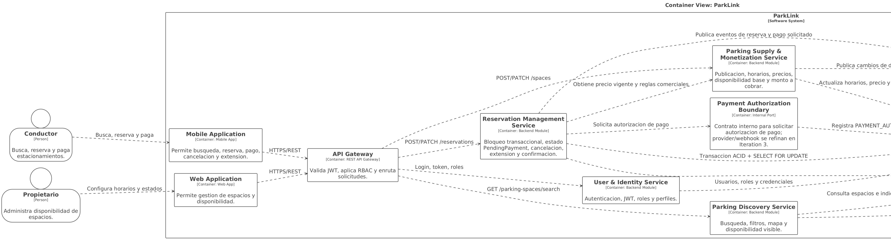

##### 4.3.2.6.2. Dynamic View — Reserva con control de concurrencia y retención de pago

Modela el flujo principal de una reserva: validación de JWT, bloqueo transaccional de disponibilidad, creación del estado `PendingPayment`, registro de autorización de pago y publicación del evento interno. La cache se actualiza después del commit; por lo tanto, nunca decide por sí sola si una reserva queda confirmada.

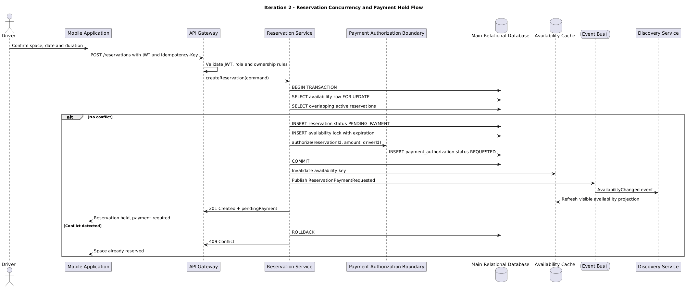

##### 4.3.2.6.3. Dynamic View — Actualización de disponibilidad visible

Modela cómo los cambios de reserva o disponibilidad se propagan mediante eventos internos hacia la proyección de lectura usada por `Parking Discovery Service`. Esta vista justifica la separación entre disponibilidad visible y disponibilidad confirmable.

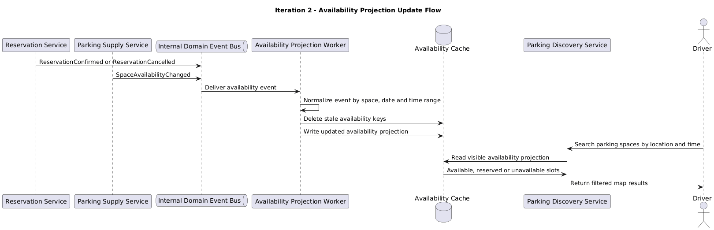

##### 4.3.2.6.4. Component View — Reservation Management Context

Vista los componentes internos de `Reservation Management Service`, mostrando cómo se separan el controlador, la política de disponibilidad, los repositorios transaccionales, el puerto de autorización de pago y el publicador de eventos de dominio.

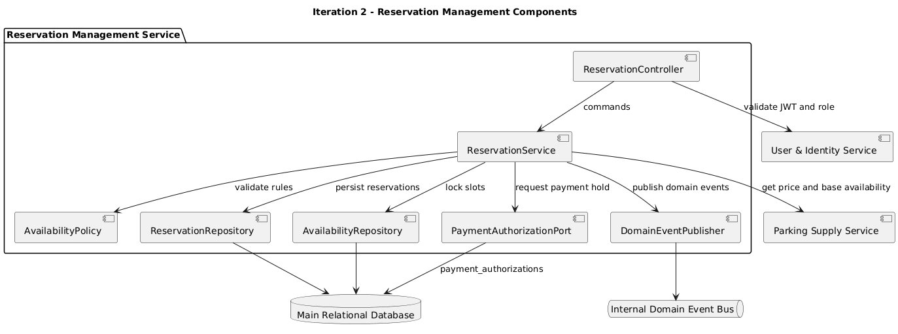

##### 4.3.2.6.5. Class Diagram — Reservation and Availability Rules

Vista de clases del modelo de reserva y disponibilidad. Explicita los estados `PendingPayment`, `Confirmed`, `Cancelled`, `Extended` y los objetos que participan en la validación de solapamientos y autorización de pago.

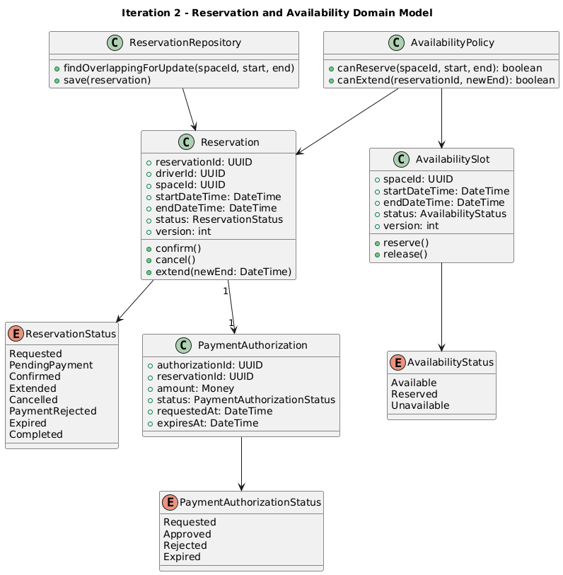

La máquina de estados complementa el diagrama de clases y evita transiciones ambiguas. Una reserva no puede pasar directamente de `Requested` a `Completed`; primero debe ser retenida para pago, confirmada, cancelada, extendida, expirada o rechazada según reglas explícitas.

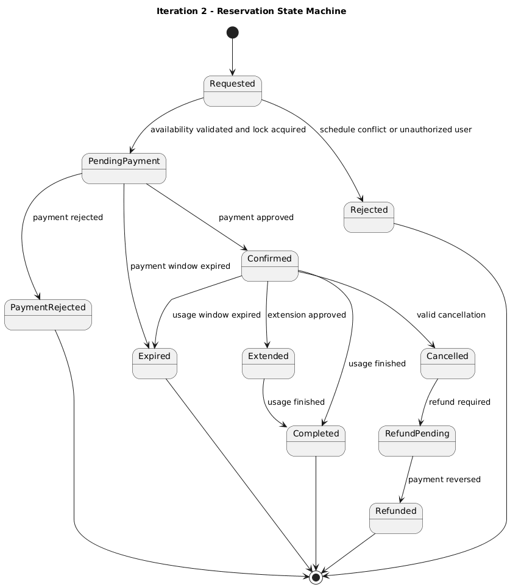

**Design Decisions registradas (ADR-style):**

| ADR | Decisión | Status | Driver | Razonamiento |
|---|---|---|---|---|
| ADR-201 | La base de datos relacional es la fuente de verdad para disponibilidad confirmable y reservas. | Accepted | QAS-02, C-03 | La cache puede estar desactualizada; la confirmación exige consistencia fuerte. |
| ADR-202 | `ReservationService` ejecuta creación, cancelación y extensión dentro de transacciones ACID. | Accepted | US05, US06, US08 | Evita estados parciales y asegura atomicidad. |
| ADR-203 | Se usa locking pesimista (`SELECT ... FOR UPDATE`) durante la validación de solapamientos. | Accepted | AC-02, QAS-02 | Reduce riesgo de doble reserva bajo concurrencia. |
| ADR-204 | `ParkingDiscoveryService` usa Redis como proyección de lectura, no como fuente de verdad. | Accepted | US02, QAS-01 | Mejora velocidad sin sacrificar consistencia de comandos. |
| ADR-205 | Cambios de reserva y disponibilidad publican eventos de dominio internos. | Accepted | US06, US08, US11 | Desacopla actualización de búsqueda, notificaciones y vistas de propietario. |
| ADR-206 | El API Gateway valida JWT y cada servicio aplica checks de ownership. | Accepted | QAS-04, AC-05 | Evita que usuarios operen reservas o espacios ajenos. |
| ADR-207 | Las búsquedas se optimizan con índices por ubicación, estado, precio y rangos horarios. | Accepted | QAS-01, AC-03 | Reduce latencia de búsqueda para usuarios móviles. |
| ADR-208 | La reserva incorpora estado `PendingPayment` y contrato `PaymentAuthorizationPort`, pero deja webhooks, idempotencia y providers para Iteration 3. | Accepted | US14, C-06 | Permite afirmar que pago queda parcialmente atendido sin sobrediseñar la integración externa. |

#### 4.3.2.7. Analysis of Current Design and Review Iteration Goal (Kanban Board)

| Driver | Status pre-iter | Status post-iter | Evidencia |
|---|---|---|---|
| US01 Buscar estacionamientos | Backlog | **Addressed** | `ParkingDiscoveryService` + cache de disponibilidad + estrategia de índices. |
| US02 Disponibilidad en tiempo real | Backlog | **Addressed** | `AvailabilityCache` actualizada por eventos de dominio. |
| US05 Reservar espacio | Backlog | **Addressed** | `ReservationService.create()` con transacción ACID y locking. |
| US06 Cancelar reserva | Backlog | **Addressed** | Comando de cancelación libera disponibilidad y publica evento. |
| US08 Extender reserva | Backlog | **Addressed** | Validación de disponibilidad futura y transición de estado `Extended`. |
| US10 Configurar horarios/precio | Backlog | **Partially addressed** | `ParkingSupplyService` actualiza disponibilidad base; monetización profunda queda en Iteration 3. |
| US11 Habilitar/deshabilitar espacio | Backlog | **Addressed** | Evento `SpaceAvailabilityChanged` actualiza proyección de búsqueda. |
| US14 Pago en línea | Backlog | **Partially addressed** | Estado `PendingPayment` + `PaymentAuthorizationPort`; webhooks e idempotencia quedan en Iteration 3. |
| QAS-01 Performance búsqueda | Backlog | **Addressed** | CQRS ligero, Redis e índices de consulta. |
| QAS-02 Consistencia reserva | Backlog | **Addressed** | ADR-201, ADR-202 y ADR-203. |
| QAS-03 Disponibilidad plataforma | Backlog | **Partially addressed** | Graceful degradation de cache; resiliencia ante terceros queda en Iteration 3. |
| QAS-04 Seguridad | Backlog | **Addressed** | JWT, RBAC y ownership checks. |
| C-03 Evitar doble reserva | Vigente | **Addressed** | Lock transaccional + validación de solapamientos. |
| AC-01 Disponibilidad real | Backlog | **Addressed** | Separación entre disponibilidad visible y confirmable. |
| AC-02 Conflictos de reserva | Backlog | **Addressed** | Control de concurrencia en `ReservationService`. |
| AC-03 Rapidez de búsqueda | Backlog | **Addressed** | Cache + modelo de lectura optimizado. |
| AC-05 Seguridad y confianza | Backlog | **Addressed** | Autenticación, autorización y separación de roles. |

**Kanban Board de la iteración:**

| To Do | In Progress | Done |
|---|---|---|
| Resiliencia avanzada ante proveedores externos | Observabilidad completa con métricas y dashboards | Diseño de transacción de reserva |
| Política detallada de reembolso, comprobantes y webhooks | Pruebas de carga reales con datos productivos | Diseño de disponibilidad visible con Redis |
| Tolerancia a fallos de pasarela de pagos | Ajuste fino de TTL e invalidación de cache | RBAC, JWT, ownership checks y `PendingPayment` |
| Disaster recovery y backup operativo | Evaluación futura de partición por zona geográfica | Eventos internos de disponibilidad y reserva |

**Iteration goal:** alcanzado para los drivers primarios. El diseño reduce los riesgos más graves del MVP: disponibilidad falsa, doble reserva y acceso no autorizado. Los pendientes no invalidan la iteración; quedan correctamente derivados hacia Iteration 3 o hacia validación empírica posterior mediante pruebas de carga y monitoreo operativo.

---

### 4.3.3. Iteration 3: External Integrations & Cross-Cutting Concerns

Esta iteración aborda los drivers vinculados a integraciones con proveedores externos (pasarela de pagos, almacenamiento de objetos, notificaciones, mapas) y capacidades transversales como auditoría y resiliencia. El objetivo es desacoplar el dominio de los proveedores, garantizar que las operaciones críticas sean idempotentes y trazables, y aislar al sistema de fallos en terceros.

#### 4.3.3.1. Architectural Design Backlog

Drivers que entran a la iteración:

| Tipo | ID | Descripción | Estado pre-iteración |
|---|---|---|---|
| Technical Story | TS04 | Auditoría de reservas, pagos, reembolsos y cambios de disponibilidad | Backlog |
| Technical Story | TS05 | Almacenamiento de fotos en Object Storage compatible con S3 | Backlog |
| Technical Story | TS06 | Manejo idempotente de pagos y webhooks | Backlog |
| Quality Attribute | RNF04 | Disponibilidad ante fallos de proveedores externos (mapas, pagos, notificaciones) | Backlog |
| User Story | US14 | Pagar una reserva en línea | Partially addressed (Iter 2) |
| User Story | US15 | Recibir reembolso por cancelación | Backlog |
| User Story | US16 | Ver comprobante de pago | Backlog |
| User Story | US20 | Recibir notificación de reserva confirmada | Backlog |
| Constraint | C-INT | Integración con Stripe/MercadoPago, SendGrid, Firebase Cloud Messaging y Google Maps | Vigente |
| Concern | CC-OBS | Trazabilidad de transacciones financieras pa cumplimiento regulatorio | Backlog |

#### 4.3.3.2. Establish Iteration Goal by Selecting Drivers

**Iteration Goal:** Diseñar los mecanismos de integración con sistemas externos y las capacidades transversales del sistema de modo que:

1. Los pagos se procesen sin duplicidad ante reintentos o webhooks repetidos.
2. Las fotos de estacionamientos se almacenen de forma privada y sólo accesibles mediante autorización explícita del backend.
3. Las transacciones críticas dejen un rastro auditable e inmutable.
4. El sistema continúe operando aceptablemente cuando un proveedor externo falle o degrade su servicio.
5. Las notificaciones al usuario se entreguen sin bloquear las operaciones principales.

**Drivers primarios seleccionados:** TS04, TS05, TS06, RNF04.
**Drivers secundarios:** US14, US15, US16, US20, CC-OBS.

#### 4.3.3.3. Choose One or More Elements of the System to Refine

Elementos a refinar dentro de la arquitectura previamente establecida:

- **Payment Processing Context** (Parking Supply & Monetization)
- **Media Management Context**
- **Notification Management Context**
- **Audit Logging** — capacidad transversal nueva
- **API Gateway** — extensión con rate limiting, retry y circuit breaker hacia proveedores
- **Domain Event Bus** — mecanismo de comunicación asíncrona entre contextos

#### 4.3.3.4. Choose One or More Design Concepts That Satisfy the Selected Drivers

| Driver | Design Concept / Pattern | Justificación |
|---|---|---|
| TS06 (idempotencia pagos) | **Idempotency Key Pattern** + tabla `processed_webhooks` con UNIQUE(provider, event_id) | Cobro repetido ante reintento de red o webhook duplicado se descarta |
| TS06 (webhooks seguros) | **HMAC Signature Verification** | Valida firma del proveedor, evita spoofing |
| TS05 (fotos) | **Object Storage S3-compatible + Pre-signed URLs** (TTL 15 min) | Bucket privado, acceso temporal autorizado por backend |
| TS04 (auditoría) | **Append-only Audit Log Table** + **Domain Events** | Registro inmutable indexado por entidad, actor y tiempo |
| RNF04 (resiliencia terceros) | **Circuit Breaker** + **Retry con backoff exponencial** + **Bulkhead** | Aísla fallos de proveedor, evita propagación |
| US20 (notificaciones) | **Event-Driven Architecture** con worker asíncrono | Desacopla operación principal de envío de notificación |
| C-INT (multi-proveedor) | **Adapter Pattern** por proveedor | Cambio Stripe ↔ MercadoPago sin tocar dominio |
| CC-OBS (observabilidad) | **Structured Logging** + **Correlation IDs** | Trazabilidad de request end-to-end |

#### 4.3.3.5. Instantiate Architectural Elements, Allocate Responsibilities, and Define Interfaces

| Componente | Responsabilidad | Interfaz pública |
|---|---|---|
| `PaymentService` | Orquestar cobro, gestionar idempotency key, exponer webhook | `POST /payments` (con header `Idempotency-Key`), `POST /payments/webhook`, `GET /payments/{id}` |
| `StripeAdapter` / `MercadoPagoAdapter` | Comunicar con API del proveedor, mapear errores y respuestas al modelo de dominio | `createCharge(amount, currency, customer)`, `refund(transactionId, amount)` |
| `WebhookVerifier` | Validar firma HMAC del webhook entrante | `verify(payload, signature, secret) → boolean` |
| `MediaService` | Emitir URLs firmadas de subida y descarga, persistir referencia en BD | `POST /media/upload-url`, `GET /media/{id}` |
| `S3StorageAdapter` | Generar pre-signed URLs, validar buckets | `getUploadUrl(key, ttl)`, `getDownloadUrl(key, ttl)` |
| `NotificationService` | Consumir eventos de dominio, decidir canal y enviar | Subscriber de eventos `ReservationConfirmed`, `PaymentSucceeded`, `RefundIssued` |
| `FCMAdapter` / `SendGridAdapter` | Enviar push/email mediante proveedor | `sendPush(token, payload)`, `sendEmail(to, template, data)` |
| `AuditLogger` | Registrar eventos auditables append-only | `log(actor, action, entityType, entityId, before, after, timestamp)` |
| `CircuitBreaker` | Envolver llamadas externas, abrir circuito ante fallos | `execute(callable) → result | fallback` |
| `EventBus` | Publicar y enrutar eventos de dominio asíncronos | `publish(event)`, `subscribe(eventType, handler)` |

#### 4.3.3.6. Sketch Views (C4 & UML) and Record Design Decisions

Las vistas se modelan en **Structurizr DSL**, manteniendo coherencia con los diagramas C4 ya producidos en la sección 4.1.3. Cada bloque define un workspace independiente con su modelo y vistas asociadas.

##### 4.3.3.6.1. Container View — Cross-Cutting Refinement

Refina el Container Diagram agregando los containers introducidos en esta iteración: `Payment Adapter`, `Notification Worker`, `Object Storage`, `Audit Log Store` y el `Event Bus`.

```structurizr
workspace "ParkLink - Iteration 3 Containers" "Container View refinada con cross-cutting concerns." {

    model {
        driver = person "Conductor urbano" "Reserva y paga estacionamientos."
        owner = person "Propietario" "Publica espacios y recibe ingresos."

        paymentGateway = softwareSystem "Pasarela de Pagos" "Stripe / MercadoPago." "External"
        emailProvider = softwareSystem "SendGrid" "Envío de correos transaccionales." "External"
        pushProvider = softwareSystem "Firebase Cloud Messaging" "Notificaciones push." "External"
        mapsProvider = softwareSystem "Google Maps Platform" "Geolocalización y mapas." "External"

        parkLink = softwareSystem "ParkLink" "Plataforma de reserva de estacionamientos." {
            mobileApp = container "Mobile Application" "Conductores y propietarios." "Flutter"
            apiGateway = container "API Gateway" "Routing, rate limiting, JWT." "Spring Cloud Gateway"

            paymentService = container "Payment Service" "Cobros, reembolsos, idempotencia." "Spring Boot"
            paymentAdapter = container "Payment Adapter" "Adapter por proveedor + Circuit Breaker." "Resilience4j"
            mediaService = container "Media Service" "Emite signed URLs, persiste referencias." "Spring Boot"
            notificationWorker = container "Notification Worker" "Consume eventos, despacha notif." "Spring Boot"
            reservationService = container "Reservation Service" "Core: crear, cancelar, extender reservas." "Spring Boot"

            eventBus = container "Event Bus" "Pub/Sub de eventos de dominio." "RabbitMQ / Kafka"
            db = container "Relational Database" "Reservas, pagos, usuarios, espacios." "PostgreSQL"
            auditStore = container "Audit Log Store" "Tabla append-only de eventos auditables." "PostgreSQL"
            objectStorage = container "Object Storage" "Bucket privado de fotos." "S3-compatible"
        }

        driver -> mobileApp "Reserva, paga, consulta"
        owner -> mobileApp "Publica, configura, ve ingresos"
        mobileApp -> apiGateway "HTTPS/REST"

        apiGateway -> paymentService "Routing"
        apiGateway -> mediaService "Routing"
        apiGateway -> reservationService "Routing"

        paymentService -> paymentAdapter "Solicita cobro/reembolso"
        paymentAdapter -> paymentGateway "HTTPS + HMAC verify" "External"
        paymentService -> db "Persiste idempotency keys, transacciones"
        paymentService -> auditStore "Registra evento auditable"
        paymentService -> eventBus "Publica PaymentSucceeded / RefundIssued"

        mediaService -> objectStorage "Genera signed URL (TTL 15 min)"
        mediaService -> db "Persiste referencia a foto"
        mobileApp -> objectStorage "Upload/download via signed URL" "HTTPS"

        reservationService -> db "Persiste reservas"
        reservationService -> auditStore "Registra cambios de estado"
        reservationService -> eventBus "Publica ReservationConfirmed / ReservationCancelled"

        eventBus -> notificationWorker "Entrega evento"
        notificationWorker -> emailProvider "sendEmail" "External"
        notificationWorker -> pushProvider "sendPush" "External"
        notificationWorker -> auditStore "Registra envío"
    }

    views {
        container parkLink "ContainersIter3" {
            include *
            autolayout lr
        }

        styles {
            element "External" {
                background #999999
                color #ffffff
            }
            element "Person" {
                shape Person
            }
        }
    }
}
```

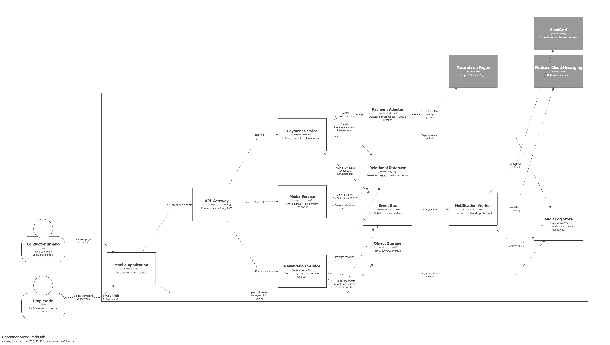

##### 4.3.3.6.2. Dynamic View — Pago con Webhook Idempotente

Modela el flujo end-to-end de un cobro: solicitud del conductor, llamado al proveedor, webhook entrante de confirmación y deduplicación por `Idempotency-Key`.

```structurizr
workspace "ParkLink - Payment Webhook Flow" "Dynamic view: cobro idempotente con webhook." {

    model {
        driver = person "Conductor"
        stripe = softwareSystem "Stripe" "Pasarela de pagos externa." "External"

        parkLink = softwareSystem "ParkLink" {
            mobileApp = container "Mobile App" "" "Flutter"
            apiGateway = container "API Gateway" "" "Spring Cloud Gateway"
            paymentService = container "Payment Service" "" "Spring Boot"
            webhookVerifier = container "Webhook Verifier" "Valida firma HMAC SHA-256." "Spring Boot"
            paymentAdapter = container "Stripe Adapter" "Circuit Breaker." "Resilience4j"
            db = container "Database" "" "PostgreSQL" {
                tags "Database"
            }
        }

        driver -> mobileApp "Confirma pago de reserva"
        mobileApp -> apiGateway "POST /payments con header Idempotency-Key=UUID"
        apiGateway -> paymentService "Forward request"
        paymentService -> db "SELECT por idempotency_key"
        paymentService -> paymentAdapter "createCharge(amount, currency, customer)"
        paymentAdapter -> stripe "POST /v1/charges" "HTTPS"
        stripe -> paymentAdapter "201 Created + charge_id"
        paymentAdapter -> paymentService "Charge result"
        paymentService -> db "INSERT transaction + idempotency_key"
        paymentService -> mobileApp "200 OK"

        stripe -> webhookVerifier "POST /payments/webhook + Stripe-Signature"
        webhookVerifier -> webhookVerifier "verify(payload, signature, secret)"
        webhookVerifier -> paymentService "Forward verified event"
        paymentService -> db "SELECT processed_webhooks WHERE event_id"
        paymentService -> db "INSERT processed_webhooks (UNIQUE constraint)"
        paymentService -> db "UPDATE transaction SET status='confirmed'"
    }

    views {
        dynamic parkLink "PaymentWebhookFlow" "Cobro con webhook idempotente." {
            driver -> mobileApp "1. Confirma pago"
            mobileApp -> apiGateway "2. POST /payments + Idempotency-Key"
            apiGateway -> paymentService "3. Forward"
            paymentService -> db "4. Verifica idempotency_key"
            paymentService -> paymentAdapter "5. createCharge()"
            paymentAdapter -> stripe "6. POST /v1/charges"
            stripe -> paymentAdapter "7. 201 + charge_id"
            paymentAdapter -> paymentService "8. Resultado"
            paymentService -> db "9. INSERT transaction"
            paymentService -> mobileApp "10. 200 OK"
            stripe -> webhookVerifier "11. POST /webhook + signature"
            webhookVerifier -> paymentService "12. Evento verificado"
            paymentService -> db "13. INSERT processed_webhooks (UNIQUE)"
            paymentService -> db "14. UPDATE transaction status"
            autolayout lr
        }
    }
}
```

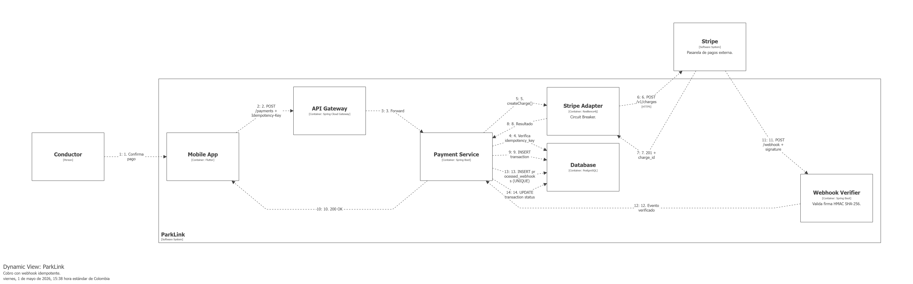

##### 4.3.3.6.3. Dynamic View — Subida de Foto via Pre-Signed URL

Modela el flujo en que el propietario sube una foto directamente al Object Storage sin pasar por el backend, mediante una URL firmada de corta duración.

```structurizr
workspace "ParkLink - Media Upload Flow" "Dynamic view: subida de foto via signed URL." {

    model {
        owner = person "Propietario"

        parkLink = softwareSystem "ParkLink" {
            mobileApp = container "Mobile App" "" "Flutter"
            apiGateway = container "API Gateway" "" "Spring Cloud Gateway"
            mediaService = container "Media Service" "" "Spring Boot"
            s3Adapter = container "S3 Storage Adapter" "" "AWS SDK"
            db = container "Database" "" "PostgreSQL"
            s3 = container "Object Storage" "Bucket privado." "S3-compatible"
        }

        owner -> mobileApp "Sube foto del espacio"
        mobileApp -> apiGateway "POST /media/upload-url"
        apiGateway -> mediaService "Forward solicitud de URL"
        mediaService -> s3Adapter "getUploadUrl(key, ttl=15m)"
        s3Adapter -> mediaService "Pre-signed URL"
        mediaService -> mobileApp "200 OK + signed URL"
        mobileApp -> s3 "PUT binary directo (HTTPS)"
        s3 -> mobileApp "200 OK"
        mobileApp -> apiGateway "POST /media (key, space_id)"
        apiGateway -> mediaService "Forward registro de referencia"
        mediaService -> db "INSERT media reference"
        mediaService -> mobileApp "201 Created"
    }

    views {
        dynamic parkLink "MediaUploadFlow" "Upload via signed URL." {
            owner -> mobileApp "1. Selecciona foto"
            mobileApp -> apiGateway "2. POST /media/upload-url"
            apiGateway -> mediaService "3. Forward solicitud de URL"
            mediaService -> s3Adapter "4. getUploadUrl(key, ttl=15m)"
            s3Adapter -> mediaService "5. Signed URL"
            mediaService -> mobileApp "6. 200 OK + signed URL"
            mobileApp -> s3 "7. PUT binary directo"
            s3 -> mobileApp "8. 200 OK"
            mobileApp -> apiGateway "9. POST /media (registrar)"
            apiGateway -> mediaService "10. Forward registro de referencia"
            mediaService -> db "11. INSERT reference"
            mediaService -> mobileApp "12. 201 Created"
            autolayout lr
        }
    }
}
```

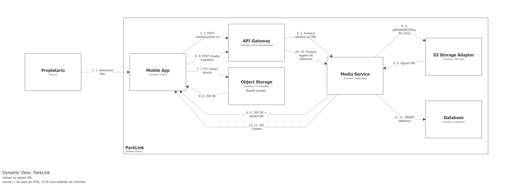

##### 4.3.3.6.4. Component View — Notification Context Event-Driven

Vista de componentes internos del Notification Worker mostrando cómo consume eventos del bus y enruta a los adapters de proveedor.

```structurizr
workspace "ParkLink - Notification Components" "Component view: notification worker event-driven." {

    model {
        parkLink = softwareSystem "ParkLink" {
            eventBus = container "Event Bus" "Pub/Sub." "RabbitMQ"

            notificationWorker = container "Notification Worker" "Consume eventos y despacha notif." "Spring Boot" {
                eventConsumer = component "Event Consumer" "Subscribe a topics ReservationConfirmed, PaymentSucceeded." "Spring AMQP"
                routingPolicy = component "Routing Policy" "Decide canal (push/email) y plantilla por tipo de evento." "Spring Bean"
                templateRenderer = component "Template Renderer" "Renderiza payload con datos del evento." "Thymeleaf"
                pushAdapter = component "FCM Adapter" "Envía push via FCM." "Firebase Admin SDK"
                emailAdapter = component "SendGrid Adapter" "Envía email via SendGrid." "SendGrid SDK"
                circuitBreaker = component "Circuit Breaker" "Aísla fallos de proveedores externos." "Resilience4j"
                retryHandler = component "Retry Handler" "Reintento con backoff + dead-letter queue." "Spring Retry"
                auditClient = component "Audit Client" "Registra envío en audit_events." "JPA"
            }

            auditStore = container "Audit Log Store" "" "PostgreSQL"
        }

        fcm = softwareSystem "Firebase Cloud Messaging" "" "External"
        sendgrid = softwareSystem "SendGrid" "" "External"

        eventBus -> eventConsumer "Entrega evento"
        eventConsumer -> routingPolicy "Determina canal y plantilla"
        routingPolicy -> templateRenderer "Renderiza payload"
        templateRenderer -> pushAdapter "Push payload"
        templateRenderer -> emailAdapter "Email payload"
        pushAdapter -> circuitBreaker "Wrap call"
        emailAdapter -> circuitBreaker "Wrap call"
        circuitBreaker -> fcm "sendPush" "External"
        circuitBreaker -> sendgrid "sendEmail" "External"
        circuitBreaker -> retryHandler "On failure"
        retryHandler -> circuitBreaker "Retry con backoff"
        eventConsumer -> auditClient "Registra recepción y envío"
        auditClient -> auditStore "INSERT audit_event"
    }

    views {
        component notificationWorker "NotificationComponents" "Componentes del Notification Worker." {
            include *
            autolayout lr
        }

        styles {
            element "External" {
                background #999999
                color #ffffff
            }
        }
    }
}
```

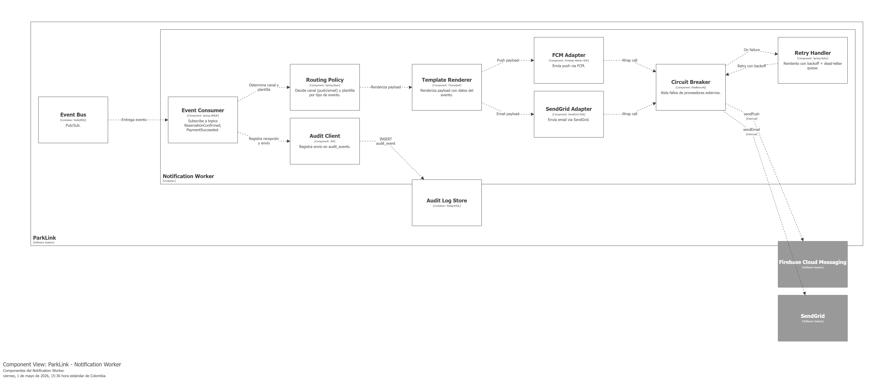

##### 4.3.3.6.5. Class Diagram — Adapter Pattern de Proveedores

Vista de clases del Adapter Pattern aplicado a proveedores de pago y notificación. Como Structurizr DSL no modela diagramas de clases, se utiliza **PlantUML** embebido.

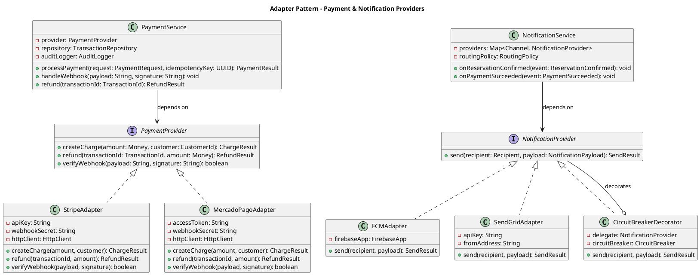

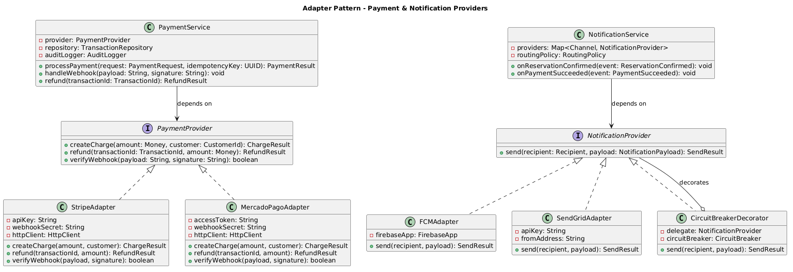

**Design Decisions registradas (ADR-style):**

| ADR | Decisión | Status | Driver | Razonamiento |
|---|---|---|---|---|
| ADR-301 | Cobros usan header `Idempotency-Key` (UUID v4 generado por cliente) persistido junto a la transacción | Accepted | TS06 | Reintento de red no genera doble cargo |
| ADR-302 | Webhooks verificados con HMAC SHA-256; tabla `processed_webhooks` con `UNIQUE(provider, event_id)` descarta duplicados | Accepted | TS06 | Garantiza procesamiento exactly-once |
| ADR-303 | Fotos en bucket S3-compatible privado; descarga sólo via pre-signed URL con TTL 15 min emitida por backend | Accepted | TS05, RNF03 | Privacidad de evidencias, no exposición pública |
| ADR-304 | Audit log en tabla append-only `audit_events(id, actor_id, action, entity_type, entity_id, before_json, after_json, occurred_at)` indexada por `entity` y `occurred_at` | Accepted | TS04, CC-OBS | Trazabilidad regulatoria, no `UPDATE`/`DELETE` |
| ADR-305 | Circuit Breaker (Resilience4j en Java o Polly en .NET) envuelve llamadas a Stripe, MercadoPago, FCM, SendGrid y Google Maps | Accepted | RNF04 | Aislamiento de fallos, fail-fast con fallback |
| ADR-306 | Notificaciones procesadas asíncronamente vía Event Bus; operación principal commit-ea sin esperar al envío | Accepted | US20, RNF04 | Reserva no falla si proveedor de notificación está caído |
| ADR-307 | Adapter Pattern por proveedor; el dominio depende de la interfaz `PaymentProvider`/`NotificationProvider`, no del SDK concreto | Accepted | C-INT, RNF04 | Cambio de proveedor sin tocar reglas de negocio |
| ADR-308 | Correlation ID propagado vía header `X-Correlation-Id` en toda llamada interna y log estructurado | Accepted | CC-OBS | Trazabilidad end-to-end de request |

#### 4.3.3.7. Analysis of Current Design and Review Iteration Goal (Kanban Board)

| Driver | Status pre-iter | Status post-iter | Evidencia |
|---|---|---|---|
| TS04 Auditoría | Backlog | **Addressed** | ADR-304 + tabla `audit_events` definida |
| TS05 Object Storage | Backlog | **Addressed** | ADR-303 + signed URLs en `MediaService` |
| TS06 Idempotencia pagos | Backlog | **Addressed** | ADR-301, ADR-302 + `processed_webhooks` |
| RNF04 Resiliencia terceros | Backlog | **Addressed** | ADR-305 circuit breaker en todos los adapters |
| US14 Pago | Partially addressed | **Fully addressed** | Idempotencia + webhook completan el flujo |
| US15 Reembolso | Backlog | **Addressed** | `PaymentService.refund` + audit log |
| US16 Comprobante | Backlog | **Addressed** | Generación a partir de `audit_events` y referencia en S3 |
| US20 Notificación | Backlog | **Addressed** | ADR-306 event-driven async |
| CC-OBS Observabilidad | Backlog | **Partially addressed** | ADR-308 correlation IDs; falta dashboard de métricas |

**Iteration goal:** ✅ alcanzado. Todos los drivers primarios atendidos.

**Refinamientos pendientes pa iteraciones futuras (post-TB2):** dashboard de métricas y SLOs, disaster recovery procedure, performance testing bajo carga real de producción, política de retención del audit log.
