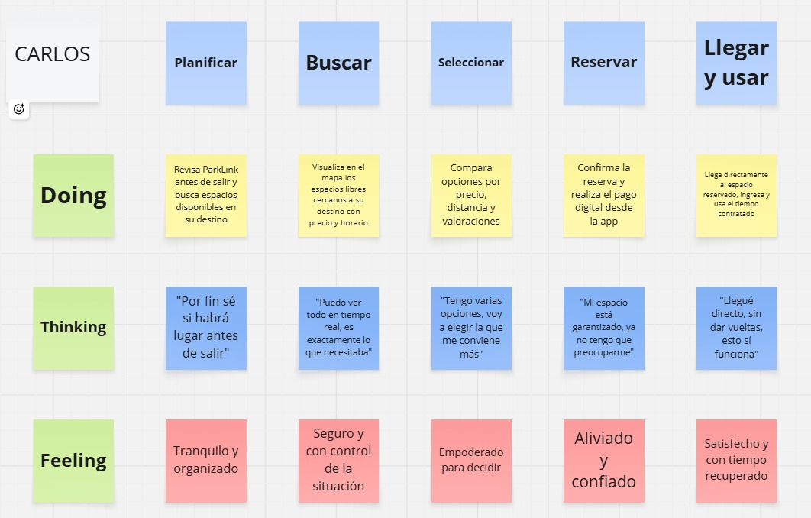
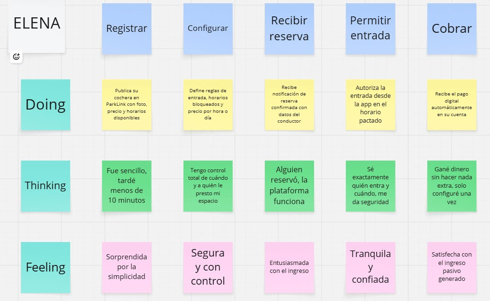
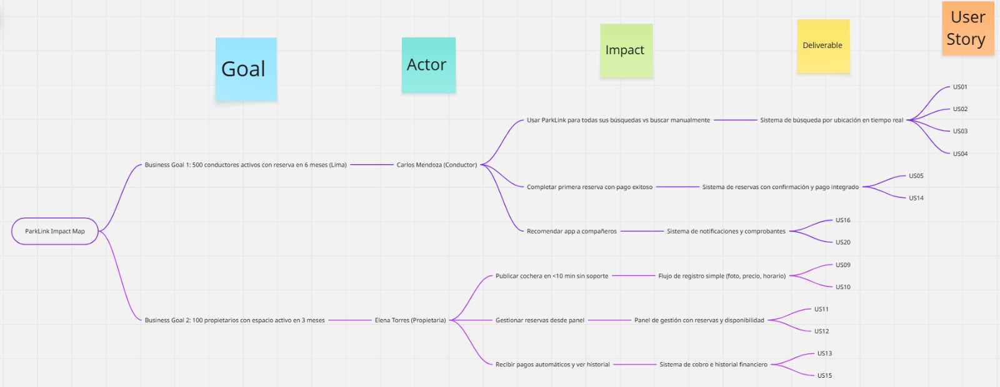
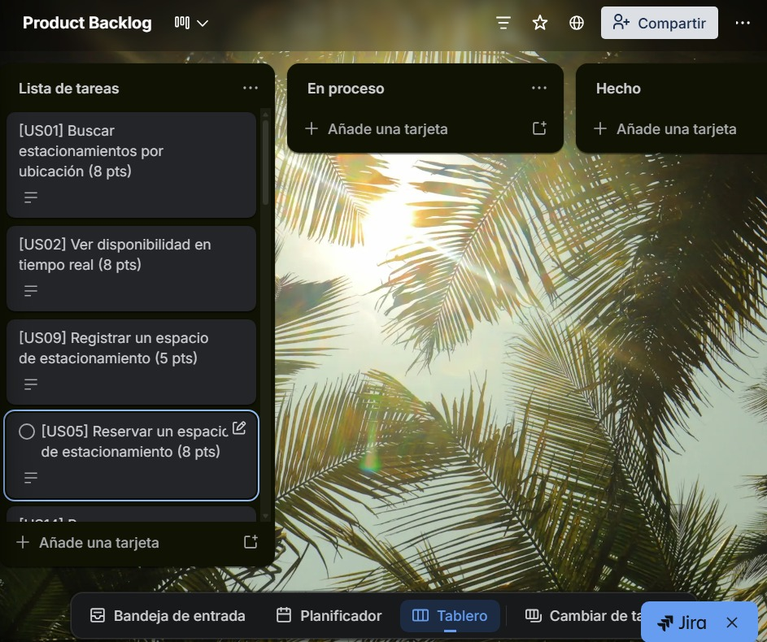

# UNIVERSIDAD PERUANA DE CIENCIAS APLICADAS

## "Informe de Trabajo Final"

**1ASI0657-2610-17949 - Fundamentos de Arquitectura de Software - Ciclo 7**

**Profesor:** Jorge Luis Delgado Vite  
**Sección:** 17949  
**Startup:** ParkTeam          
**Producto:** ParkLink       

-------------------------------

### Integrantes:

| Nombre                                | Código       |
|---------------------------------------|--------------|
|Javier Masaru Nikaido Vargas           |U20221G099    |
|Fabian Alejandro Oliva Lopez           |U202312013    |
|Pietro Osores Marchese                 |U202310971    |
|Percy Alonso Muñiz Huayanca            |U202319563    |
|Matias Rodolfo Salcedo Champi          |U202319698    |

**Abril 2026**

## Registro de Versiones del Informe

| Version | Fecha      | Autor                             | Descripcion  |
| ------- | ---------- | ---------------------------------- | ------------------------------------------------------------------------------------------------------------------------------------------------------------------------------------------------------------------------------------------------------------------------------------------- |
| Avance 1     | 14/04/2026| Javier Masaru Nikaido Vargas        |                                                                                                                                              |
| Avance 1      | 14/04/2026 | Fabian Alejandro Oliva Lopez        |                                                                                                                                                        |
| Avance 1      | 14/04/2026 | Pietro Osores Marchese           |                                                                                                                                           |
| Avance 1      | 14/04/2026 | Percy Alonso Muñiz Huayanca           |                                                                                                                                                                                        |
| Avance 1    | 14/04/2026 | Matias Rodolfo Salcedo Champi       |                                                                                                                                                                                                           |

## Student Outcome
| Criterio específico | Acciones realizadas | Conclusiones |
|---------------------|---------------------|--------------|
| **CO1:** Actualiza conceptos y conocimientos necesarios para su desarrollo profesional y en especial para su proyecto en soluciones de software. | **TB1 - Fabian Alejandro Oliva López:** Definí el ADN de la startup, estableciendo la visión, misión y valores como fundamento estratégico del proyecto. Supervisé el proceso Lean UX para garantizar la alineación con los objetivos del curso. Identifiqué y definí los segmentos objetivo, aplicando conocimientos de estrategia de producto. **TB1 - Javier Masaru Nikaido Vargas:** Realicé investigación de competidores mediante benchmarking para entender el mercado. Ejecuté entrevistas y needfinding para validar el problema con usuarios reales, aplicando técnicas de UX Research. **TB1 - Matias Rodolfo Salcedo Champi:** Diseñé el Solution Profile y nombre del producto, aplicando conceptos de product design. Creé User Personas y Empathy Maps para comprender las necesidades de los usuarios, integrando conocimientos de diseño centrado en el usuario. **TB1 - Percy Alonso Muñiz Huayanca:** Desarrollé Lean UX Assumptions e Hypothesis Statements, aplicando metodologías de diseño ágil. Construí User Task Matrix, As-is y To-Be Scenario Mapping para analizar procesos actuales y futuros, integrando conocimientos de análisis de procesos. **TB1 - Pietro Osores Marchese:** Elaboré el Lean UX Canvas para consolidar la propuesta de valor. Creé User Stories, Impact Map y Product Backlog para especificar requerimientos del proyecto, aplicando conocimientos de gestión de proyectos ágiles. | El equipo ha demostrado capacidad para integrar y aplicar conocimientos de arquitectura de software en un proyecto real de solución tecnológica. Cada integrante actualizó sus conocimientos en las áreas de UX, diseño de producto, análisis de procesos y gestión de requerimientos, aplicando metodologías ágiles y herramientas de elicitación de requisitos. |
| **CO2:** Reconoce la necesidad del aprendizaje permanente para el desempeño profesional y el desarrollo de proyectos en soluciones de software. | **TB1 - Fabian Alejandro Oliva López:** Al definir la visión y estrategia de la startup, reconocí la importancia de actualizar constantemente los conocimientos en estrategia de producto y liderazgo de proyectos. **TB1 - Javier Masaru Nikaido Vargas:** Al realizar entrevistas y needfinding, identifiqué la necesidad de mejorar continuamente las técnicas de investigación de usuarios y comunicación con stakeholders. **TB1 - Matias Rodolfo Salcedo Champi:** Al crear User Personas y Empathy Maps, comprendí la relevancia del aprendizaje continuo en metodologías de diseño centrado en el usuario. **TB1 - Percy Alonso Muñiz Huayanca:** Al desarrollar escenarios y mappings de procesos, reconocí la necesidad de actualizarse en herramientas de análisis y modelado de procesos de negocio. **TB1 - Pietro Osores Marchese:** Al crear el Product Backlog y User Stories, entendí la importancia del aprendizaje continuo en gestión de requerimientos y priorización de funcionalidades en entornos ágiles. | El equipo reconoce que el desarrollo de soluciones de software requiere aprendizaje continuo. La aplicación de metodologías como Lean UX, Needfinding, User Stories e Impact Mapping evidencia el compromiso de cada miembro por adquirir nuevas competencias y adaptarse a las tendencias tecnológicas del mercado de movilidad urbana. |

## Contenido 

- [Capítulo I: Introducción](#capítulo-i-introducción)
    - [1.1. Startup Profile](#11-startup-profile)
    - [1.1.1. Descripción de la Startup](#111-descripción-de-la-startup)
    - [1.1.2. Perfiles de integrantes del equipo](#112-perfiles-de-integrantes-del-equipo)
    - [1.2. Solution Profile](#12-solution-profile)
    - [1.2.1. Nombre del Producto](#121-nombre-del-producto)
    - [1.2.2. Antecedentes y problemática](#122-antecedentes-y-problemática)
    - [1.2.3. Lean UX Process](#123-lean-ux-process)
    - [1.2.3.1. Lean UX Problem Statements](#1221-lean-ux-problem-statements)
    - [1.2.3.2. Lean UX Assumptions](#1222-lean-ux-assumptions)
    - [1.2.3.3. Lean UX Hypothesis Statements](#1223-lean-ux-hypothesis-statements)
    - [1.2.3.4. Lean UX Canvas](#1224-lean-ux-canvas)
    - [1.3. Segmentos objetivo](#13-segmentos-objetivo)
- [Capítulo II: Requirements Elicitation \& Analysis](#capítulo-ii-requirements-elicitation--analysis)
    - [2.1. Competidores](#21-competidores)
    - [2.2. Entrevistas](#22-entrevistas)
    - [2.3. Needfinding](#23-needfinding)
    - [2.3.1. User Personas](#231-user-personas)
    - [2.3.2. User Task Matrix](#232-user-task-matrix)
    - [2.3.3. Empathy Mapping](#233-empathy-mapping)
    - [2.3.4. As-is Scenario Mapping](#234-as-is-scenario-mapping)
 - [Capítulo III: Requirements Specification](#capítulo-iii-requirements-specification)
   - [3.1. To-Be Scenario Mapping](#31-to-be-scenario-mapping)
   - [3.2. User Stories](#32-user-stories)
   - [3.3. Impact Mapping](#33-impact-mapping)
   - [3.4. Product Backlog](#34-product-backlog)
  
# Capítulo I: Introducción

## 1.1. Startup Profile

### 1.1.1. Descripción del Startup

En las ciudades modernas, uno de los principales problemas que enfrentan los conductores es la dificultad para encontrar estacionamiento disponible. Esta situación genera congestión vehicular, pérdida de tiempo, estrés y un impacto ambiental negativo debido al aumento de emisiones contaminantes producto de la circulación innecesaria de vehículos.

**Misión:**
Brindar una plataforma eficiente y confiable que permita a los conductores encontrar y reservar estacionamientos fácilmente, mientras se genera valor para los propietarios mediante la monetización de sus espacios.

**Visión:**
Ser la plataforma líder en reserva de estacionamientos en Latinoamérica, contribuyendo al desarrollo de ciudades más organizadas, sostenibles y tecnológicamente conectadas.

**Valores:**

Innovación tecnológica
Eficiencia operativa
Confianza y seguridad
Sostenibilidad urbana

#### 1.1.2. Perfiles de integrantes del equipo

| Nombre                        | Descripción                                                                                                                                                                                                                                                                                                                                 | Foto |
|-------------------------------|---------------------------------------------------------------------------------------------------------------------------------------------------------------------------------------------------------------------------------------------------------------------------------------------------------------------------------------------|------|
| Fabian Alejandro Oliva Lopez | Me considero una persona activa en los proyectos, impulsado al equipo a realizar buenos trabajos, mi objetivo es brindar apoyo y realizar lo mejor de mí, para así fomentar un ambiente colaborativo y de respeto.                                                                                                                                 |
| Javier Masaru Nikaido Vargas | Estudiante de Ingeniería de Software con enfoque en el desarrollo organizado y eficiente de soluciones. Me caracterizo por trabajar de manera estructurada, priorizando la planificación y el cumplimiento de plazos, manteniendo un ambiente de trabajo tranquilo y productivo.                                                                              |  |
| Pietro Osores Marchese       | Soy Pietro Osores Marchese, estudiante de Ingeniería de Sistemas con interés en el desarrollo de software y la innovación tecnológica. Mi perfil combina habilidades en programación frontend, diseño de interfaces y gestión de proyectos ágiles, con un enfoque en la creación de soluciones digitales funcionales y escalables. Me caracterizo por el trabajo en equipo, la adaptabilidad y la búsqueda constante de nuevas herramientas para optimizar procesos y experiencias de usuario. |  |
| Percy Alonso Muñiz Huayanca   |                                                                                                                                                                                                                                                                                                                                             |
| Matias Rodolfo Salcedo Champi| Soy un estudiante de Ingeniería de Software con experiencia en el desarrollo de aplicaciones móviles y web. He participado en proyectos de investigación y desarrollo, y tengo conocimientos en tecnologías como Flutter, Dart, Node.js, Express.js, MongoDB, PostgreSQL, Git, GitHub, entre otras.                                                                                                                                                                                                                                                                                                                                            |  |
## 1.2. Solution Profile

### 1.2.1. Nombre del producto

El producto desarrollado lleva por nombre ParkLink, una plataforma digital orientada a la gestión y reserva de estacionamientos.

### 1.2.2 Antecedentes y problemática

En entornos urbanos, encontrar estacionamiento se ha convertido en una tarea compleja debido al crecimiento exponencial del parque automotor y la limitada disponibilidad de espacios. Esta situación obliga a los conductores a recorrer largas distancias en busca de un lugar donde estacionar, generando efectos adversos en múltiples dimensiones de la vida cotidiana.

El crecimiento sostenido de la circulación vehicular en las ciudades ha superado significativamente la capacidad de infraestructura disponible. Los espacios de estacionamiento públicos y privados no han aumentado en la misma proporción que el número de vehículos, creando un desequilibrio crónico entre la demanda y la oferta. Este problema se agrava especialmente en zonas comerciales, centros empresariales, instituciones educativas y áreas residenciales densamente pobladas.

Para analizar esta problemática de manera integral, se aplica la técnica de las **5W's + 2H's**:

#### 🟩 What (¿Qué sucede?)
Los conductores no cuentan con información en tiempo real sobre la disponibilidad de estacionamientos, lo que los obliga a buscar manualmente. La falta de visibilidad sobre dónde hay espacios disponibles genera una búsqueda constante e ineficiente, donde los conductores circulan repetidamente por las mismas calles esperando encontrar un lugar libre.

#### 🟩 Why (¿Por qué es un problema?)
- **Tráfico innecesario**: La búsqueda de estacionamiento genera viajes adicionales que congestionan las vías urbanas
- **Consumo de combustible**: Se desperdicia combustible buscando un espacio que podría evitarse con información previa
- **Estrés en los conductores**: La incertidumbre y el tiempo de búsqueda prolongado generan ansiedad y frustración
- **Eficiencia del tiempo**: El tiempo invertido en buscar estacionamiento representa una pérdida significativa de productividad
- **Contaminación ambiental**: Los vehículos en búsqueda constante de estacionamiento contribuyen a la emisión de gases contaminantes
- **Accidentes**: El stress y la distracción aumentan el riesgo de incidentes viales menores

#### 🟩 Who (¿A quiénes afecta?)
- **Conductores urbanos**: Todos aquellos que utilizan vehículo para movilizarse daily en zonas de alta demanda
- **Propietarios de estacionamientos no utilizados**: Personas o empresas con espacios disponibles que no tienen forma de monetizarlos eficientemente
- **Ciudades en general**: El tráfico causedo por la búsqueda de estacionamiento afecta la movilidad urbana整体
- **Comercios locales**: Los clientes potenciales pueden evitar zonas donde es difícil estacionar
- **Medio ambiente**: El increase de emisiones afecta la calidad del aire urbano

#### 🟩 When (¿Cuándo ocurre?)
- Principalmente en horas pico de la mañana y tarde, cuando las personas se desplazan hacia sus centros de trabajo o estudio
- En eventos especiales, días de pago, o fechas comerciales importantes
- Durante horarios de lunch en zonas empresariales y comerciales
- Los fines de semana en zonas de entretenimiento, centros comerciales y áreas recreativas

#### 🟩 Where (¿Dónde ocurre?)
- En zonas urbanas, comerciales y residenciales con alta densidad vehicular
- Centros financieros y distritos empresariales
- Alrededores de universidades, hospitales y centros comerciales
- Calles y avenidas principales con alta circulación
- Espacios de estacionamiento subutilizados en residencial areas

#### 🟩 How (¿Cómo sucede?)
- **Falta de plataformas digitales centralizadas**: No existe una herramienta unificada que conecte oferta y demanda
- **Información desactualizada o inexistente**: Los sistemas existentes no reflejan la disponibilidad real en tiempo real
- **Procesos manuales**: tanto para propietarios como para usuarios, todo se maneja de forma tradicional
- **Desconexión entre partes**: Los propietarios no tienen cómo dar a conocer sus espacios disponibles
- **Ausencia de sistemas de reservas**: No hay forma de garantizar un espacio con anticipación

#### 🟩 How Much (¿Cuánto cuesta o impacta?)
- **Económico**: Gasto adicional de combustible estimado en porcentajes significativos del presupuesto familiar
- **Ambiental**: Aumento de emisiones de CO2 por vehículos circulando sin necesidad
- **Social**: Estrés, pérdida de tiempo familiar y reducción de la calidad de vida
- **Productividad**: Horas de trabajo perdidas en búsqueda de estacionamiento
- **Económico para propietarios**: Ingresos no percibidos por espacios subutilizados

### 1.2.3 Lean UX Process

El proceso de Lean UX se enfoca en crear productos digitales eficientes mediante la experimentación rápida y la validación constante de hipótesis, priorizando la colaboración y el aprendizaje continuo. En el caso de ParkLink, plataforma de reserva de estacionamientos, el proceso Lean UX se desarrolló en las siguientes fases:

#### Comprender 
En esta fase, se realizó una investigación cualitativa centrada en el comportamiento de los conductores en zonas urbanas, enfocándonos en entender cómo buscan actualmente estacionamiento y cuáles son las principales dificultades que enfrentan. A través de observaciones y supuestos iniciales del equipo, identificamos que la mayoría de los conductores pierde tiempo recorriendo calles sin tener información clara sobre la disponibilidad de espacios.

#### Esbozar
Con los hallazgos obtenidos, comenzamos a diseñar prototipos de baja fidelidad para la plataforma ParkLink. Estos prototipos se enfocaron en funcionalidades clave que respondieran directamente a las necesidades de los usuarios:
- **Mapa interactivo**: Que muestra estacionamientos disponibles según la ubicación del conductor.
- **Sistema de reservas anticipadas**: Para asegurar un espacio antes de llegar al destino.
- **Visualización de precios y horarios**: Facilitando la toma de decisiones.
- **Registro y gestión de espacios**: Permitiendo a los propietarios publicar y administrar sus cocheras.

#### Probar
Se realizaron pruebas de usabilidad con usuarios potenciales, simulando escenarios reales de búsqueda de estacionamiento en zonas de alta demanda. Durante las pruebas, observamos cómo los usuarios interactuaban con el mapa y el sistema de reservas, evaluando la facilidad de uso y la comprensión de la plataforma.

#### Medir 
Una vez implementados los prototipos mejorados, se definieron métricas clave para evaluar el rendimiento de la plataforma. Se analizaron indicadores como el tiempo promedio que tarda un usuario en encontrar estacionamiento, la cantidad de reservas realizadas y la frecuencia de uso de la aplicación.

#### 1.2.3.1 Lean UX Problem Statements

##### Problem Statement 1
Muchos conductores en zonas urbanas pierden tiempo buscando estacionamiento debido a la falta de información en tiempo real sobre espacios disponibles. Esta situación genera congestión vehicular, mayor consumo de combustible, estrés en los usuarios y una experiencia de movilidad ineficiente.

**¿Cómo podríamos diseñar una solución digital que permita a los conductores encontrar y reservar estacionamientos en tiempo real, reduciendo el tráfico y mejorando su experiencia de movilidad?**

---

##### Problem Statement 2

Actualmente, muchos propietarios de estacionamientos o espacios disponibles no cuentan con una plataforma que les permita ofrecer sus cocheras de manera sencilla, segura y organizada. Esto provoca que dichos espacios permanezcan desaprovechados, generando una pérdida de oportunidades económicas.

**¿Cómo podríamos diseñar una plataforma que permita a los propietarios publicar y gestionar sus espacios de estacionamiento de forma fácil, segura y rentable?**

#### 1.2.3.2 Lean UX Assumptions

### 1.2.3.2.1 Business Assumptions
- Existe una alta demanda de soluciones digitales que optimicen la búsqueda de estacionamientos en zonas urbanas.
- Los conductores están dispuestos a pagar por conveniencia, ahorro de tiempo y seguridad al estacionar.
- Los propietarios de espacios buscan generar ingresos adicionales mediante la monetización de sus cocheras.

### 1.2.3.2.2 Business Outcomes
- Generar ingresos a través de comisiones por reservas realizadas en la plataforma.
- Incrementar la base de usuarios activos (conductores y propietarios).
- Posicionar la plataforma como una solución confiable en el mercado de movilidad urbana.

### 1.2.3.2.3 User Assumptions
- Los conductores actualmente buscan estacionamiento de forma manual, sin herramientas digitales especializadas.
- Prefieren soluciones rápidas, intuitivas y que les permitan planificar con anticipación.
- Los propietarios desean una forma sencilla de publicar y gestionar sus espacios sin procesos complejos.

### 1.2.3.2.4 User Outcomes
- Los conductores reducen significativamente el tiempo de búsqueda de estacionamiento.
- Disminuye el estrés asociado a la conducción en zonas congestionadas.
- Los propietarios logran generar ingresos adicionales mediante el uso eficiente de sus espacios.

### 1.2.3.3 Lean UX Hypothesis Statements

#### Hypothesis Statement 1

Creemos que lograremos reducir el tiempo de búsqueda de estacionamiento y mejorar la experiencia de movilidad urbana.

Sabremos que si los conductores
pueden visualizar y reservar estacionamientos disponibles en tiempo real,
cuando implementemos una plataforma digital que centralice la información de espacios y permita reservas anticipadas.

---

#### Hypothesis Statement 2

Creemos que lograremos un aumento en la generación de ingresos para los propietarios de estacionamientos.

Sabremos que si los propietarios
pueden publicar y gestionar fácilmente sus espacios dentro de la plataforma,
cuando veamos que utilizan activamente la aplicación para ofrecer sus cocheras y recibir reservas.

#### Hypothesis Statement 3

Creemos que lograremos una mejora en la toma de decisiones de los usuarios al momento de estacionar.

Sabremos que si los conductores
tienen acceso a información clara sobre precios, ubicación y disponibilidad,
cuando implementemos una interfaz que muestre datos en tiempo real de forma sencilla y confiable.

### 1.2.3.4	Lean UX Canvas

### 1.3. Segmentos objetivo

**Segmento 1: Conductores**
- **Características:**
  - Personas que conducen en zonas urbanas
  - Edades entre 20 y 60 años
  - Uso frecuente de apps móviles
    
- **Necesidades:**
  - Encontrar estacionamiento rápido
  - Reducir tiempo de búsqueda
  - Reservar anticipadamente
  - Pago seguro

**Segmento 2: Propietarios de estacionamientos**
- **Características:**
  - Personas o empresas con espacios disponibles
  - Interés en generar ingresos
    
- **Necesidades:**
  - Publicar espacios fácilmente
  - Gestionar reservas
  - Definir precios
  - Recibir pagos seguros
  

---

# Capítulo III: Requirements Specification

## 3.1. To-Be Scenario Mapping

El To-Be Scenario Mapping describe cómo cambiaría la experiencia de cada User Persona al contar con ParkLink como solución. El proceso de elaboración siguió las etapas de preparación, lluvia de ideas individual, revisión, identificación de fases y comparación con el As-Is Scenario Mapping para evidenciar las mejoras que la solución introduce. Los mapas fueron elaborados en la herramienta Miro.

### To-Be Scenario Map — Conductor Urbano (Carlos Mendoza)

> Elaborado en Miro. Acceso al artefacto: [Ver en Miro](https://miro.com/app/board/uXjVGiIH610=/?share_link_id=240859047074)

| | **Planificar** | **Buscar** | **Seleccionar** | **Reservar** | **Llegar y usar** |
|---|---|---|---|---|---|
| **Doing** | Revisa ParkLink antes de salir y busca espacios disponibles en su destino | Visualiza en el mapa los espacios libres cercanos a su destino con precio y horario | Compara opciones por precio, distancia y valoraciones | Confirma la reserva y realiza el pago desde la app | Llega directamente al espacio reservado, ingresa y usa el tiempo contratado |
| **Thinking** | "Por fin sé si habrá lugar antes de salir" | "Puedo ver todo en tiempo real, es exactamente lo que necesitaba" | "Tengo varias opciones, voy a elegir la que me conviene más" | "Mi espacio está garantizado, ya no tengo que preocuparme" | "Llegué directo, sin dar vueltas, esto sí funciona" |
| **Feeling** | Tranquilo y organizado | Seguro y con control de la situación | Empoderado para decidir | Aliviado y confiado | Satisfecho y con tiempo recuperado |

---

### To-Be Scenario Map — Propietario de Espacio (Elena Torres)

> Elaborado en Miro. Acceso al artefacto: [Ver en Miro](https://miro.com/app/board/uXjVGiIFZLU=/?share_link_id=511863885761)

| | **Registrar** | **Configurar** | **Recibir reserva** | **Gestionar acceso** | **Cobrar** |
|---|---|---|---|---|---|
| **Doing** | Publica su cochera en ParkLink con foto, precio y horarios disponibles | Define reglas de acceso, horarios bloqueados y precio por hora o día | Recibe notificación de reserva confirmada con datos del conductor | Autoriza el acceso desde la app en el horario pactado | Recibe el pago automáticamente en su cuenta sin manipular efectivo |
| **Thinking** | "Fue sencillo, tardé menos de 10 minutos" | "Tengo control total de cuándo y a quién le presto mi espacio" | "Alguien reservó, la plataforma funciona" | "Sé exactamente quién entra y cuándo, me da seguridad" | "Gané dinero sin hacer nada extra, solo configuré una vez" |
| **Feeling** | Sorprendida por la simplicidad | Segura y con control | Entusiasmada con el ingreso | Tranquila y confiada | Satisfecha con el ingreso pasivo generado |

---

## 3.2. User Stories

A continuación se presentan las Épicas y User Stories identificadas para ParkLink. Cada User Story incluye su descripción siguiendo el patrón "Como [rol], deseo [característica], para [beneficio]" y sus criterios de aceptación en formato Given-When-Then.

### Épicas

| Epic ID | Título | Descripción |
|---|---|---|
| EP01 | Búsqueda y descubrimiento de estacionamientos | Funcionalidades que permiten al conductor encontrar espacios disponibles en tiempo real según su ubicación y filtros. |
| EP02 | Reserva y gestión de reservas | Funcionalidades que permiten al conductor reservar un espacio, gestionarlo y cancelarlo si es necesario. |
| EP03 | Publicación y gestión de espacios | Funcionalidades que permiten al propietario registrar, configurar y administrar sus espacios de estacionamiento. |
| EP04 | Pagos y facturación | Funcionalidades relacionadas con el procesamiento de pagos, reembolsos y comprobantes. |
| EP05 | Gestión de cuenta y autenticación | Funcionalidades de registro, inicio de sesión y administración del perfil de usuario. |
| EP06 | Notificaciones y comunicación | Funcionalidades de alertas y mensajes para conductores y propietarios sobre el estado de sus reservas y espacios. |

---

### User Stories

| Epic ID | User Story ID | Título | Descripción | Criterios de Aceptación | Relacionado con (Epic ID) |
|---|---|---|---|---|---|
| EP01 | US01 | Buscar estacionamientos por ubicación | Como conductor, deseo buscar estacionamientos disponibles cerca de mi destino, para planificar mi llegada sin perder tiempo buscando en la calle. | **Given** que el conductor ha ingresado un destino en la app, **When** ejecuta la búsqueda, **Then** el sistema muestra en el mapa todos los espacios disponibles en un radio de 1 km con precio, horario y distancia. | EP01 |
| EP01 | US02 | Ver disponibilidad en tiempo real | Como conductor, deseo ver en tiempo real si un espacio está disponible, para no llegar a un lugar ya ocupado. | **Given** que el conductor visualiza un espacio en el mapa, **When** selecciona el espacio, **Then** el sistema muestra su disponibilidad actualizada al momento con estados: disponible, reservado u ocupado. | EP01 |
| EP01 | US03 | Filtrar estacionamientos por precio y horario | Como conductor, deseo filtrar los estacionamientos disponibles por rango de precio y horario, para encontrar la opción que mejor se ajusta a mis necesidades. | **Given** que el conductor ha realizado una búsqueda, **When** aplica filtros de precio (mínimo/máximo) y horario, **Then** el mapa actualiza los resultados mostrando solo los espacios que cumplen los criterios seleccionados. | EP01 |
| EP01 | US04 | Ver detalle de un espacio de estacionamiento | Como conductor, deseo ver el detalle completo de un espacio antes de reservarlo, para tomar una decisión informada. | **Given** que el conductor selecciona un espacio en el mapa, **When** accede al detalle, **Then** el sistema muestra foto, dirección exacta, precio por hora, horario disponible, valoración promedio y reseñas de otros usuarios. | EP01 |
| EP02 | US05 | Reservar un espacio de estacionamiento | Como conductor, deseo reservar un espacio de estacionamiento con anticipación, para asegurar mi lugar antes de llegar al destino. | **Given** que el conductor ha seleccionado un espacio disponible, **When** elige la fecha, hora de inicio y duración y confirma la reserva, **Then** el sistema bloquea el espacio, genera un código de confirmación y notifica al propietario. | EP02 |
| EP02 | US06 | Cancelar una reserva | Como conductor, deseo poder cancelar una reserva realizada, para liberar el espacio si ya no lo necesito. | **Given** que el conductor tiene una reserva activa, **When** selecciona cancelar con al menos 1 hora de anticipación, **Then** el sistema cancela la reserva, libera el espacio y procesa el reembolso correspondiente según la política de cancelación. | EP02 |
| EP02 | US07 | Ver historial de reservas | Como conductor, deseo ver el historial de mis reservas anteriores, para llevar control de mis gastos de estacionamiento. | **Given** que el conductor accede a su perfil, **When** navega a "Mis reservas", **Then** el sistema muestra un listado con todas las reservas pasadas incluyendo fecha, espacio, duración, costo y estado (completada, cancelada). | EP02 |
| EP02 | US08 | Extender tiempo de reserva activa | Como conductor, deseo poder extender el tiempo de mi reserva activa, para evitar cargos por sobrepasar el tiempo sin haberlo planificado. | **Given** que el conductor tiene una reserva en curso, **When** solicita extender el tiempo antes de que expire, **Then** el sistema valida disponibilidad del espacio, agrega el tiempo adicional y cobra la diferencia automáticamente si el espacio sigue libre. | EP02 |
| EP03 | US09 | Registrar un espacio de estacionamiento | Como propietario, deseo registrar mi espacio de estacionamiento en la plataforma, para empezar a recibir reservas y generar ingresos. | **Given** que el propietario accede a "Publicar espacio", **When** completa los datos (dirección, foto, precio por hora, horario disponible) y confirma, **Then** el sistema publica el espacio en el mapa y lo hace visible para búsquedas de conductores. | EP03 |
| EP03 | US10 | Configurar horarios y precio del espacio | Como propietario, deseo configurar los horarios disponibles y el precio de mi cochera, para tener control total sobre cuándo y a qué precio se alquila. | **Given** que el propietario accede a la configuración de su espacio, **When** modifica los horarios y precio, **Then** el sistema actualiza la información en tiempo real y aplica los nuevos parámetros a partir de la siguiente reserva disponible. | EP03 |
| EP03 | US11 | Habilitar y deshabilitar un espacio | Como propietario, deseo poder habilitar o deshabilitar mi espacio temporalmente, para no recibir reservas cuando no esté disponible sin eliminarlo de la plataforma. | **Given** que el propietario accede a la gestión de su espacio, **When** cambia el estado a "No disponible", **Then** el sistema oculta el espacio del mapa de búsqueda y cancela automáticamente las reservas futuras notificando a los conductores afectados. | EP03 |
| EP03 | US12 | Ver reservas activas de mi espacio | Como propietario, deseo ver las reservas activas de mis espacios, para saber quién usará mi cochera y en qué momento. | **Given** que el propietario accede a su panel de gestión, **When** navega a "Mis reservas", **Then** el sistema muestra un calendario con todas las reservas confirmadas, incluyendo datos del conductor, horario y monto a cobrar. | EP03 |
| EP03 | US13 | Ver historial de ingresos | Como propietario, deseo ver el historial de ingresos generados por mis espacios, para hacer seguimiento de mis ganancias. | **Given** que el propietario accede a su panel financiero, **When** selecciona un rango de fechas, **Then** el sistema muestra el total de ingresos, número de reservas completadas y detalle por espacio en el período seleccionado. | EP03 |
| EP04 | US14 | Pagar una reserva en línea | Como conductor, deseo pagar mi reserva directamente en la app con tarjeta o billetera digital, para no manejar efectivo y tener comprobante inmediato. | **Given** que el conductor confirma una reserva, **When** selecciona su método de pago y confirma el cobro, **Then** el sistema procesa el pago de forma segura, genera un comprobante digital y activa la reserva. | EP04 |
| EP04 | US15 | Recibir reembolso por cancelación | Como conductor, deseo recibir un reembolso automático si cancelo con anticipación suficiente, para no perder dinero por cambios de planes. | **Given** que el conductor cancela una reserva dentro del plazo de política de cancelación, **When** confirma la cancelación, **Then** el sistema procesa el reembolso al método de pago original en un plazo máximo de 3 días hábiles. | EP04 |
| EP04 | US16 | Ver comprobante de pago | Como conductor, deseo poder ver y descargar el comprobante de cada pago realizado, para tener respaldo de mis transacciones. | **Given** que el conductor accede a una reserva completada o confirmada, **When** selecciona "Ver comprobante", **Then** el sistema muestra el detalle del pago (monto, fecha, espacio, duración) con opción de descarga en PDF. | EP04 |
| EP05 | US17 | Registrarse como conductor | Como usuario nuevo, deseo registrarme como conductor en ParkLink, para acceder a la búsqueda y reserva de estacionamientos. | **Given** que un usuario accede a la pantalla de registro, **When** completa sus datos (nombre, correo, contraseña, número de placa) y confirma, **Then** el sistema crea su cuenta, envía un correo de verificación y le permite iniciar sesión. | EP05 |
| EP05 | US18 | Registrarse como propietario | Como usuario nuevo, deseo registrarme como propietario en ParkLink, para publicar mis espacios y recibir reservas. | **Given** que un usuario accede al registro y selecciona el rol "Propietario", **When** completa sus datos personales y bancarios para recibir pagos y confirma, **Then** el sistema crea su cuenta con perfil de propietario y le habilita el panel de gestión de espacios. | EP05 |
| EP05 | US19 | Iniciar sesión | Como usuario registrado, deseo iniciar sesión con mi correo y contraseña, para acceder a mi cuenta y funcionalidades de la app. | **Given** que el usuario ingresa su correo y contraseña correctos, **When** presiona "Iniciar sesión", **Then** el sistema autentica al usuario y lo redirige a su pantalla principal según su rol (conductor o propietario). | EP05 |
| EP06 | US20 | Recibir notificación de reserva confirmada | Como conductor, deseo recibir una notificación cuando mi reserva sea confirmada, para tener certeza de que el espacio está asegurado. | **Given** que el sistema procesa una reserva exitosa, **When** el pago es aprobado, **Then** el conductor recibe una notificación push y correo electrónico con los datos de la reserva (dirección, hora, código de acceso). | EP06 |

---

## 3.3. Impact Mapping

El Impact Map se elaboró identificando los Business Goals SMART del producto, los actores clave (User Personas), los impactos esperados en su comportamiento y los entregables que ParkLink debe proveer para generarlos. Los User Stories se vinculan a los entregables correspondientes.

> Elaborado en Miro. Acceso al artefacto: [Ver en Miro](https://miro.com/app/board/uXjVGiIFZLU=/?share_link_id=410165343938)

### Business Goal 1
**"Alcanzar 500 conductores activos con al menos una reserva completada en Lima Metropolitana en los primeros 6 meses de operación."**

| Actor | Impact | Deliverable | User Stories |
|---|---|---|---|
| Carlos Mendoza (Conductor) | Usar ParkLink para todas sus búsquedas de estacionamiento en lugar de buscar manualmente | Sistema de búsqueda de espacios por ubicación en tiempo real | US01, US02, US03, US04 |
| Carlos Mendoza (Conductor) | Completar su primera reserva en la plataforma con pago exitoso | Sistema de reservas con confirmación y pago integrado | US05, US14 |
| Carlos Mendoza (Conductor) | Recomendar la app a compañeros de trabajo con el mismo problema | Sistema de notificaciones y comprobantes que generan confianza | US16, US20 |

### Business Goal 2
**"Lograr que 100 propietarios publiquen al menos un espacio activo en la plataforma durante los primeros 3 meses de lanzamiento."**

| Actor | Impact | Deliverable | User Stories |
|---|---|---|---|
| Elena Torres (Propietaria) | Publicar su cochera en menos de 10 minutos sin necesidad de soporte técnico | Flujo de registro de espacio simple con foto, precio y horario | US09, US10 |
| Elena Torres (Propietaria) | Gestionar sus reservas y acceso desde el panel de propietario | Panel de gestión con reservas activas y control de disponibilidad | US11, US12 |
| Elena Torres (Propietaria) | Recibir pagos automáticos y ver su historial de ingresos | Sistema de cobro automático e historial financiero | US13, US15 |

---

## 3.4. Product Backlog

El Product Backlog se prioriza según el valor que cada User Story aporta al negocio y a los usuarios, poniendo primero las funcionalidades que entregan la propuesta de valor central de ParkLink. La estimación utiliza la escala Fibonacci (1, 2, 3, 5, 8).

> Elaborado en Trello. Acceso al Product Backlog: [Ver en Trello](https://trello.com/invite/b/69df03bb02e6ebfeb10cb05b/ATTI20390e86970646ac1ef1ccb1898c24b573D43151/product-backlog)

| # Orden | User Story ID | Título | Descripción | Story Points |
|---|---|---|---|---|
| 1 | US01 | Buscar estacionamientos por ubicación | Como conductor, deseo buscar estacionamientos disponibles cerca de mi destino, para planificar mi llegada sin perder tiempo buscando en la calle. | 8 |
| 2 | US02 | Ver disponibilidad en tiempo real | Como conductor, deseo ver en tiempo real si un espacio está disponible, para no llegar a un lugar ya ocupado. | 8 |
| 3 | US09 | Registrar un espacio de estacionamiento | Como propietario, deseo registrar mi espacio de estacionamiento en la plataforma, para empezar a recibir reservas y generar ingresos. | 5 |
| 4 | US05 | Reservar un espacio de estacionamiento | Como conductor, deseo reservar un espacio de estacionamiento con anticipación, para asegurar mi lugar antes de llegar al destino. | 8 |
| 5 | US14 | Pagar una reserva en línea | Como conductor, deseo pagar mi reserva directamente en la app, para no manejar efectivo y tener comprobante inmediato. | 8 |
| 6 | US10 | Configurar horarios y precio del espacio | Como propietario, deseo configurar los horarios y precio de mi cochera, para tener control total sobre cuándo y a qué precio se alquila. | 5 |
| 7 | US03 | Filtrar estacionamientos por precio y horario | Como conductor, deseo filtrar los estacionamientos por precio y horario, para encontrar la opción que mejor se ajusta a mis necesidades. | 3 |
| 8 | US04 | Ver detalle de un espacio de estacionamiento | Como conductor, deseo ver el detalle completo de un espacio antes de reservarlo, para tomar una decisión informada. | 3 |
| 9 | US12 | Ver reservas activas de mi espacio | Como propietario, deseo ver las reservas activas de mis espacios, para saber quién usará mi cochera y cuándo. | 5 |
| 10 | US20 | Recibir notificación de reserva confirmada | Como conductor, deseo recibir una notificación cuando mi reserva sea confirmada, para tener certeza de que el espacio está asegurado. | 3 |
| 11 | US11 | Habilitar y deshabilitar un espacio | Como propietario, deseo habilitar o deshabilitar mi espacio temporalmente, para no recibir reservas cuando no esté disponible. | 3 |
| 12 | US06 | Cancelar una reserva | Como conductor, deseo cancelar una reserva realizada, para liberar el espacio si ya no lo necesito. | 5 |
| 13 | US15 | Recibir reembolso por cancelación | Como conductor, deseo recibir un reembolso automático si cancelo con anticipación, para no perder dinero por cambios de planes. | 5 |
| 14 | US08 | Extender tiempo de reserva activa | Como conductor, deseo extender el tiempo de mi reserva activa, para evitar cargos por sobrepasar el tiempo contratado. | 5 |
| 15 | US13 | Ver historial de ingresos | Como propietario, deseo ver el historial de ingresos de mis espacios, para hacer seguimiento de mis ganancias. | 3 |
| 16 | US16 | Ver comprobante de pago | Como conductor, deseo ver y descargar el comprobante de cada pago, para tener respaldo de mis transacciones. | 2 |
| 17 | US07 | Ver historial de reservas | Como conductor, deseo ver el historial de mis reservas anteriores, para llevar control de mis gastos. | 2 |
| 18 | US17 | Registrarse como conductor | Como usuario nuevo, deseo registrarme como conductor, para acceder a la búsqueda y reserva de estacionamientos. | 3 |
| 19 | US18 | Registrarse como propietario | Como usuario nuevo, deseo registrarme como propietario, para publicar mis espacios y recibir reservas. | 3 |
| 20 | US19 | Iniciar sesión | Como usuario registrado, deseo iniciar sesión, para acceder a mi cuenta y funcionalidades de la app. | 2 |
