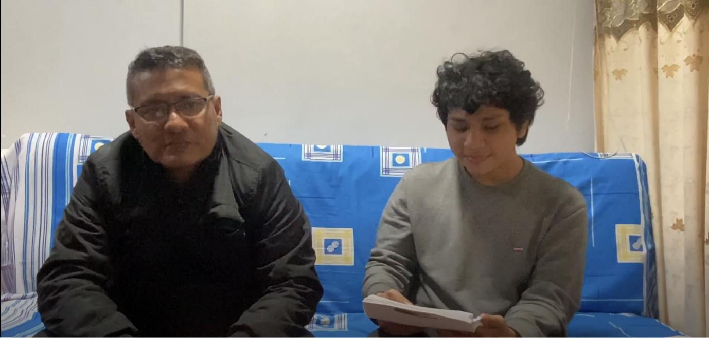
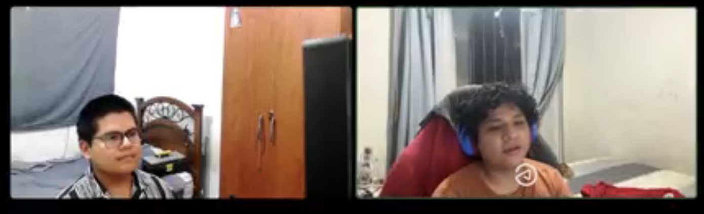

# Capítulo II: Requirements & Analysis

### 2.1.1 Competitive Analysis Landscape

<table>
  <tr>
    <th colspan="6">Competitive Analysis Landscape</th>
  </tr>

  <tr>
    <th>¿Por qué llevar a cabo este análisis?</th>
    <th colspan="5">
      ¿Cómo podemos diseñar una solución digital eficiente, confiable y diferenciada que permita a los conductores encontrar y reservar estacionamientos en tiempo real, reduciendo el tiempo de búsqueda, el tráfico urbano y el estrés, superando las limitaciones actuales de las aplicaciones existentes en el mercado?
    </th>
  </tr>

  <tr>
    <th rowspan="4">Perfil</th>
    <th></th>
    <th>ParkLink</th>
    <th>Apparka</th>
    <th>Parkopedia</th>
    <th>Quadra</th>
  </tr>

  <tr>
    <td><b>Overview</b></td>
    <td>
      Plataforma digital orientada a la búsqueda, visualización y reserva de estacionamientos en tiempo real. 
      Conecta a conductores con propietarios de espacios disponibles, permitiendo optimizar el uso de infraestructura urbana subutilizada.
    </td>
    <td>
      Aplicación peruana enfocada en el pago digital de estacionamientos en vía pública, facilitando la gestión del tiempo de estacionamiento sin necesidad de efectivo.
    </td>
    <td>
      Plataforma global que ofrece un amplio directorio de estacionamientos en múltiples ciudades del mundo, proporcionando información de ubicación, precios y disponibilidad aproximada.
    </td>
    <td>
      Aplicación enfocada en la gestión y administración de estacionamientos, orientada a mejorar la eficiencia del uso de espacios mediante herramientas tecnológicas.
    </td>
  </tr>

  <tr>
    <td><b>Ventaja competitiva</b></td>
    <td>
      Integración de múltiples funcionalidades en una sola plataforma: búsqueda en tiempo real, reservas anticipadas y monetización de espacios privados.
    </td>
    <td>
      Alta adopción local y facilidad de uso para pagos digitales en zonas reguladas por municipalidades.
    </td>
    <td>
      Gran cobertura internacional y base de datos extensa de estacionamientos.
    </td>
    <td>
      Enfoque en optimización operativa y uso eficiente de espacios a través de tecnología.
    </td>
  </tr>

  <tr>
    <td><b>¿Qué valor ofrece a los clientes?</b></td>
    <td>
      Reducción significativa del tiempo de búsqueda, menor estrés al conducir, posibilidad de asegurar un espacio antes de llegar y generación de ingresos para propietarios.
    </td>
    <td>
      Comodidad en el pago, eliminación del uso de efectivo y facilidad para gestionar el tiempo de estacionamiento.
    </td>
    <td>
      Acceso a información amplia sobre ubicaciones de estacionamiento en diferentes ciudades.
    </td>
    <td>
      Mejora en la organización y control de estacionamientos, especialmente en contextos institucionales.
    </td>
  </tr>

  <tr>
    <th rowspan="2">Perfil de Marketing</th>
    <td><b>Mercado Objetivo</b></td>
    <td>
      Conductores urbanos que buscan optimizar su tiempo y propietarios de estacionamientos interesados en monetizar sus espacios.
    </td>
    <td>
      Conductores en zonas urbanas del Perú donde el estacionamiento es regulado.
    </td>
    <td>
      Conductores a nivel global que requieren información sobre estacionamientos en distintas ciudades.
    </td>
    <td>
      Municipalidades, empresas privadas y operadores de estacionamientos.
    </td>
  </tr>

  <tr>
    <td><b>Estrategias de Marketing</b></td>
    <td>
      Marketing digital, campañas en redes sociales, alianzas estratégicas con estacionamientos privados y enfoque en experiencia de usuario.
    </td>
    <td>
      Implementación mediante convenios con municipalidades y campañas locales de adopción.
    </td>
    <td>
      Posicionamiento SEO, presencia global y partnerships con plataformas de movilidad.
    </td>
    <td>
      Estrategias B2B y acuerdos institucionales con entidades públicas y privadas.
    </td>
  </tr>

  <tr>
    <th rowspan="3">Perfil de Producto</th>
    <td><b>Productos & Servicios</b></td>
    <td>
      Plataforma web y aplicación móvil para búsqueda, reserva y gestión de estacionamientos.
    </td>
    <td>
      Aplicación móvil para pago de estacionamientos en vía pública.
    </td>
    <td>
      Plataforma web y móvil para consulta de estacionamientos.
    </td>
    <td>
      Aplicación móvil orientada a la gestión y administración de estacionamientos.
    </td>
  </tr>

  <tr>
    <td><b>Precios & Costos</b></td>
    <td>
      Modelo freemium con comisión por reserva realizada dentro de la plataforma.
    </td>
    <td>
      Pago por uso según tiempo de estacionamiento.
    </td>
    <td>
      Acceso gratuito con posibles servicios premium o integraciones comerciales.
    </td>
    <td>
      Modelo basado en licencias o contratos con instituciones.
    </td>
  </tr>

  <tr>
    <td><b>Canales de distribución (Web y/o Móvil)</b></td>
    <td>Web y móvil</td>
    <td>Móvil</td>
    <td>Web y móvil</td>
    <td>Móvil</td>
  </tr>

  <tr>
    <th rowspan="4">Análisis SWOT</th>
    <td><b>Fortalezas</b></td>
    <td>
      Propuesta integral que combina búsqueda, reserva y monetización en una sola plataforma. 
      Enfoque centrado en el usuario y alineado con tendencias de smart cities.
    </td>
    <td>
      Aplicación consolidada en el mercado local con alta adopción y facilidad de uso.
    </td>
    <td>
      Amplia base de datos global y reconocimiento internacional.
    </td>
    <td>
      Capacidad de optimizar el uso de espacios mediante soluciones tecnológicas especializadas.
    </td>
  </tr>

  <tr>
    <td><b>Debilidades</b></td>
    <td>
      Proyecto en etapa inicial sin posicionamiento consolidado en el mercado.
    </td>
    <td>
      Limitado a pagos, sin funcionalidades de reserva o predicción de disponibilidad.
    </td>
    <td>
      No garantiza disponibilidad en tiempo real ni permite reservas.
    </td>
    <td>
      Enfoque limitado al sector institucional, con poca orientación al usuario final.
    </td>
  </tr>

  <tr>
    <td><b>Oportunidades</b></td>
    <td>
      Crecimiento de soluciones de movilidad inteligente y demanda de optimización urbana.
    </td>
    <td>
      Expansión a más ciudades y mejora de funcionalidades.
    </td>
    <td>
      Integración con nuevas tecnologías y servicios de movilidad.
    </td>
    <td>
      Implementación en proyectos de smart cities y expansión institucional.
    </td>
  </tr>

  <tr>
    <td><b>Amenazas</b></td>
    <td>
      Competencia de aplicaciones ya posicionadas y barreras de adopción inicial.
    </td>
    <td>
      Entrada de nuevas aplicaciones más completas.
    </td>
    <td>
      Dependencia de la actualización de datos y falta de precisión en tiempo real.
    </td>
    <td>
      Dependencia de entidades públicas y cambios en regulaciones.
    </td>
  </tr>

</table>

### 2.1.2. Estrategias y tácticas frente a competidores

A partir del análisis competitivo realizado en la sección anterior, se identificaron diversas oportunidades y debilidades en los competidores actuales (Apparka, Parkopedia y Quadra). En base a estos hallazgos, se plantean las siguientes estrategias y tácticas para posicionar a ParkLink como una solución diferenciada en el mercado:

#### 1. Diferenciación mediante reservas en tiempo real
Se identificó que competidores como Parkopedia no ofrecen disponibilidad en tiempo real ni permiten realizar reservas anticipadas, mientras que Apparka se limita únicamente al pago.

**Estrategia:**
Implementar un sistema de reservas en tiempo real que permita a los usuarios asegurar un espacio antes de llegar a su destino.

**Tácticas:**
- Desarrollo de un mapa interactivo con disponibilidad actualizada.
- Sistema de confirmación inmediata de reservas.
- Integración de notificaciones en tiempo real.

---

#### 2. Plataforma integral 
Los competidores actuales ofrecen soluciones parciales: Apparka se enfoca en pagos, Parkopedia en información y Quadra en gestión.

**Estrategia:**
Ofrecer una plataforma integral que combine búsqueda, reserva, pago y gestión en un solo sistema.

**Tácticas:**
- Integración de múltiples funcionalidades dentro de una sola aplicación.
- Experiencia unificada para conductores y propietarios.
- Optimización de flujos de usuario para reducir fricción.

---

#### 3. Enfoque en la monetización de espacios privados
Ninguno de los competidores explota completamente el potencial de los estacionamientos privados subutilizados.

**Estrategia:**
Permitir a los propietarios publicar y monetizar sus espacios de estacionamiento.

**Tácticas:**
- Sistema de registro sencillo para propietarios.
- Panel de gestión de ingresos y reservas.
- Incentivos para atraer nuevos espacios a la plataforma.

---

#### 4. Mejora de la experiencia del usuario (UX/UI)
Se observó que varias soluciones no están centradas completamente en la experiencia del usuario o presentan limitaciones en usabilidad.

**Estrategia:**
Desarrollar una interfaz intuitiva, rápida y centrada en el usuario.

**Tácticas:**
- Diseño responsive y mobile-first.
- Navegación simple basada en mapas.
- Pruebas de usabilidad constantes con usuarios reales.

---

#### 5. Posicionamiento como solución de smart mobility
El crecimiento de las ciudades inteligentes representa una gran oportunidad para soluciones innovadoras.

**Estrategia:**
Posicionar a ParkLink como una solución de movilidad inteligente (smart parking).

**Tácticas:**
- Integración con tecnologías de geolocalización y análisis de datos.
- Uso de métricas para optimizar la oferta y demanda de estacionamientos.
- Comunicación del impacto en reducción de tráfico y contaminación.

---

#### 6. Estrategia de crecimiento y adopción
Se identificó que algunos competidores dependen fuertemente de instituciones o tienen alcance limitado.

**Estrategia:**
Expandir la plataforma mediante estrategias digitales y alianzas estratégicas.

**Tácticas:**
- Campañas en redes sociales dirigidas a conductores urbanos.
- Alianzas con centros comerciales, empresas y parkings privados.
- Programas de referidos para aumentar la base de usuarios.

---

#### 7. Mejora continua basada en datos
Los competidores presentan limitaciones en actualización de datos o precisión.

**Estrategia:**
Implementar un modelo de mejora continua basado en datos y feedback de usuarios.

**Tácticas:**
- Recolección de métricas de uso en la plataforma.
- Análisis del comportamiento del usuario.
- Actualizaciones frecuentes con nuevas funcionalidades.

## 2.2.Entrevistas.
Esta parte del informe presentará la parte objetiva de las entrevistas junto con el análisis 
relevante de cada una de ellas

### 2.2.1. Diseño de entrevistas.

En esta sección se presenta el diseño de entrevistas aplicado a los segmentos objetivo definidos previamente. El objetivo de estas entrevistas es comprender las necesidades, comportamientos, problemas y expectativas de los usuarios en relación con la búsqueda y gestión de estacionamientos en entornos urbanos.

A través de estas entrevistas se busca obtener información cualitativa relevante que permita validar el problema identificado, así como identificar oportunidades de mejora y funcionalidades clave para el desarrollo de la solución propuesta.

---

#### Segmento #1 Conductores urbanos

Nuestra plataforma ha desarrollado un conjunto de preguntas diseñadas específicamente para comprender las experiencias, necesidades y dificultades de los conductores al momento de buscar estacionamiento en zonas urbanas.

Actualmente, muchos conductores enfrentan problemas como la falta de información en tiempo real, la pérdida de tiempo buscando espacios disponibles y el estrés asociado a la congestión vehicular. Nuestro objetivo es identificar cómo realizan actualmente este proceso, qué herramientas utilizan y qué expectativas tienen frente a una posible solución digital.

Además, buscamos entender qué funcionalidades consideran más importantes en una aplicación de estacionamientos, así como su disposición a utilizar herramientas tecnológicas que optimicen su experiencia de movilidad urbana.

##### Preguntas Principales

- ¿Nos podría indicar su nombre, edad y con qué frecuencia conduce en zonas urbanas?
- ¿Cómo sueles buscar estacionamiento actualmente?
- ¿Cuánto tiempo promedio te toma encontrar un espacio disponible?
- ¿Qué problemas enfrentas al buscar estacionamiento?
- ¿Utilizas alguna aplicación o herramienta digital para encontrar estacionamiento? ¿Cuál?
- ¿Qué aspectos valoras más al momento de elegir un estacionamiento? (precio, ubicación, seguridad, etc.)
- ¿Te gustaría poder reservar un estacionamiento antes de llegar a tu destino? ¿Por qué?
- ¿Qué funcionalidades te gustaría encontrar en una aplicación de estacionamientos?
- ¿Qué tipo de información te gustaría visualizar en tiempo real dentro de la aplicación?
- ¿Qué esperas lograr al usar una aplicación como ParkLink?

---

#### Segmento #2 Propietarios de estacionamientos

Nuestra solución también se enfoca en propietarios de espacios de estacionamiento, ya sean personas naturales o empresas, que cuentan con espacios disponibles y buscan una forma eficiente de gestionarlos y monetizarlos.

Actualmente, muchos de estos espacios no son aprovechados adecuadamente debido a la falta de herramientas digitales que faciliten su administración, visibilidad y control. Por ello, el objetivo de estas entrevistas es comprender cómo gestionan actualmente sus espacios, qué dificultades enfrentan y qué necesidades tienen en cuanto a una plataforma digital.

Asimismo, se busca identificar qué funcionalidades consideran necesarias para facilitar la gestión de reservas, el control de ingresos y la interacción con los usuarios.

##### Preguntas Principales

- ¿Nos podría indicar su nombre, edad y si es propietario de espacios de estacionamiento o representa a una empresa?
- ¿Cuántos espacios de estacionamiento tiene disponibles actualmente?
- ¿Cómo gestiona actualmente el uso de sus espacios?
- ¿Qué problemas enfrenta al administrar sus estacionamientos?
- ¿Ha considerado alquilar o monetizar sus espacios? ¿Por qué?
- ¿Qué tipo de herramientas utiliza actualmente para llevar el control de sus espacios?
- ¿Qué funcionalidades le gustaría ver en una aplicación de gestión de estacionamientos?
- ¿Qué información considera importante para administrar sus espacios de manera eficiente?
- ¿Qué tan importante es para usted poder visualizar reservas en tiempo real?
- ¿Qué nivel de control o personalización espera de una aplicación como ParkLink?
- ¿Qué beneficios esperaría obtener al implementar una solución como ParkLink?

  
### 2.2.2. Registro de entrevistas

---

#### Segmento: Conductores urbanos

| Información del entrevistado | Detalle | Evidencia / Foto |
| :--- | :--- | :--- |
| **Nombre:** | Humberto Garcia Calla | |
| **Edad:** | 50 años |  |
| **Procedencia:** | Lima, Perú | |
| **Link de Entrevista:** | [Ver Entrevista - Conductor 1](https://upcedupe-my.sharepoint.com/:v:/g/personal/u202319563_upc_edu_pe/IQA6cKL_J7H1Q5sAObrd-g1vAWugvlOh81HxZl96DyfSgxo?e=O8QHUO) | |

**Resumen:**
Humberto conduce a diario por motivos laborales en zonas céntricas de Lima. Comentó que su mayor problema es llegar a un destino sin saber si habrá espacio disponible, lo que a veces le toma hasta 20 minutos resolver dando vueltas. Durante la entrevista dejó claro que lo que más le interesaría de una app como ParkLink es poder ver en tiempo real qué espacios están libres cerca de su destino, idealmente con precio y distancia visibles desde el mapa.

---

| Información del entrevistado | Detalle | Evidencia / Foto |
| :--- | :--- | :--- |
| **Nombre:** | Juan Pablo Yataca Juarez | |
| **Edad:** | 25 años |  |
| **Procedencia:** | Miraflores, Lima | |
| **Link de Entrevista:** | [Ver Entrevista - Conductor 2](https://upcedupe-my.sharepoint.com/:v:/g/personal/u202319563_upc_edu_pe/IQC5Pn9y3_vMSKKKp_IpOexzAd2qvLUgFDTOpbtFJuvqdyM?e=QZNtnX) | |

**Resumen:**
Juan usa su vehículo principalmente los fines de semana para salidas sociales. Mencionó que varias veces ha tenido que cancelar planes porque no encontró dónde estacionarse a tiempo. Lo que más le llamó la atención de la propuesta fue la posibilidad de reservar un espacio antes de salir, algo que considera que le ahorraría mucho estrés. También indicó que le gustaría poder extender su reserva desde la misma app si se demora más de lo previsto.

---

#### Segmento: Propietarios de estacionamientos

| Información del entrevistado | Detalle | Evidencia / Foto |
| :--- | :--- | :--- |
| **Nombre:** | Jarol Saquiray Vargas | |
| **Edad:** | 24 años |  |
| **Procedencia:** | San Isidro, Lima | |
| **Link de Entrevista:** | [Ver Entrevista - Alquilador 1](https://upcedupe-my.sharepoint.com/:v:/g/personal/u202319563_upc_edu_pe/IQCRWaljRumMQZEnTSeyx43mAcyZOxY7GjN-oaVipHdFt_w?e=vKuME0) | |

**Resumen:**
Jarol tiene 3 espacios de cochera que alquila de manera informal a vecinos conocidos. Reconoce que pierde ingresos porque no tiene cómo llegar a más personas. A lo largo de la entrevista, lo que más le interesó fue la posibilidad de publicar sus espacios en una plataforma y poder configurar él mismo los horarios y el precio según el día. Actualmente lo gestiona todo por WhatsApp y considera que eso le genera mucha confusión.

---

| Información del entrevistado | Detalle | Evidencia / Foto |
| :--- | :--- | :--- |
| **Nombre:** | Dlan Garcia Levano | |
| **Edad:** | 23 años |  |
| **Procedencia:** | Surco, Lima | |
| **Link de Entrevista:** | [Ver Entrevista - Alquilador 2](https://upcedupe-my.sharepoint.com/:v:/g/personal/u202319563_upc_edu_pe/IQDgcsDPBaZbSq5m9rknewivAauO8nQm4IM_qcDCXGv_Vug?e=gbPYcK) | |

**Resumen:**
Dlan administra espacios de un edificio residencial que quedan vacíos durante las mañanas entre semana. Nos comentó que no tiene ningún sistema para gestionarlos y que ha intentado alquilarlos antes sin éxito por falta de visibilidad. Su principal necesidad es poder habilitar y deshabilitar los espacios fácilmente según el horario, sin que eso implique darlos de baja definitivamente.

### 2.2.3. Análisis de entrevistas

#### Análisis de entrevistas al segmento Conductores urbanos

##### Datos demográficos
**Edad:** Promedio: **28.5 años** | Rango: **25 - 32 años**
**Sexo:** El **100%** de los entrevistados son de género **masculino**.
**Procedencia:**
● El **50% (1)** proviene de **Lima Centro**
● El **50% (1)** proviene de **Miraflores**

---

##### Estadísticas:
● El **100%** de los entrevistados pierde entre 15 a 20 minutos buscando estacionamiento.  
● El **100%** no utiliza herramientas digitales específicas actualmente.  
● El **50%** ha llegado a cancelar planes sociales por falta de parqueo.  
● El **100%** considera el estrés de búsqueda como un factor negativo en su rutina.  

---

##### Funcionalidades deseadas en la aplicación:
● Visualización de disponibilidad en tiempo real: **100%**
● Sistema de reserva anticipada: **100%**
● Extensión de tiempo desde la app: **50%**
● Mapa con precios y distancias: **100%**

---

#### Análisis de entrevistas al segmento Propietarios de estacionamientos

##### Datos demográficos
**Edad:** Promedio: **41.5 años** | Rango: **38 - 45 años**
**Sexo:** El **100%** de los entrevistados son de género **masculino**.
**Procedencia:**
● El **50% (1)** proviene de **San Isidro**
● El **50% (1)** proviene de **Surco**

---

##### Estadísticas:
● El **100%** de los entrevistados gestiona sus espacios de forma manual o informal (WhatsApp).  
● El **100%** busca monetizar espacios subutilizados durante el día.  
● El **50%** presenta dificultades para llevar un control ordenado de sus ingresos.  
● El **100%** requiere autonomía total para decidir sus horarios de disponibilidad.  

---

##### Funcionalidades deseadas en la aplicación:
● Panel de configuración de horarios y precios: **100%**
● Registro de ingresos y exportación de reportes: **50%**
● Sistema de activación/desactivación rápida de espacios: **100%**
● Verificación de identidad para mayor seguridad: **100%**

## 2.3. Needfinding

### 2.3.1. User Personas

Para la elaboración de nuestros User Persona se tomaron en cuenta los datos obtenidos y analizados en las entrevistas realizadas a los segmentos de conductores urbanos y propietarios de estacionamientos.

Se identificaron patrones comunes en ambos grupos, considerando aspectos como sus necesidades, comportamientos, problemas frecuentes y expectativas frente a una posible solución digital. En base a ello, se definieron perfiles representativos que reflejan las características más relevantes de cada segmento.

Asimismo, a partir de las respuestas recopiladas, se construyeron los User Persona incluyendo sus objetivos, motivaciones y frustraciones principales, priorizando aquellos elementos que se repitieron con mayor frecuencia durante el proceso de entrevistas.

Finalmente, se realizó un análisis que permitió identificar los valores, habilidades (skills) y una frase representativa para cada perfil, con el fin de sintetizar de manera clara las características más importantes de los usuarios y facilitar la comprensión de sus necesidades dentro del desarrollo de la solución propuesta.
