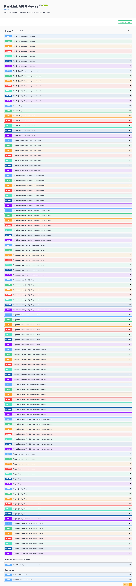
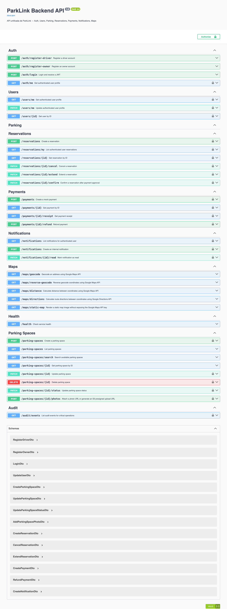
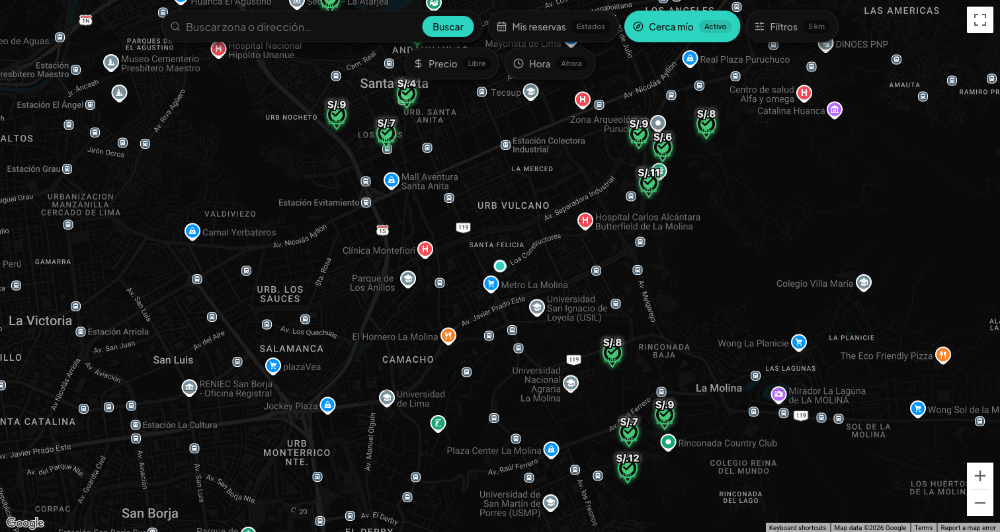
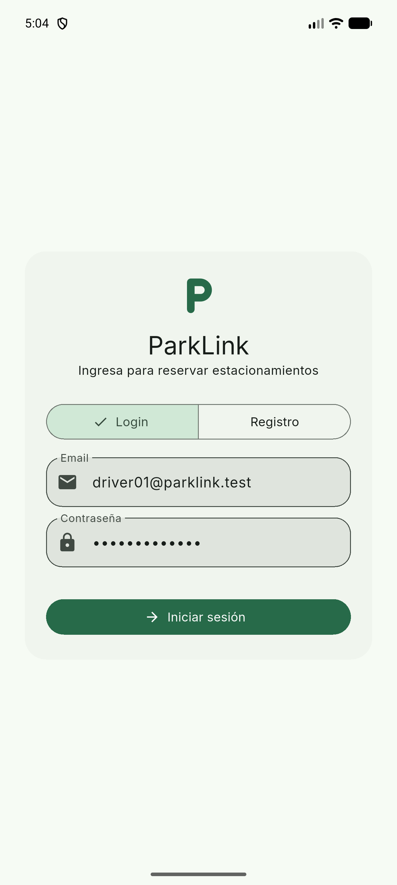
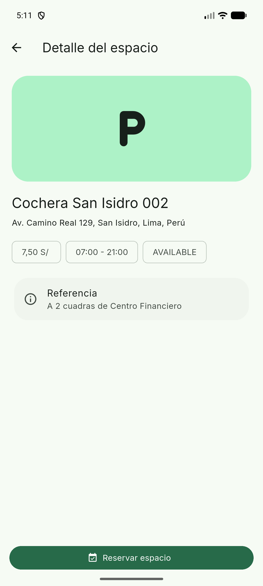
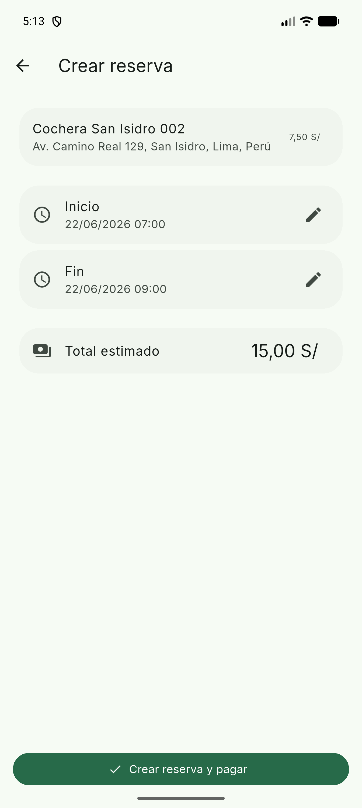
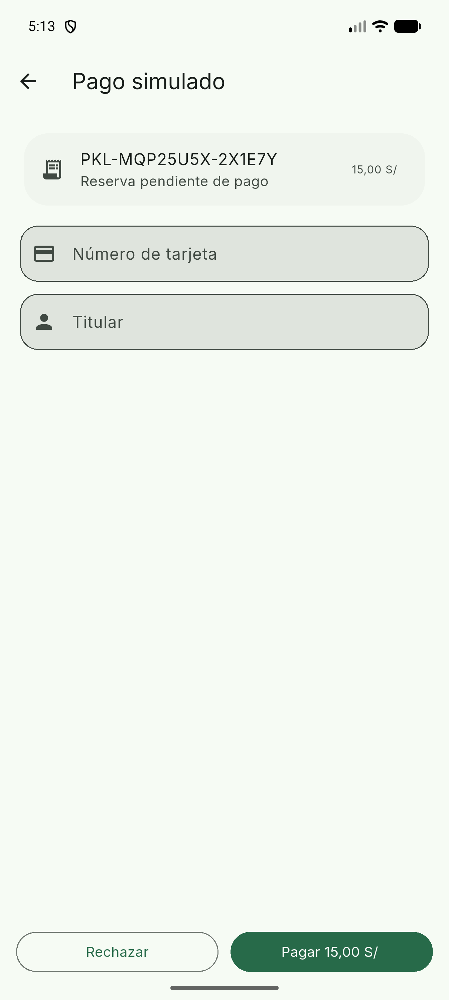

# ParkLink — Drivers arquitectónicos y pruebas que los confirman

Fecha: **2026-07-07**

Este documento resume los drivers arquitectónicos principales de ParkLink y las pruebas/evidencias que confirman que fueron atendidos. La trazabilidad conecta:

1. **Driver**: necesidad arquitectónica o atributo de calidad.
2. **Qué exige**: condición que debe cumplir el sistema.
3. **Qué se implementó**: táctica o decisión técnica aplicada.
4. **Qué prueba se hace**: verificación concreta.
5. **Cómo se hace**: pasos o comando usado.
6. **Qué confirma**: evidencia resultante.

Documentos relacionados:

- `DRIVERS_TACTICAS_ARTEFACTOS.md`
- `PLAN_CIERRE_DRIVERS_FALTANTES.md`
- `ParkLink-Report/evidencias-cierre/EVIDENCIAS_TESTS_PARKLINK.md`

---

## 1. Resumen de drivers validados

| Driver | Estado validado | Evidencia principal |
|---|---|---|
| Seguridad | Confirmado | Login JWT, rutas protegidas, headers `Authorization` por gateway. |
| Consistencia transaccional / no doble reserva | Confirmado | Dos usuarios intentan reservar mismo parking/hora: primera `201`, segunda `400`. |
| Disponibilidad | Confirmado | `/health` gateway responde `ok`, backend `available`, latencia reportada. |
| Rendimiento / Escalabilidad | Confirmado parcialmente | Búsqueda con paginación `limit`, cache con métricas hit/miss, índices definidos. |
| Interoperabilidad | Confirmado | Web y Flutter apuntan al API Gateway. Swagger backend/gateway disponible. |
| Mantenibilidad / Modificabilidad | Confirmado | Backend modular por dominios y gateway separado. Build/test por componente. |
| Usabilidad funcional | Confirmado visualmente | Capturas web/mobile muestran login, mapa, detalle, reserva y pago. |

---

## 2. Driver: Seguridad

### Qué exige

El sistema debe proteger operaciones sensibles como reservas, pagos y gestión de cocheras. El usuario debe autenticarse con JWT y cada operación protegida debe validar permisos.

### Qué se implementó

- Login con JWT en backend.
- Guards de autenticación y roles.
- Reenvío del header `Authorization` desde API Gateway.
- Secretos fuera del código mediante variables de entorno en Vercel.

### Pruebas que lo confirman

| Prueba | Cómo se hace | Qué confirma | Resultado |
|---|---|---|---|
| Login conductor 1 | `POST /auth/login` con `driver01@parklink.test` vía gateway. | El backend autentica usuario y emite token válido. | OK |
| Login conductor 2 | `POST /auth/login` con `driver02@parklink.test` vía gateway. | Un segundo usuario puede autenticarse de forma independiente. | OK |
| Reserva con token | `POST /reservations` con header `Authorization: Bearer <token>`. | Las operaciones transaccionales se ejecutan autenticadas. | `201` en primera reserva |
| Test gateway | `bun run test:api-gateway`. | El proxy reenvía método, body y header `Authorization`. | OK — 2 suites, 3 tests |

### Evidencia

```text
login=ok
firstReservation=201
```

Archivos relacionados:

- `ParkLink-Backend/apps/backend/src/modules/auth/`
- `ParkLink-Backend/apps/backend/src/common/guards/`
- `ParkLink-Backend/api-gateway/src/proxy/proxy.service.ts`

---

## 3. Driver: Consistencia transaccional / prevención de doble reserva

### Qué exige

Dos personas no deben poder reservar el mismo estacionamiento en el mismo rango horario. La disponibilidad visible no puede ser la fuente final de verdad; la confirmación debe validarse en backend con transacción.

### Qué se implementó

- Validación de solape antes de crear reserva.
- Transacción serializable.
- Advisory lock por parking space.
- Mapeo de conflicto de DB a error funcional `400`.
- Migración SQL con constraint anti-overlap para reforzar la regla a nivel base de datos.

### Pruebas que lo confirman

| Prueba | Cómo se hace | Qué confirma | Resultado |
|---|---|---|---|
| Test unitario anti-overlap | `bun run test:backend`. | El servicio rechaza reservas solapadas dentro de la transacción. | OK |
| Test productivo doble usuario | Login con `driver01` y `driver02`; ambos intentan reservar mismo parking/hora vía gateway. | Sólo una reserva se acepta; la segunda se rechaza. | Primera `201`, segunda `400` |
| Limpieza de reserva | `PATCH /reservations/:id/cancel` con token del primer usuario. | La reserva de prueba no queda ensuciando datos productivos. | `200` |

### Evidencia

```text
firstReservation=201
secondReservation=400 {"message":"Parking space already has a reservation in this time range"}
cleanupCancel=200
```

Archivos relacionados:

- `ParkLink-Backend/apps/backend/src/modules/reservation/reservations.service.ts`
- `ParkLink-Backend/apps/backend/test/reservations.service.spec.ts`
- `ParkLink-Backend/apps/backend/prisma/migrations/202607070001_availability_indexes_and_no_overlap/migration.sql`

---

## 4. Driver: Disponibilidad

### Qué exige

El sistema debe reportar su estado y degradarse de forma controlada cuando falle backend o una dependencia externa. El gateway no debe bloquear indefinidamente una solicitud.

### Qué se implementó

- Health check del backend.
- Health check del gateway con latencia hacia backend.
- Retry acotado en gateway para errores transitorios.
- Circuit breaker simple por upstream.
- Timeout de proxy.
- Fallback funcional para errores de Google Maps.

### Pruebas que lo confirman

| Prueba | Cómo se hace | Qué confirma | Resultado |
|---|---|---|---|
| Health gateway | `GET https://api-gateway-xi-five.vercel.app/health`. | Gateway operativo y backend disponible. | `200`, status `ok`, backend `available` |
| Swagger gateway raíz | `GET https://api-gateway-xi-five.vercel.app/`. | Gateway responde desde ruta principal. | `200` |
| Test retry gateway | `bun run test:api-gateway`. | Si upstream responde `5xx`, gateway reintenta una vez antes de responder. | OK |
| Maps geocode | `GET /maps/geocode?address=Lima%2C%20Peru` vía gateway. | Dependencia Maps funciona y responde por backend. | `200` |

### Evidencia

```text
gatewayHealth=200 backend=available
mapsGeocode=200
```

Capturas:



Archivos relacionados:

- `ParkLink-Backend/api-gateway/src/health/health.service.ts`
- `ParkLink-Backend/api-gateway/src/proxy/proxy.service.ts`
- `ParkLink-Backend/apps/backend/src/modules/maps/maps.service.ts`

---

## 5. Driver: Rendimiento / Escalabilidad

### Qué exige

Las búsquedas de estacionamientos deben responder de forma eficiente y evitar respuestas masivas o cálculos repetidos innecesarios.

### Qué se implementó

- Paginación en búsqueda con `limit` y `offset`.
- Cache de disponibilidad.
- Métricas de cache `hit`, `miss`, `invalidation` en logs.
- Índices Prisma para filtros frecuentes.
- Invalidación de cache cuando cambian parking, reserva o pago.

### Pruebas que lo confirman

| Prueba | Cómo se hace | Qué confirma | Resultado |
|---|---|---|---|
| Búsqueda paginada productiva | `GET /parking-spaces/search?limit=1` vía gateway. | El endpoint acepta paginación y devuelve respuesta acotada. | `200` |
| Test backend parking search | `bun run test:backend`. | La búsqueda usa cache e invalida cuando corresponde. | OK |
| Build backend | `bun run build:backend`. | DTOs, índices Prisma y servicio compilan. | OK |

### Evidencia

```text
GET https://api-gateway-xi-five.vercel.app/parking-spaces/search?limit=1 -> 200
```

Archivos relacionados:

- `ParkLink-Backend/apps/backend/src/modules/parking/dto/search-parking-spaces.dto.ts`
- `ParkLink-Backend/apps/backend/src/modules/parking/parking-spaces.service.ts`
- `ParkLink-Backend/apps/backend/src/modules/availability-cache/availability-cache.service.ts`
- `ParkLink-Backend/apps/backend/prisma/schema.prisma`

---

## 6. Driver: Interoperabilidad

### Qué exige

La web y la app mobile deben consumir el mismo contrato HTTP/JSON mediante un punto de entrada consistente. La arquitectura objetivo define el API Gateway como entrada única.

### Qué se implementó

- Web usa `VITE_API_URL` y apunta a `https://api-gateway-xi-five.vercel.app`.
- Flutter usa `PARKLINK_API_URL` por `--dart-define` y por defecto apunta al gateway.
- Backend y gateway exponen Swagger/OpenAPI.
- Web productiva fue redeployada con `VITE_API_URL` explícito.

### Pruebas que lo confirman

| Prueba | Cómo se hace | Qué confirma | Resultado |
|---|---|---|---|
| Bundle web principal | Revisar bundle de `https://parklink-eta.vercel.app`. | Contiene gateway y no contiene backend directo. | `gateway=true`, `backendDirect=false` |
| Bundle web alternativa | Revisar bundle de `https://parklink-web.vercel.app`. | Segundo deployment también usa gateway. | `gateway=true`, `backendDirect=false` |
| Build mobile | `flutter build apk --debug --dart-define=PARKLINK_API_URL=https://api-gateway-xi-five.vercel.app`. | La app mobile compila usando gateway. | OK |
| Swagger backend/gateway | Abrir `/` en backend y gateway. | Contratos visibles para clientes y pruebas manuales. | `200` |

### Evidencia

```text
https://parklink-eta.vercel.app gateway=true googleKey=true backendDirect=false
https://parklink-web.vercel.app gateway=true googleKey=true backendDirect=false
```

Capturas:





Archivos relacionados:

- `ParkLink-Frontend/src/lib/api.ts`
- `ParkLink-App/lib/core/api/api_client.dart`
- `ParkLink-Backend/apps/backend/src/main.ts`
- `ParkLink-Backend/api-gateway/src/main.ts`

---

## 7. Driver: Mantenibilidad / Modificabilidad

### Qué exige

Los cambios deben quedar acotados por dominio para evitar modificar todo el sistema cuando cambia una regla de negocio.

### Qué se implementó

- Backend modular por dominios: Auth, Users, Parking, Reservations, Payments, Notifications, Maps, Audit.
- API Gateway separado del backend de reglas de negocio.
- `libs/common` para filtros, interceptores, guards y utilidades compartidas.
- Clientes web/mobile con API clients centralizados.

### Pruebas que lo confirman

| Prueba | Cómo se hace | Qué confirma | Resultado |
|---|---|---|---|
| Test backend por módulos | `bun run test:backend`. | Cambios en reservas, parking y pagos se validan sin romper otros módulos. | OK |
| Test gateway separado | `bun run test:api-gateway`. | Gateway mantiene responsabilidad de proxy, no reglas de negocio. | OK |
| Build separado | `bun run build:backend && bun run build:api-gateway`. | Backend y gateway compilan como apps separadas. | OK |

### Evidencia

```text
backend tests: 3 suites / 9 tests OK
gateway tests: 2 suites / 3 tests OK
```

Archivos relacionados:

- `ParkLink-Backend/apps/backend/src/app.module.ts`
- `ParkLink-Backend/apps/backend/src/modules/`
- `ParkLink-Backend/api-gateway/`
- `ParkLink-Backend/libs/common/src/`

---

## 8. Driver: Usabilidad funcional

### Qué exige

El usuario debe poder entender y completar el flujo principal: iniciar sesión, explorar cocheras, ver detalle, reservar y pagar.

### Qué se implementó

- Web dashboard con mapa y cocheras disponibles.
- App Flutter con login, registro, mapa, detalle, reserva, pago y resultado.
- Feedback visual en el flujo mobile.

### Pruebas que lo confirman

| Prueba | Cómo se hace | Qué confirma | Resultado |
|---|---|---|---|
| Captura web dashboard | Abrir `https://parklink-eta.vercel.app/dashboard` y capturar pantalla. | La web carga dashboard con mapa y espacios. | OK |
| Capturas mobile | Revisar capturas Flutter del reporte. | El flujo mobile está documentado visualmente. | OK |
| Test Flutter | `flutter test`. | Pantalla auth soporta login/registro. | OK |
| Flutter analyze/build | `flutter analyze` + `flutter build apk --debug`. | La app mobile compila sin errores estáticos. | OK |

### Evidencia mobile










---

## 9. Matriz final Driver → Prueba → Confirmación

| Driver | Prueba clave | Qué se hace | Confirmación |
|---|---|---|---|
| Seguridad | Login + reserva autenticada | Se autentica usuario y se llama `/reservations` con JWT. | Operación sensible requiere token válido. |
| Consistencia / no doble reserva | Doble intento mismo parking/hora | Dos usuarios reservan el mismo slot. | Segunda reserva rechazada con `400`. |
| Disponibilidad | `GET /health` gateway | Gateway consulta backend y expone latencia. | Status `ok`, backend `available`. |
| Rendimiento / escalabilidad | `GET /parking-spaces/search?limit=1` | Se consulta búsqueda paginada. | Respuesta `200` acotada. |
| Interoperabilidad | Bundle web + build mobile | Web y Flutter apuntan al gateway. | `gateway=true`, APK compila con `PARKLINK_API_URL`. |
| Mantenibilidad | Tests/build por app | Backend y gateway se prueban/compilan separados. | Cambios acotados por módulo. |
| Usabilidad | Capturas web/mobile | Se revisan pantallas de flujo usuario. | Login, mapa, detalle, reserva y pago visibles. |

---

## 10. Comandos principales usados

```bash
bun run test:backend
bun run test:api-gateway
bun run lint
bun run build:backend && bun run build:api-gateway
```

```bash
bun run test
bun run build
bun run lint
```

```bash
flutter test
flutter analyze
GOOGLE_MAPS_API_KEY=<key-publica-maps> \
flutter build apk --debug \
  --dart-define=PARKLINK_API_URL=https://api-gateway-xi-five.vercel.app
```

---

## 11. Conclusión

Las pruebas confirman que los drivers arquitectónicos principales están cubiertos:

- La seguridad se valida con JWT y uso de rutas protegidas.
- La consistencia se valida con la prueba anti doble-reserva.
- La disponibilidad se valida con health checks y gateway operativo.
- El rendimiento se atiende con paginación, cache e índices.
- La interoperabilidad se confirma porque web y mobile consumen el API Gateway.
- La mantenibilidad se evidencia en la modularización y builds separados.
- La usabilidad se documenta mediante capturas del flujo web/mobile.
